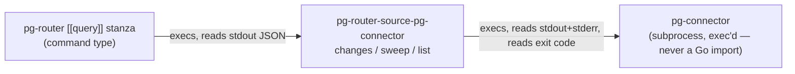

# pg-router-source-pg-connector — behavior docs

`pg-router-source-pg-connector` is a small, standalone Go binary with three subcommands
(`changes`, `sweep`, `list`) that lets a pg-router `[[query]]` command-type stanza consume
pg-connector without a shell/jq pipeline. It knows exactly two contracts — pg-connector's
`changes`/`list` wire envelopes, and pg-router's command-query rawItem array shape — and holds
NO state of its own: every fact it reports lives in pg-connector's own delta ledger (a sibling
component in this docket), never in a file this binary writes itself.

This document is a plain statement of this adapter's own behavior, not a full application of the
repo's `behavior-docs` method (no separate actors/journeys/interfaces registers): the adapter has
no interface surface of its own beyond the two wire contracts already owned and documented
elsewhere (pg-connector's own `docs/behavior/interfaces.md`, pg-router's own
`internal/query/command.go` rawItem shape) — it is a pure translation layer between them.

## What it does

```mermaid
flowchart LR
    ROUTER["pg-router [[query]] stanza\n(command type)"]
    ADAPTER["pg-router-source-pg-connector\nchanges / sweep / list"]
    CONNECTOR["pg-connector\n(subprocess, exec'd — never a Go import)"]
    ROUTER -->|"execs, reads stdout JSON"| ADAPTER
    ADAPTER -->|"execs, reads stdout+stderr, reads exit code"| CONNECTOR
```

- **`changes <type> <query> --consumer <id> [--beads-dir <path>] [--retry-window <duration>]`** —
  runs `pg-connector <type> changes --query <query> --consumer <id> --output json`, and reprints
  its response as one rawItem per reported change. Every printed item's `metadata.entity_id` is the
  bare entity id (always, bead `pg2-1ldvy`), and its `metadata.degraded_sources`
  names every backend that answered degraded on that ONE invocation (the same list on every item,
  never a per-entity fact). When at least one of those degraded backends also reported a reason
  (pg-connector's own `sources[].reason`), `metadata.degraded_reasons` carries it too, as a
  `{backend: reason}` map — omitted entirely when no degraded backend on that call reported one
  (bead `pg2-wa5uk`).

  `--retry-window <duration>` (bead `pg2-1ldvy`; default `0` = off) gives the router a bounded
  retry window per change. With the default, the item `id` is the bare entity id and the output is
  byte-identical to a call without the flag apart from `metadata.entity_id`; no `at`/`expiresAt` is
  printed, so every event is born expired and a failed dispatch is offered once (pg-router
  INV-EVT-4). Only when the window is greater than zero:
  - the item `id` becomes `<entity id>@<12 hex>`, the first 12 hex characters of the SHA-256 over
    the canonical JSON of `{change, source, entity_id, head_sha?, version?}` (keys in that order,
    `head_sha`/`version` taken from the entity only when it carries a non-null one). Nothing else
    reaches the digest: not `as_of` or `stale` (which vary per fetch; pg-connector's own ledger
    hash excludes the same two), and not content such as the title or comment counts. Two reports
    of the same row therefore get the same id (a crash re-report, or a repeated identical row,
    dedupes in the queue: "a duplicate, never a loss"), while a new head, a new change kind, or a
    different source gets a new id and is queued as a separate event even while the first is in
    flight;
  - the item carries `at` (this invocation's emit time, UTC, whole seconds, one value for every
    item of the call) and `expiresAt` = `at` + window, so the router retries a failed dispatch of
    that event until `expiresAt` (INV-EVT-4) and dedupes the same id for as long as it is retained
    (INV-EVT-3).

  The suffix exists only on `changes` items. Every other query, and every consumer that uses
  `Item.ID` as a bead or entity id (the escalation and triager roles, `RefreshItem`, the ccpool
  handler), keeps bare ids; a handler that needs the real entity id behind a suffixed event reads
  `metadata.entity_id`. A negative window is a usage error.

  Known trade-offs of the digest, accepted with the retry window (bead `pg2-1ldvy`):
  - **A -> B -> A flip.** If a PR's head goes A, then B, then back to A inside one window, the third
    report hashes to the first report's id and is deduped while that event is still retained: a
    rare lost update, caught by the next sweep. The emit time is deliberately NOT part of the
    digest, because it would defeat crash re-report dedup.
  - **Content-only changes on one head** (a comment, a label) are `changed` rows with the same
    head, so they share an id inside the window and coalesce into the first event; the next sweep
    picks up what the window absorbed.
  - **Id-only catch-up rows.** pg-connector's ledger holds hashes, not entity bodies, so a row it
    re-reports from the ledger (a catch-up after a missed or crashed poll) carries only
    `{"id": ...}`: no `head_sha`, so its digest is over `{change, source, entity_id}` alone and two
    such rows for one PR coalesce inside the window whatever their heads. Rows classified by the
    same call's own refresh carry the full entity and are unaffected.

- **`sweep <type> <query>... [--since <bound>] [--beads-dir <path>]`** — runs
  `pg-connector <type> list --query <query> --ids-only [--since <bound>] --output json` once per
  named query (one or more); `--since`, when given, is forwarded unchanged to every call (a bound
  is an RFC3339 timestamp, a Go duration such as `40m`, or whole days; pg-connector parses and
  applies it, narrowing each list to entities updated in that window, and the adapter adds no
  parsing of its own), and when omitted the whole matched set is listed. A narrowed sweep only
  re-surfaces entities whose own last-updated time moved, so it does not re-surface a change that
  leaves that time alone (for a PR, a mergeability or CI change); a deployment that narrows its
  periodic sweep SHOULD keep a second, unnarrowed sweep on a longer period. The sweep unions the matched ids by reading each response's top-level `present_ids` array
  (never `entities`, which is always empty for `--ids-only`), and prints one rawItem per unioned
  id with `title` equal to the id and `metadata` exactly `{"change": "sweep"}`. It never runs a
  second, full fetch to backfill title/other fields — its purpose is a cheap reconciliation
  signal by id, not a content refresh.
- **`list <type> <query> --backend <binary> [--beads-dir <path>] [--title-prefix 
] [--issue-type <t>]`**
  — runs `pg-connector <type> list --query <query> --backend <binary> --output json` (a full,
  non-`--ids-only` fetch), applies the two post-filters (case-sensitive exact title prefix; exact
  issue-type equality; ANDed when both given), and prints one rawItem per surviving entity, with
  `metadata` copied from the entity's own metadata map as-is.

## Exit codes

This binary's own exit-code scheme is deliberately just two values, never pg-connector's own
0/1/2/3/4 taxonomy re-emitted as its own:

| pg-connector's own CLI exit                     | This adapter's own exit | What happens                                                                                                                                                                                                                           |
| ----------------------------------------------- | ----------------------- | -------------------------------------------------------------------------------------------------------------------------------------------------------------------------------------------------------------------------------------- |
| 0 (complete) or 2 (degraded)                    | 0                       | stdout JSON parsed; rawItems printed (degraded backends, and any reason they reported, named in the items)                                                                                                                             |
| 1 (invalid_argument/other) or 3 (total failure) | 1                       | nothing printed on this adapter's own stdout; pg-connector's own captured stderr is copied to this adapter's own stderr for diagnosis, and any `sources[].reason` pg-connector's own stdout carries is appended too (bead `pg2-wa5uk`) |

`sweep`'s own "zero query names given" case never reaches a pg-connector subprocess at all — it
is classified directly as the same non-zero exit, with this adapter's own usage message on
stderr.

## Telemetry (D24)

This binary emits **no OpenTelemetry or Prometheus telemetry of any kind**. It has no metrics
exporter, no tracer, and no persistent process — every invocation is a single one-shot CLI call
that execs pg-connector once (or, for `sweep`, once per named query) and exits.

Logging is stderr-only, and only on a failure path: on a total-failure or invalid_argument
outcome from pg-connector, this adapter copies pg-connector's own captured stderr bytes verbatim
to its own stderr, and — since pg-connector's own stderr is always empty for an ordinary fan-out
failure by design — additionally decodes pg-connector's own stdout JSON for any `sources[].reason`
a degraded/failed backend reported and appends that too (bead `pg2-wa5uk`; this is what lets the
real cause, e.g. a rate-limit message, survive all the way to pg-router's own producer-tick WARN
log instead of a bare "exit status N"); on a purely local usage error (e.g. `sweep` given zero
query names, or a malformed JSON response this adapter could not decode), it writes its own
one-line diagnostic to stderr instead. On success it writes nothing to stderr at all — the printed
rawItem array on stdout is the only output.

## Out of scope

- The delta-ledger engine and the `changes`/`ledger show`/`ledger clear` CLI verbs this adapter's
  own `changes`/`sweep` calls consume — owned by pg-connector itself (this docket's sibling
  packets).
- The GitHub fingerprint cursor and the three ZR `[[query]]` stanza rewrites that actually invoke
  this adapter — this docket's sibling packets.
