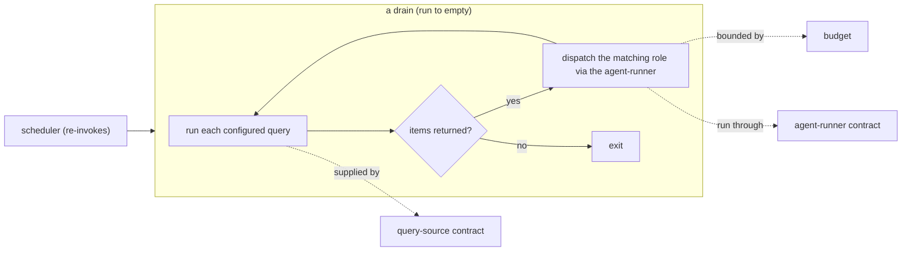

# pr-pool — behavior docs

These documents describe **how pr-pool should behave**, from the user's perspective.
pr-pool is a **generic orchestrator** and nothing more: it runs **queries** to
discover items of work, and for whatever a query returns it dispatches the matching
**role** to handle it, running that role through an **agent-runner** under a
**budget**. It repeats until nothing is ready (a **drain**), and a **scheduler**
re-invokes it.

pr-pool is deliberately ignorant of _what the work is_. Whether a query returns a
pull request, an alert, a backlog item, or a policy violation is **not pr-pool's
concern** — that meaning, and the workflow around it, is defined by whoever
configures the queries, roles, and prompts (a deployment). pr-pool therefore names
**no** specific tool and **no** specific workflow: it defines the **contracts** its
extensions plug into and guarantees only what an orchestrator can guarantee.

New to the vocabulary? Start with the [glossary](glossary.md); the rules are in
[invariants](invariants.md); the extension boundaries are in
[contracts](contracts.md). These follow the behavior-docs method
(`phillipgreenii-nix-agent-support · behavior-docs/docs/behavior`).

## What pr-pool is — and is not

| pr-pool _is_                                                 | pr-pool is _not_                                           |
| ------------------------------------------------------------ | ---------------------------------------------------------- |
| A drain: discover ready work → dispatch roles → run to empty | A definition of any workflow (review, merge, backlog, …)   |
| A dispatcher of configured roles over query results          | Aware of PRs/MRs, reviews, merging, gates, or stacked work |
| A budget- and failure-aware runner of an agent-runner        | The owner of what a role _does_ once dispatched            |
| A definer of contracts (agent-runner, query-source)          | A namer of any specific tool or organization               |

The workflows a deployment builds _on top of_ pr-pool — reviewing PRs, shepherding
changes to merge, working a backlog, escalation, triage — live in that deployment's
own behavior-doc set, not here.

## The model

## Documents

- **[glossary](glossary.md)** — pr-pool's orchestration vocabulary; read first.
- **[invariants](invariants.md)** — the orchestrator's own contract (the rules
  pr-pool guarantees).
- **[contracts](contracts.md)** — the extension boundaries: the **agent-runner**
  contract and the **query-source** contract a deployment plugs tools into.
- **[operating pr-pool](operating-pr-pool.md)** — how you drive it: choosing the
  queries, roles, and tools that fulfil the contracts.

## No org- or tool-specifics here

This set is generic and public. It **MUST NOT** name a tool or reference any
organization's deployment (`GOAL-SIMPLE-2`, `GOAL-METHOD-6`). Which tool fills the
agent-runner or a query-source, and every workflow built on pr-pool, is documented by
the deployment that does it — for example the ZR deployment keeps its set in its own
(private) repository. That set cites these invariant IDs; this set never points back
at it.
