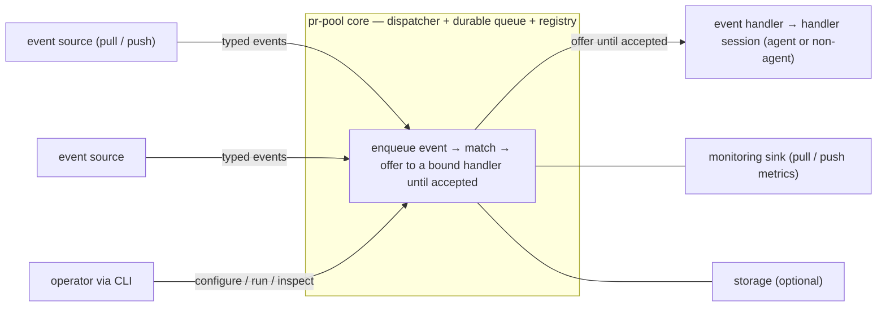

# pr-pool — behavior docs

pr-pool is a **dispatcher**: it routes **typed events** from pluggable **event sources** to bound
**event handlers**, through a small set of interfaces. The core knows only those interfaces — which
concrete implementation fills a **participant** (event source, event handler, monitoring sink, or
storage) is uninteresting to it. This set follows the behavior-docs method
(`phillipgreenii-nix-agent-support · behavior-docs/docs/behavior`).

Start here, then the [glossary](glossary.md); the rules are in [invariants](invariants.md), the
boundaries in [interfaces](interfaces.md), the actors in [actors](actors.md), and the stories,
journeys, and open questions in [journeys](journeys.md).

## The model

Event sources **emit** typed events; event handlers **bind** to event types (or other declared
fields) and respond to any of their bound events. Everything outside the core — event sources,
handlers, monitoring, storage — is a **participant** reached through an interface; adding another
implementation is a detail the core never sees. Handlers may be agent or non-agent.

## Scope (extent + floor)

- **Extent (in)** — matching and routing typed events to bound handlers; the participant interfaces
  and their common contract; the **durable, ordered, de-duped, TTL-bounded event queue** with
  at-least-once delivery; concurrency and per-handler capacity; the operator CLI; the metric catalog;
  the **wiring** (declared routing graph + validation); the daemon / run-until-idle lifecycle.
- **Extent (out)** — concrete participant **implementations** (ccpool, beads, prometheus, …) and any
  deployment-specific behavior live in a downstream deployment set that implements these interfaces;
  governance authority and tech choices are decision docs; the "how" is downstream.
- **Floor** — pr-pool speaks in events, bindings, participants, handler sessions, and wiring. It
  names no concrete tool, transport, tuning constant, or file layout.

## External references

This set follows the behavior-docs method and cites elements the method defines. Each external
element it references is declared here with the owner's UUID, so a cross-set reference resolves by
the owner's UUID — not the mutable name (a rename never breaks the seam). The owner set-path is the
cited `<repo> · <set-path>`; every owner below lives in the method set.

| Name     | Owner set-path                                                   | Owner UUID                           |
| -------- | ---------------------------------------------------------------- | ------------------------------------ |
| `INV-11` | `phillipgreenii-nix-agent-support · behavior-docs/docs/behavior` | f8174e40-806c-4c42-97da-996efd7c6e23 |
| `INV-19` | `phillipgreenii-nix-agent-support · behavior-docs/docs/behavior` | 4325bdf4-2458-4606-8b37-2e5e996aa53a |
