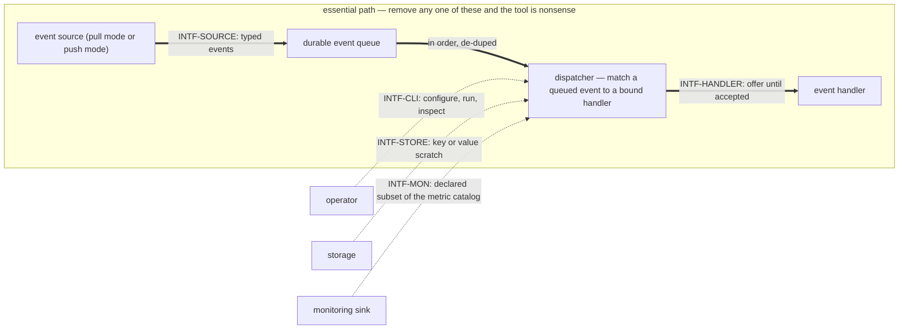

# pr-pool — behavior docs

pr-pool is a **dispatcher**: it routes **typed events** from pluggable **event sources** to bound
**event handlers**, through a small set of interfaces. The core knows only those interfaces — which
concrete implementation fills a **participant** (event source, event handler, monitoring sink, or
storage) is uninteresting to it. This set follows the behavior-docs method
(`phillipgreenii-nix-agent-support · behavior-docs/docs/behavior`).

Start here, then the [glossary](glossary.md); the rules are in [invariants](invariants.md), the
boundaries in [interfaces](interfaces.md), the actors in [actors](actors.md), and the stories,
journeys, and open questions in [journeys](journeys.md).

## The model

The diagram below **is** this set's **interface inventory** — the five interfaces and the participant
kinds behind them. It is not a data-flow diagram and not a component diagram.

**The essential path is event source → queue → event handler**, drawn thick and boxed above. An
event source **emits** typed events; whether the core pulls them or the source pushes them is a
**mode** of the one source participant kind, not two kinds. Every event reaches a handler **through
the queue**, so the queue is a node here rather than a phrase inside a subgraph label — it is the
universal intermediary, not a realization detail. An event handler **binds** to event types — and MAY
narrow on a payload path its own binding names — and responds to any of its bound events; **one run of
one handler against one event** is a **handler session**, which is why the handler and the session are
not the same box.
A handler may be agent or non-agent, and a configured handler's operator-facing name is its **role**.

**The operator, storage and the monitoring sink are optional participants**, drawn dotted and
outside the box: the system runs untouched without them. `INTF-STORE` says a **default in-memory**
store applies when none is configured, and `INTF-MON` says a sink may be absent or several. The
**operator** is optional on the **event path** in the same sense, while being the only actor who
authors the wiring — the operator shapes what flows without standing in the flow. So the event source
and the event handler are this system's **essential participants** and those three are its
**optional participants**: the second axis the method requires of every interface, alongside its
counterparty's kind.

**The frequency asymmetry is why that split is worth drawing.** A new event source or a new event
handler is added often, and that extension is what the tool exists for; storage and monitoring are
configured once or never. Grouping all five interfaces on **kind** alone would flatten exactly that
difference away, so this set groups them on kind **and** participation.

The interfaces themselves are in [interfaces](interfaces.md), each carrying a diagram of the
interaction it intends, because the method asks a set to show intent through examples
(`phillipgreenii-nix-agent-support · behavior-docs/docs/behavior · GOAL-7`). The concrete message
shapes those diagrams stand for are realization detail and live in pr-pool's decision docs
(`phillipgreenii-nix-agent-support · packages/pr-pool/docs/decisions · DEC-WIRE-1`); what an
implementation is actually checked against is the interface conformance suite (`INV-INTF-2`).

### The boundary principle

pr-pool knows an event was **delivered**. It knows **nothing** about what happens inside an event
handler and **nothing** about how an event source derives its events. What is left is the whole of
what pr-pool does: **enqueue, offer, accept-or-decline, expire, depth**.

One question generates that boundary: **does pr-pool ACT on the value, or merely HAND IT OVER?** A
value pr-pool acts on is part of pr-pool's own configuration and contract. A value pr-pool only
hands over is an **opaque token** — equally welcome, and it stays opaque. **Enforcing or
interpreting another tool's internals is what is out of scope.** A `command` handler's argv is the
shape of that grey area: it looks like another application's configuration living inside pr-pool's,
but pr-pool invokes it and never reads it, so it is a **pass-through** and belongs.
**Pass-through is fine; enforcing another tool's limit is not.**

Asking that one question is what puts the following five outside pr-pool's contract. They are **one
boundary, not five unrelated trims**:

1. **The handler's status callback** — what a running handler reports about its own progress is the
   handler's, so pr-pool takes no such stream back.
2. **Post-acceptance failure classes** — after acceptance the handler owns persistence, resume and
   retry, so a failure past that point is not pr-pool's to classify.
3. **Per-role capacity** — how many events a handler will run at once is the handler's own limit to
   keep, and pr-pool declares it nowhere.
4. **Per-run `state` and `progress` fields in the operator's status reply** — the same handler
   internals reached by a second route, so the same answer applies.
5. **Tool-specific event-source query types** — how a source finds its events is the source's, so
   pr-pool declares **one opaque source contract** rather than one type per tool.

Content the boundary puts outside this set is **relocated**, not discarded: it moves to pr-pool's
decision area by the method's relocation procedure
(`phillipgreenii-nix-agent-support · behavior-docs/docs/behavior · USECASE-5`). `GOAL-MIN-1` is this
principle's rule form; the principle is stated here, once, and nowhere else restated as a rule.

## Scope (extent + floor)

- **Extent (in)** — matching and routing typed events to bound handlers; the participant interfaces
  and their common contract; the **durable, ordered, de-duped, retention-bounded event queue** with
  at-least-once delivery; concurrency as the offer/accept model and its serialize marks — but **no
  declared per-handler ceiling**; the operator CLI; the metric catalog;
  the **wiring** (declared routing graph + validation); the daemon / run-until-idle lifecycle.
- **Extent (out)** — concrete participant **implementations** (ccpool, beads, prometheus, …) and any
  deployment-specific behavior live in a downstream deployment set that implements these interfaces;
  governance authority and tech choices are decision docs; the "how" is downstream.
- **Floor** — pr-pool speaks in events, bindings, participants, handler sessions, and wiring. It
  names no concrete tool, transport, tuning constant, or file layout.

## Realization gaps

This set's **realization-gap register** (`INV-23`): intended behavior this set's implementation has
not built yet, one row per gap, each keyed by the **element id** the gap is against. The register is
**set-level metadata and never part of an element** — which is exactly what lets it say where the
code currently stands without putting a status annotation or a _how_ into any definition. A gap is
**not** an open question: the intent below is settled and the build has not caught up, so no gap is
recorded as an `OQ-`. One element MAY carry more than one row, because merging two divergences into
one row would lose which of them converged. A row names where the work is tracked because this
project tracks it in beads; that column is this set's own choice, not the register's shape.

| Element      | Intended                                                                                                                                                   | Where the implementation stands                                                                                                                                                                                                                                                                                                                                     | Tracked by         |
| ------------ | ---------------------------------------------------------------------------------------------------------------------------------------------------------- | ------------------------------------------------------------------------------------------------------------------------------------------------------------------------------------------------------------------------------------------------------------------------------------------------------------------------------------------------------------------- | ------------------ |
| `INV-CONC-1` | capacity is handler-enforced and declared nowhere, never a core-tracked number                                                                             | the core both stores and enforces a per-role ceiling: `packages/pr-pool/internal/orchestrator/orchestrator.go:155` leases `n := r.Cap - bus.Inflight(r.Name)`, and `:202` stops at `worked >= role.Cap`                                                                                                                                                             | bead `pg2-f3mcb.2` |
| `INV-CONC-1` | a `type` MAY be marked to **serialize**, so events of that type never run in parallel                                                                      | no per-type serialization exists in the dispatch path — neither the event bus nor the queue's per-listener serial FIFO is a per-type mark, and nothing reads such a mark                                                                                                                                                                                            | bead `pg2-cl9jz`   |
| `INV-INTF-1` | a participant pushes its own self-status (`healthy`/`degraded`/`unavailable`, [interfaces](interfaces.md) "Self-status") over a callback the core hands it | no participant kind is handed a callback for this: `callbackFor` (`packages/pr-pool/internal/core/core.go:263`) hands a callback to `KindSource` only, and that target (`ingest-event`) carries events, not self-status; `Registry.SetSelfStatus` (`packages/pr-pool/internal/core/registry.go:169`) has zero production callers — only its own test suite calls it | bead `pg2-zaghi`   |

## External references

This set follows the behavior-docs method and cites elements the method defines, and its
implementation cites elements a downstream deployment set defines. Each external element it
references is declared here with the owner's UUID, so a cross-set reference resolves by the owner's
UUID — not the mutable name (a rename never breaks the seam). The owner set-path is the cited
`<repo> · <set-path>`, and this table spans **two** owner sets: the **method** set (the rules this
set follows) and the **ZR deployment** set (the deployment that implements these interfaces, whose
elements pr-pool's own implementation cites). The **what it is** column is one line, so a reader
learns why the row is there without following the reference, and the UUID is rendered as a link to
the owner's remote-served definition. **The UUID is the authority; the URL may rot** — a dead link is
an inconvenience, never a broken identity. A row declares **one** element: where the implementation
cites a whole family (`INTF-ZR-*`), the family resolves through the declared member below.

| Name             | What it is                                                                                                              | Owner set-path                                                   | Owner UUID                                                                                                                                            |
| ---------------- | ----------------------------------------------------------------------------------------------------------------------- | ---------------------------------------------------------------- | ----------------------------------------------------------------------------------------------------------------------------------------------------- |
| `INV-11`         | a set's extent is exactly what its stories, use cases and journeys require                                              | `phillipgreenii-nix-agent-support · behavior-docs/docs/behavior` | [f8174e40-806c-4c42-97da-996efd7c6e23](https://github.com/phillipgreenii/nix-agent-support/blob/main/behavior-docs/docs/behavior/invariants.md)       |
| `INV-18`         | inter-consistency at every interface, reconciled by the counterparty's kind                                             | `phillipgreenii-nix-agent-support · behavior-docs/docs/behavior` | [4c6a764b-02f5-4c85-afae-a082fe6c21cd](https://github.com/phillipgreenii/nix-agent-support/blob/main/behavior-docs/docs/behavior/invariants.md)       |
| `INV-19`         | a set MAY declare a precedence ordering over its own invariants                                                         | `phillipgreenii-nix-agent-support · behavior-docs/docs/behavior` | [4325bdf4-2458-4606-8b37-2e5e996aa53a](https://github.com/phillipgreenii/nix-agent-support/blob/main/behavior-docs/docs/behavior/invariants.md)       |
| `INV-23`         | the realization-gap register is set-level, named `## Realization gaps`, and never an element                            | `phillipgreenii-nix-agent-support · behavior-docs/docs/behavior` | [f3bba3e7-440f-4109-a4de-9d37daa34bcf](https://github.com/phillipgreenii/nix-agent-support/blob/main/behavior-docs/docs/behavior/invariants.md)       |
| `GOAL-7`         | a set SHOULD show intent through examples                                                                               | `phillipgreenii-nix-agent-support · behavior-docs/docs/behavior` | [42ad1aa1-af11-4387-bf02-e0f028f80434](https://github.com/phillipgreenii/nix-agent-support/blob/main/behavior-docs/docs/behavior/invariants.md)       |
| `USECASE-5`      | the method's procedure for relocating implementation content out of a behavior doc                                      | `phillipgreenii-nix-agent-support · behavior-docs/docs/behavior` | [7d6de948-3ef5-426a-949e-2dd872f06d28](https://github.com/phillipgreenii/nix-agent-support/blob/main/behavior-docs/docs/behavior/journeys.md)         |
| `INV-CCPOOL-6`   | a handler run held for a human decision is preserved, not reaped, and the accepting handler owns its resume             | `phillipg-nix-ziprecruiter · modules/zm/pr-pool/docs/behavior`   | [a5f2e14b-1a49-4bfd-be44-69acc603d685](https://github.com/phillipgziprecruiter/phillipg_mbp/blob/main/modules/zm/pr-pool/docs/behavior/invariants.md) |
| `INV-FRESH-1`    | don't act on stale truth — a readiness signal derived from data past its bound MUST NOT be presented as current         | `phillipg-nix-ziprecruiter · modules/zm/pr-pool/docs/behavior`   | [ceac8879-4bfd-45c7-94ed-9d8c3bd11c38](https://github.com/phillipgziprecruiter/phillipg_mbp/blob/main/modules/zm/pr-pool/docs/behavior/invariants.md) |
| `INTF-ZR-SOURCE` | the deployment's event sources implementing `INTF-SOURCE` — the declared member the `INTF-ZR-*` family resolves through | `phillipg-nix-ziprecruiter · modules/zm/pr-pool/docs/behavior`   | [9dad0914-4589-4690-9814-2f5936628722](https://github.com/phillipgziprecruiter/phillipg_mbp/blob/main/modules/zm/pr-pool/docs/behavior/interfaces.md) |
