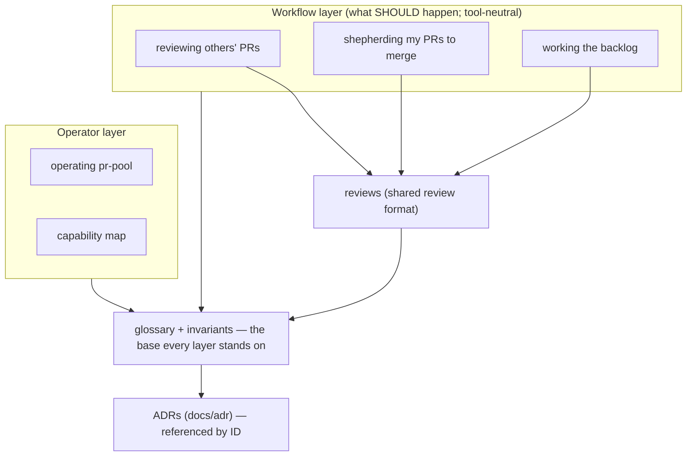

# pr-pool — behavior docs

These documents describe **how pr-pool should behave**, from the user's
perspective, in terms of user stories, journeys, constraints, goals, and
invariants. They are **org-agnostic**: how a specific organization _uses_ pr-pool
(its labels, team, integration styles, added roles) lives in a per-project overlay
in that org's own repo — see the overlays list below. New to the vocabulary? Start
with the [glossary](glossary.md).

These follow the behavior-docs method — what a behavior doc is, the in/out rubric,
the invariant-ID convention, the base/overlay layering, and change-control — defined
in `phillipgreenii-nix-agent-support · behavior-docs/docs/behavior`. This set does
not restate the method.

## Design principles for pr-pool

- **Keep the orchestrator minimal.** `pr-pool` orchestrates and nothing more; _how_
  work happens is defined by **configuration and extensions**, not baked into the
  tool. See [operating pr-pool](operating-pr-pool.md).
- **Org/repo-specific behavior lives in org/repo-specific repositories** — never in
  this generic set.

## The map

## Documents

- **[glossary](glossary.md)** — pr-pool's vocabulary; read first.
- **[reviewing others' PRs](reviewing-others-prs.md)** — team/requested/labeled PRs
  I don't own; first-pass agent draft reviews.
- **[shepherding my PRs to merge](shepherding-my-prs.md)** — my authored PRs to
  merge; stacked PRs; merge authority per integration style.
- **[working the backlog](working-the-backlog.md)** — pulling, triaging, routing,
  and doing backlog work with a do→review→resolve loop; not all work ends in a PR.
- **[reviews](reviews.md)** — what a review is and its output format
  (whole-review / per-file / per-block comments); shared by every workflow.
- **[cross-cutting invariants, goals & concepts](invariants.md)** — the ID'd rules
  that hold across every workflow.
- **[operating pr-pool](operating-pr-pool.md)** — how you drive the (deliberately
  minimal) orchestrator; workflow-agnostic.
- **[capability map](capability-map.md)** — which tool provides each capability
  today; the one place tool names concentrate.

## Per-project overlays (how pr-pool is actually used)

- **pr-pool @ ZR** — `phillipg-nix-ziprecruiter · pr-pool-components/docs/behavior`.
  ZR's watched labels, team, integration style, configured roles, and `.pr-pool`
  config. This generic set stays deployment-agnostic; the overlay supplies the
  specifics.

## Downstream reference

`docs/pr-review-flow.md` (repo root — code paths, tests, tool detail, current-state
framing) is **downstream**: how the review flow is realized in code today. It may
lag; when it and a behavior doc disagree, the behavior doc wins.
