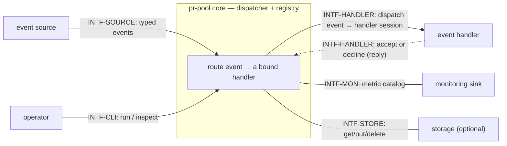
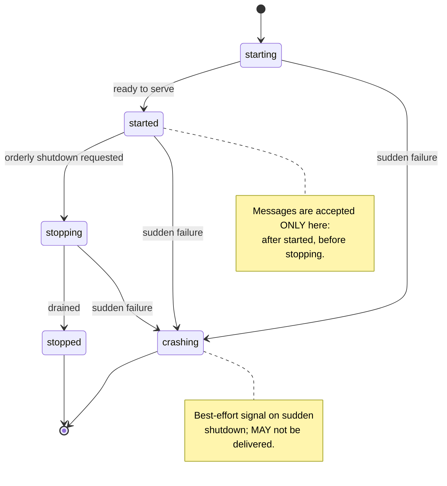
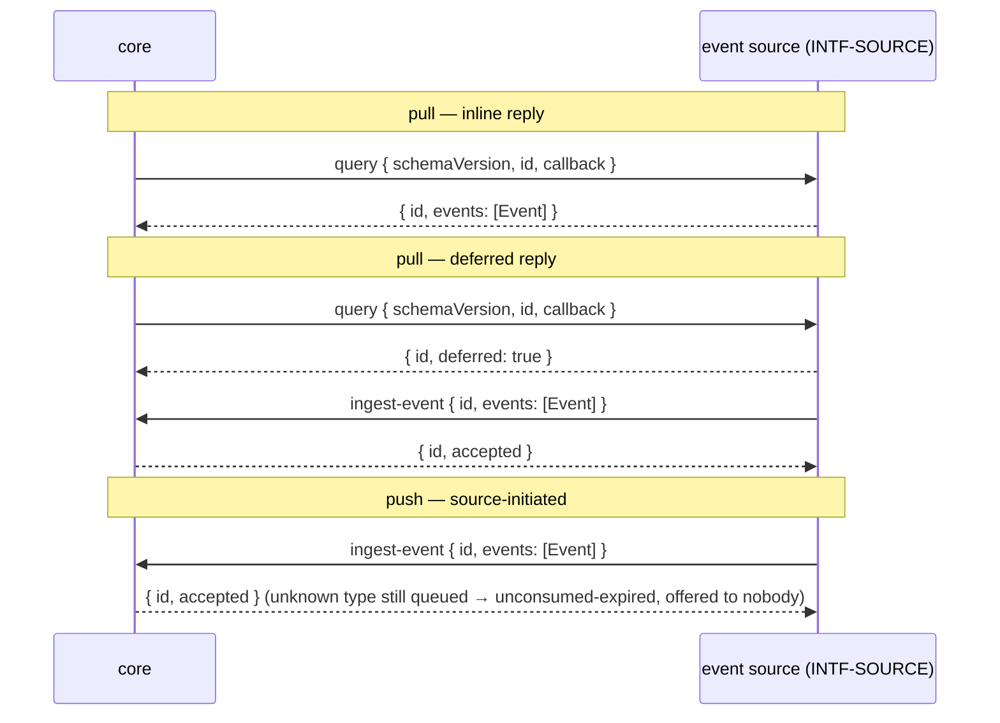
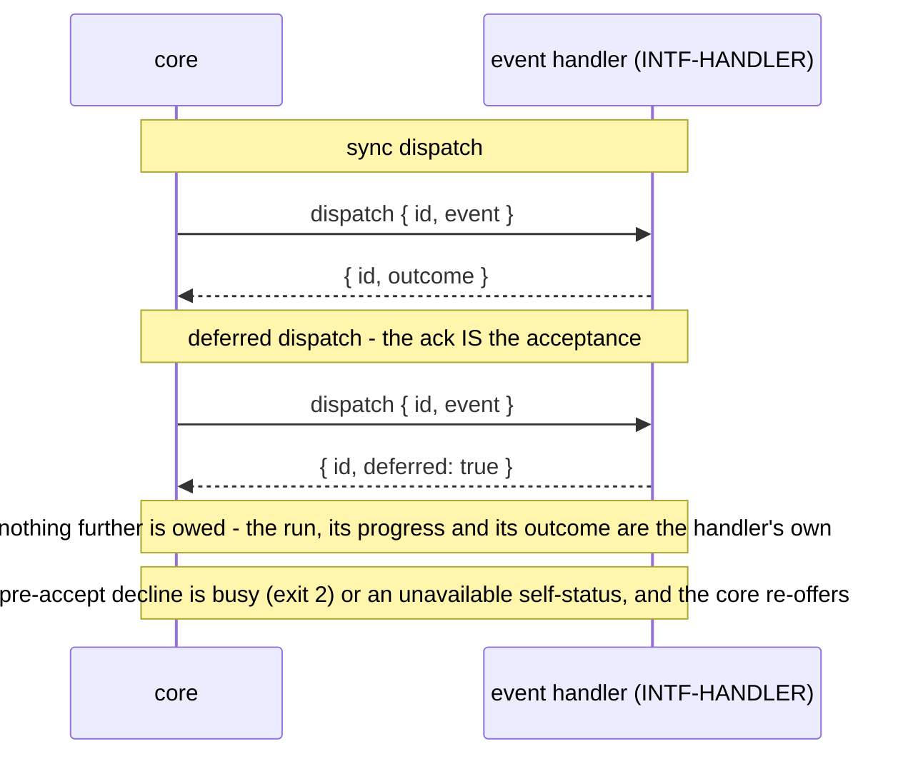
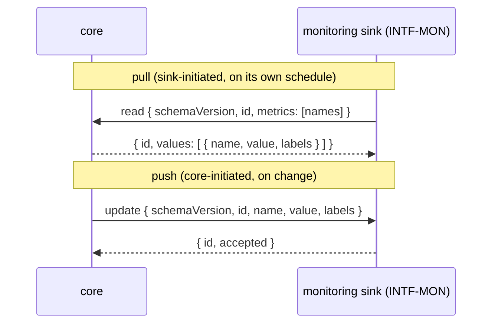
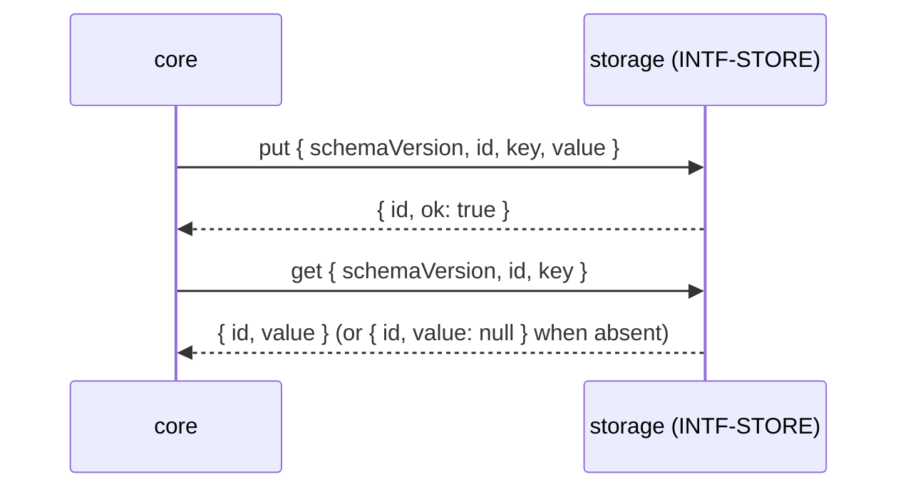
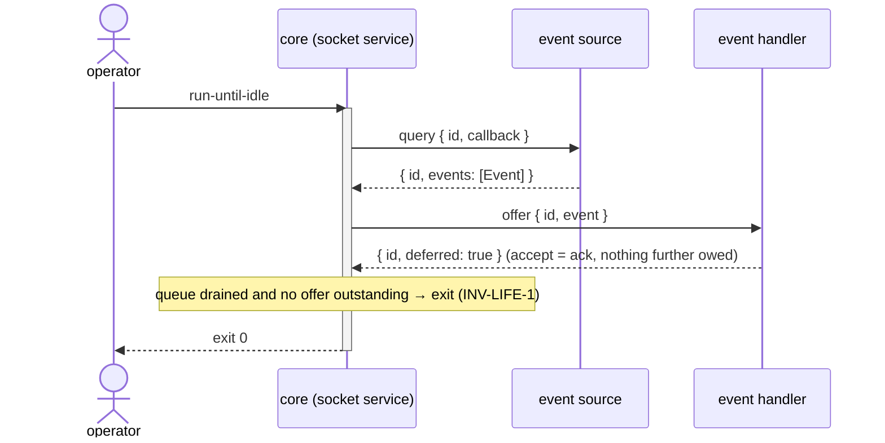
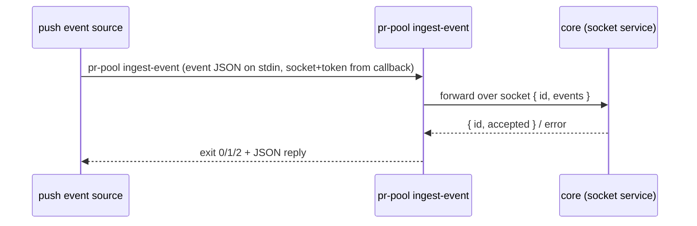

# Interfaces — pr-pool

This file follows the interface convention of the behavior-docs method
(`phillipgreenii-nix-agent-support · behavior-docs/docs/behavior`): an **interface** is a
boundary described by **what crosses it** and **what must hold**, so the parties on each side
can be confirmed to agree — never _how_ it is implemented. See the [glossary](glossary.md) for
terms, [actors](actors.md) for who sits on each side, [invariants](invariants.md) for the rules,
and [journeys](journeys.md) for the flows that exercise these interfaces.

pr-pool's core is a **dispatcher**: everything outside it is a pluggable **participant** reached
through one of the interfaces below. Which concrete implementation fills a participant — a bead
store, ccpool, prometheus — is uninteresting to the core; only these contracts are. (The concrete
implementations and any organization-specific workflow live in a downstream deployment set that
implements these interfaces.)

The five interfaces, each named for its boundary rather than a number, are:

| Interface      | Boundary                                 | Counterparty (actor)             | Initiator                    |
| -------------- | ---------------------------------------- | -------------------------------- | ---------------------------- |
| `INTF-SOURCE`  | typed events into the core               | `ACTOR-SRC` event source         | core (pull) or source (push) |
| `INTF-HANDLER` | events out to a handler; acceptance back | `ACTOR-HDL` event handler        | core                         |
| `INTF-MON`     | the metric catalog out                   | `ACTOR-MON` monitoring sink      | either (sink declares)       |
| `INTF-STORE`   | key/value scratch for core state         | `ACTOR-STO` storage              | core                         |
| `INTF-CLI`     | operator commands; manager callbacks     | `ACTOR-OP` operator (+ managers) | operator / manager           |



## The common manager contract

Every participant interface shares one shape. `INV-INTF-1` (in [invariants](invariants.md))
requires it; the details are here.

- **CLI transport.** The default **transport contract** invokes a participant as
  `<command> <subcommand>`; the **request payload is JSON on stdin** and the **reply is JSON on
  stdout**. A subcommand MAY take its own arguments, but arguments are never the payload channel.
  The _shapes_ are the **message schema**, not the wire format — a participant MAY instead speak a
  gRPC or in-code **transport contract** over the socket and still conform, so long as it carries the
  same message schema.
- **Schema-versioned payloads.** Every request and reply carries a `schemaVersion` string, and
  every payload is defined by the interface's formal **message schema** (a JSON Schema) that backs
  the conformance suite. A party that receives a `schemaVersion` it cannot handle MUST report it
  rather than guess. The shapes shown below are **illustrative examples**, not golden ones — the
  authoritative **message schemas** are the versioned JSON Schema artifacts each conformance suite
  checks against (`INV-INTF-2`).
- **Tracking id.** Every core→participant request carries a unique **tracking id** (`id`). A
  deferred result or a later callback correlates by **echoing that `id`** — or the participant MAY
  return its own tracking id in the deferred acknowledgement, which the core stores and maps back.
  Either way the core can match a later delivery to the original call. The tracking id is per-call.
- **Deferred replies.** A reply is **either** an inline result **or** `{ "deferred": true }`. Where a
  deferred reply still **owes the core a result**, the participant later reaches the core over its
  **callback** channel, keyed by the tracking id — `INTF-SOURCE`'s deferred `query`, whose events
  arrive later via `ingest-event`. Where the deferred reply **is** the acceptance and the core is owed
  nothing further — `INTF-HANDLER`'s `dispatch` — **no later callback follows**. The core handles
  either form on every call; a participant does not declare a sync/async mode up front. Which calls a
  given interface may defer is shown in that interface's sequence diagram below.
- **Callback.** When the core needs to be reached back, it hands the participant a single
  **callback** — one `command` string already carrying the socket and an auth token as arguments.
  The participant appends its own arguments and runs it; it never assembles the socket or token
  itself. The one concrete callback target for a deferred or pushed result is the `INTF-CLI`
  `ingest-event` subcommand — a **source**'s. A handler needs no callback target of its own: its
  acceptance already arrives in the **dispatch reply**, so nothing is left for it to call back about.
- **Coarse exit codes.** A subcommand's exit code stays coarse: `0` ok, `1` unexpected error,
  `2` busy. The **rich outcome is in the JSON reply**; a participant in a degraded state MAY return
  an exit code only (e.g. busy → `2`, no body).
- **Self-status.** Any participant MAY push its **own** status — `healthy` / `degraded` /
  `unavailable` — over its callback channel, independent of any per-item outcome. This is the
  participant reporting on **itself**, and it is the **only** status channel into the core: an
  `unavailable` self-report is a **pre-accept decline** the core acts on by re-offering the event
  while it is unexpired (`INV-FAIL-1`, `INV-CONC-1`). It is distinct from the accept-or-decline reply
  a participant gives to one dispatched item, and pr-pool takes no per-item progress stream at all.
- **Registry & lifecycle.** A participant **registers** with the core (joins the **registry**) to
  receive lifecycle signals and to make its callback reachable, and **deregisters** on exit. The
  lifecycle and its state diagram are the next section.
- **Conformance suite.** Each interface ships a suite of **positive and negative checks** that
  invoke the subcommands and assert the replies match the JSON Schema, so an implementation can
  verify it adheres _before_ the core is trusted to route through it (`INV-INTF-2`).

## Lifecycle

The core signals a participant through a fixed lifecycle. For an executable participant these are
realized as spawn/stop; for a daemon participant that may outlive the core, as register/deregister.
The core tolerates participants whose lifetime is shorter or longer than its own; **multiple**
participants of any kind may exist, and one process MAY implement several interfaces at once (the
core neither knows nor cares).



- **`starting`** — the participant is initializing (opening its store, registering). The core does
  **not** yet route messages to it, and does not yet rely on its callback.
- **`started`** — the participant is serving. **This is the only state in which messages are
  accepted** — core→participant requests and participant→core callbacks. `INV-INTF-1` states this
  boundary as a rule.
- **`stopping`** — an orderly shutdown is underway. The core stops issuing _new_ requests; in-flight
  deferred work MAY complete on the callback channel or be abandoned. New messages are not accepted.
- **`stopped`** — the participant has drained and deregistered; no messages cross.
- **`crashing`** — a **best-effort** signal emitted on a _sudden_ shutdown (crash or forced kill)
  from any active state. It is a courtesy, not a guarantee: it MAY be lost entirely. A participant
  or the core that receives it SHOULD treat the peer as immediately gone. Because it is best-effort,
  no correctness rule may depend on it — it only lets the healthy side react faster than a timeout.

## Event delivery (shared by `INTF-SOURCE` and `INTF-HANDLER`)

Delivery of an **event** from a source to a handler goes through the core's **durable, ordered,
de-duped, retention-bounded queue** and is **at-least-once** (`INV-EVT-1`, `ADR 0031`). An event is
enqueued durably and the core **offers it until a handler accepts** (`INV-CONC-1`), and **every
matching handler gets at least one opportunity** — nothing is dropped un-offered. An event carries an
optional **`at`** (the source stamp; absent, the core's own ingest-now applies) and an optional
**`expiresAt`** (an absolute instant; absent, `at` applies). If the event is **already expired at the
moment an attempt is made, that attempt is the last one for that handler**, after which the event is
dropped unconditionally (unconsumed-expired, `INV-EVT-4`). An accepted event is **retained** while its
`id` is still needed for de-duplication and while any matching handler is still owed an attempt, and
delivery **survives a restart**.

**Acceptance** is the reply that hands responsibility to the handler: an inline **completion**
(synchronous) or a deferred **ack** (asynchronous), keyed by the tracking id. The core's delivery
responsibility ends at acceptance; the durable record is written **after acceptance is confirmed**,
so a **narrow crash window** (accepted but not yet persisted) MAY redeliver. Therefore:

- an **event handler MUST tolerate duplicates** (be idempotent) — the crash window, a pre-accept
  re-offer while the event is unexpired, or a source re-emitting can redeliver the same event
  (`INV-EVT-2`);
- the core **de-duplicates by event `id` across the retained id set** — including ids already
  delivered/accepted (`INV-EVT-3`) — so a source never has to track "did I already emit this". With
  the born-expired default that retention window is roughly one dispatch cycle, so a pull source's
  next-trigger re-emit is **not** deduped (`INV-EVT-3`);
- a **pull source** re-derives current truth on its next **query trigger**; a **push-only source**'s
  events are now **durable through their retention** (no longer lost on a core restart), lost only if
  nothing accepts them before they expire.

A callback bearing a **tracking id the core does not recognize** (never issued, or already expired and
evicted) is **acknowledged and ignored** — a logged no-op, not an error, and it does not resurrect an
expired event (`INV-INTF-1`).

## `INTF-SOURCE` — event source <!-- uuid: fe42416a-5f10-4db1-b8c3-46b1609213c7 -->

- **Counterparty:** `ACTOR-SRC`, a pluggable event source. **Initiator:** core (**pull**) or source
  (**push**). **Multiplicity:** zero or more.
- **Purpose:** supply typed **events** for the core to route.

**One opaque invocation, not a menu of source kinds.** There is exactly **one** source contract. To
pull, the core makes **one invocation** of the source and reads the reply against the **query-reply
contract** below; it does not know — and **MUST NOT** be told — **what kind** of source it is
invoking or how that source arrives at its events. Whatever a particular source needs in order to
answer (a tool it drives, a query language, credentials, paging, a cache) sits **inside** the
invocation the operator configures, and is **never** a case the core distinguishes: the core would
otherwise hold one tool's configuration inside its own, which is what `GOAL-MIN-1` forbids and what
the boundary principle in this set's [README](README.md) rules out. So **adding a source is
configuration**: name the invocation, the event types it emits, and — for a pull source — its query
trigger. The core gains nothing.

**Pull mode.** The core invokes `query` on a **query trigger** — a **periodic** tick. The reply
carries events inline, or defers and delivers them later on the callback (the `ingest-event`
target).

**Push mode.** The core never calls `query`; the source invokes the `ingest-event` callback as
external facts arrive. A push-only source still **registers** so it appears in the registry and its
lifecycle is known.

**The query trigger belongs to the core, and stays.** Deciding **when to poll** is pr-pool's own
scheduling decision, taken from pr-pool's own state; it is not part of the source's configuration and
a source is never asked when it would like to be queried. That is why the trigger stays in this
contract while the query's internals do not — the two look alike from outside and are opposite sides
of the boundary.

**What a source declares — and what it does not.** A source declares the **event types it emits**;
that declaration, its invocation, and its mode are the whole of its configuration. The declared
emitted types are a **contract boundary and MUST stay one**: the wiring validation runs on them in
**both** directions (`INV-WORKFLOW-1`, `JOURNEY-VALIDATE`) — a bound `type` no source emits is an
orphan error, and an emitted `type` no binding covers is a warned dead end — and neither check has
anything to compare without them. What a source does **not** declare is which of its fields may be
matched, or any shape for `payload`: **matchability is the handler's alone** (`INV-DISP-1`).

**Event shape** (illustrative):

```json
{
  "schemaVersion": "1",
  "id": "evt-abc123",
  "type": "review-requested",
  "at": "2026-07-16T12:00:00Z",
  "expiresAt": "2026-07-16T12:15:00Z",
  "payload": {
    "note": "source-defined; OPAQUE to the core except a path a binding names"
  }
}
```

- `id` — unique; the core de-duplicates on it across the retained id set (`INV-EVT-3`).
- `type` — the **primary matcher**: a **binding** MUST match it before anything else applies.
- `at` — **optional** source stamp. Absent, the core's own "now" at ingest is used (`INV-EVT-1`).
- `expiresAt` — **optional**, an **absolute instant**. Absent, `at` is used, so an event carrying
  neither field is **born expired**: offered once to every matching handler, then dropped
  (`INV-EVT-4`). Setting it in the future is how a retry window is requested; nothing computes a
  duration.
- `payload` — MUST be a JSON **object** (a keyed structure, never a bare scalar/array), so a handler
  always receives a struct. The core neither reads nor validates it, save for a single path a
  **binding** names for narrowing (below). Its **shape is not declared anywhere** — see
  `OQ-EVT-CATALOG`.

**Matching (what a binding may match).** A **binding** matches an event over its **fields**, and
**matchability is the handler's alone** — a source declares nothing about which of its fields may be
matched:

- `type` is the **primary matcher** and **MUST** match; a binding does not match an event whose `type`
  it does not name, whatever else that event carries;
- a binding **MAY** then carry one **narrowing predicate** over a **payload path it names itself**,
  applied **only after** the type match succeeds. The core reads **only that path** and nothing else
  in the payload, so `payload` stays opaque everywhere the binding does not point — it is the
  **binding**, not the source, that makes one path readable _for matching_;
- a field or payload path a binding names that is **absent** on a given event **simply does not
  match** — that is a non-match, not an error.

This is the field-matching model `INV-DISP-1` states as a rule.

A named path **cannot be validated when the config is authored**, because no per-`type` payload shape
is declared anywhere (`OQ-EVT-CATALOG`); **while that open question stands**, a mistyped path narrows
to nothing and nothing reports it. That is the deferred catalog's consequence, not a property of path
matching: settling `OQ-EVT-CATALOG` gives config-time validation a shape to check the path against.

**Unknown type.** An event whose `type` no configured binding matches is **accepted into the queue**
and, with no handler to offer it to, **is dropped unconsumed-expired** — not a rejection of the
source. The core records it to logs and the unconsumed-expired metric; a `type` with
**no configured binding at all** is also surfaced as a **config-time warning** (`JOURNEY-VALIDATE`).
This is the "no event misses" visibility signal, not a runtime error (`INV-DISP-3`).

**The query-reply contract carries events or a deferral, and nothing else — so it stays as it is.**
A reply says either "here are events" or "later, on the callback"; it carries no view into how the
source produced them and no per-run stream about the source itself. The source side therefore has
**no twin** of the handler-side internals the boundary principle puts outside this contract: there is
nothing here to trim, and a later reader MUST NOT trim it by analogy with the handler side. What the
core acts on — the events, and whether it must wait — is exactly what crosses.



## `INTF-HANDLER` — event handler <!-- uuid: 10939663-7a48-4d44-8c4a-9a2df8ae4654 -->

- **Counterparty:** `ACTOR-HDL`, a pluggable event handler. **Initiator:** core. **Multiplicity:**
  one or more. (A handler's concrete kind — a **role** — is named in a downstream deployment set;
  the core knows only the interface.)
- **Purpose:** run a handler against one event as a **handler session**, tracked by the request's
  tracking id, and report its outcome.

**Dispatch (core → handler)** (illustrative):

```json
{
  "schemaVersion": "1",
  "id": "hs-771e",
  "event": {
    "id": "evt-abc123",
    "type": "review-requested",
    "expiresAt": "2026-07-16T12:15:00Z",
    "payload": {}
  }
}
```

- **Reply (sync):** `{ "schemaVersion": "1", "id": "hs-771e", "outcome": { … } }` — an inline
  completion: the handler took the event and finished it inside the call.
- **Reply (deferred):** `{ "schemaVersion": "1", "id": "hs-771e", "deferred": true }` — an **ack**:
  the handler took the event and will run it on its own. The core never holds an open call across
  long or paused work, and **the ack is the last thing the core is owed** for that dispatch.

**A handler's run status is not part of this contract.** The core's delivery responsibility ends at
acceptance (`INV-EVT-1`, `INV-FAIL-1`), so how far a handler has got, what it is doing, and how it
finished are the **handler's** to expose on the **handler's own** surface (for a ccpool-backed
handler, ccpool's own CLI — which pr-pool's implementation already reads directly rather than being
pushed to, so nothing that works today depended on a status callback). The core keeps only what it
needs to route: acceptance per `(event, handler)`, queue depth, and the unconsumed-expired count
(`INV-OBS-1`).

A handler reporting **its own** health — `healthy` / `degraded` / `unavailable`, over the common
**self-status** channel above — is a **different channel**, and pr-pool **does** act on it: an
`unavailable` self-report is a **pre-accept decline** that drives the core's re-offer (`INV-FAIL-1`,
`INV-CONC-1`). Self-status describes the **participant**; it never describes one dispatched event, so
the two never collide.

**Failure class** (coarse; response follows the **acceptance boundary**, `INV-FAIL-1`). This
vocabulary is the **handler-side** contract — a handler reports these and `INV-FAIL-1` routes them —
and it is deliberately **not** the list of things pr-pool measures. pr-pool **classifies and counts**
the **delivery-side** cases only: a **pre-accept decline** (`unavailable`, or a **`busy` exit code
`2`**) and a **dispatch failure** where the core could not hand the event over at all (`INV-OBS-1`).
The three **post-accept** classes — `retryable`, `resource-limit`, `critical` — pr-pool merely **hands
over**; they are the accepting **handler's own observability concern** and live on the handler's own
surface (for a ccpool-backed handler, ccpool's own metrics and logs), so their absence from pr-pool's
metric catalog is the boundary working, not an oversight.

| class            | meaning                                                       | response                                            |
| ---------------- | ------------------------------------------------------------- | --------------------------------------------------- |
| `retryable`      | transient (network blip, flake)                               | post-accept: handler retries; MAY surface / re-emit |
| `resource-limit` | a capacity/quota ceiling (e.g. a usage window) — not a defect | post-accept: handler pauses, resumes once it lifts  |
| `unavailable`    | cannot take work now (down, starting, or at capacity)         | pre-accept decline: core re-offers while unexpired  |
| `critical`       | MUST NOT be retried; a human is needed                        | post-accept: surfaced to a human; never re-offered  |

The core itself re-offers **only on a pre-accept decline** — an `unavailable` report, or a **`busy`
exit code `2`** when the handler is at capacity (`INV-CONC-1`). Once a handler **accepts** an event,
retry/resume/persistence is the **handler's** responsibility (`INV-FAIL-1`), not the core's.

**Obligations.** A handler **MUST tolerate a duplicate event** (be idempotent) and **MUST support
the deferred form**, so a paused or long-running handler session never pins an open call from the
core.



## `INTF-MON` — monitoring sink <!-- uuid: 11c08936-42df-4fd6-a912-70fe88244012 -->

- **Counterparty:** `ACTOR-MON`, a pluggable monitoring sink. **Initiator:** either — the sink
  **declares** push or pull. **Multiplicity:** optional; may be absent or several.
- **Purpose:** expose the core's metrics. The **core owns the metric catalog** — a declared set of
  metrics, each with `name`, `kind` (`counter | gauge | histogram`), `unit`, and label shape,
  including **queue depth**, **failure rate**, and **unconsumed-expired** (`INV-OBS-1`). An
  **observer** (`ACTOR-OBS`) reads the sink's surface, never the core directly.
- **Emission transport:** the default is **OTel for metrics only** (a neutral standard, not a
  mandated backend); **logs stay JSONL**. Observability covers metrics + logs (traces later). The
  concrete backend (a scrape target, a log store) is the sink's own binding.
- A sink **declares which mode it uses and which subset of the metric catalog it handles**:
  - **pull** — the sink reads current values from the core on its own schedule;
  - **push** — the core sends the named metric updates to the sink as they change.
- The sink's own external surface (e.g. serving a scrape endpoint, writing a dashboard feed) is
  entirely the sink's concern and invisible to the core.



## `INTF-STORE` — storage <!-- uuid: aa658dfb-7631-4f16-87aa-6c17d9abc097 -->

- **Counterparty:** `ACTOR-STO`, an optional pluggable storage. **Initiator:** core.
  **Multiplicity:** optional; a **default in-memory** store applies when none is configured.
- **Purpose:** a general **key/value scratch for core state** — **explicitly not event delivery**.
- **Operations:** `get(key) → value?`, `put(key, value)`, `delete(key)`; `key` is a string, `value`
  is a JSON string; each request/reply carries `schemaVersion`. The operation set is identical
  whether the backing is in-memory, local, or remote — the core codes to the interface, never the
  backing.
- **Guarantees.** Best-effort like any participant: the core MUST function if storage is absent or
  down, and MUST NOT rely on it to back any delivery guarantee. The default store's contents do not
  survive a restart.



## `INTF-CLI` — operator commands (and the manager callbacks) <!-- uuid: 746dd5a6-34c4-4294-b727-e442c2afa723 -->

- **Counterparty:** `ACTOR-OP`, the operator. **Initiator:** operator. The same binary
  **also** carries the **manager→core callback** subcommand `ingest-event`; it belongs to
  `INTF-SOURCE`'s manager-initiated direction and is invoked through the callback the core hands
  out, not by the operator.
- **Operator push-inject.** The operator subcommand `push-inject` (below) is the **operator-facing
  front door to the push-ingest path**: it performs the **same core-side enqueue** as the
  `ingest-event` manager callback, but is **operator-initiated** (not invoked through a core-issued
  callback). The injected event is durable via the queue and delivered at-least-once and deduped like
  any push event (`INV-EVT-*`); no new delivery semantics. It is **distinct from** `ingest-event` (a
  manager→core callback) and from `run-role` (a one-shot smoke test that tears down).
- **Locating the core.** The CLI finds the running core via an injected socket path (env/arg) or by
  discovering the running socket service. When neither locates a **running** core, the CLI **MUST
  fail with a "no running core" error** and a **non-zero exit code**; it **MUST NOT start one**.
  Locating means being able to **reach** a core, not merely finding a trace that one once existed — a
  trace left behind by a core that has died is the same outcome as no trace at all. This holds on
  every locate path: the manager callbacks and the operator subcommands alike (`ADR 0036`).
- **Output.** Every operator subcommand emits **human-readable text by default** and **JSON with
  `--json`** for machine consumption. Coarse exit codes follow the common contract (`0` ok, non-zero
  on error; a usage error is distinct from a runtime error).

### Global options

| Option                 | Effect                                                                   |
| ---------------------- | ------------------------------------------------------------------------ |
| `--json`               | emit JSON instead of text (any operator subcommand)                      |
| `--only <selector>`    | allow-list: restrict the **active** set of sources/handlers for this run |
| `--disable <selector>` | deny-list: exclude sources/handlers for this run                         |
| `--version`, `-v`      | print the version and exit                                               |
| `--help`, `-h`         | print help and exit                                                      |

`--only` / `--disable` (and their env equivalents) restrict the active set **without editing
config** — the mechanism behind `STORY-OP-3`. They scope which sources and handlers a `run` /
`run-until-idle` activates and which a smoke test may reach.

### Operator subcommands

| Subcommand                | Arguments                      | Behavior                                                                                                                                                                                                                                                                                                                                                                                                                                                               |
| ------------------------- | ------------------------------ | ---------------------------------------------------------------------------------------------------------------------------------------------------------------------------------------------------------------------------------------------------------------------------------------------------------------------------------------------------------------------------------------------------------------------------------------------------------------------- |
| `run`                     | —                              | Start the core as a long-running **daemon** (socket service); route events as sources emit them until stopped.                                                                                                                                                                                                                                                                                                                                                         |
| `run-until-idle`          | —                              | Start the socket service and dispatch from the durable queue; **exit once the queue is drained and no offer is outstanding** (every enqueued event accepted or expired, and no handler holding an offer, `INV-LIFE-1`). The default when no subcommand is given.                                                                                                                                                                                                       |
| `run-role <role> <event>` | role, event                    | **Smoke test**: dispatch **one named event** through **one handler** (its CLI-facing name is its _role_), then tear down. Runs **no discovery** — the event is explicit. Sets a **test-mode** signal (env) so the handler knows a test is in flight.                                                                                                                                                                                                                   |
| `run-query <query>`       | query                          | **Smoke test**: run **one pull source's query** once, **read-only**, and print the events it would emit. Also sets the test-mode signal.                                                                                                                                                                                                                                                                                                                               |
| `push-inject <json>`      | event JSON                     | Inject an **arbitrary operator-supplied event** into the **live** core — the same core-side enqueue as the `ingest-event` manager callback, but **operator-initiated**, locating/authenticating the core like the other operator subcommands. Durable via the queue, delivered at-least-once and deduped (`INV-EVT-*`). **Distinct** from `ingest-event` (a manager→core callback) and `run-role` (a smoke test that tears down). Primarily for manual/test injection. |
| `status`                  | —                              | Resolved-config summary **plus** live **deliveries** and per-`type` **queue depths**.                                                                                                                                                                                                                                                                                                                                                                                  |
| `config`                  | `--show` \| `--print-defaults` | `--show` prints the **resolved** configuration; `--print-defaults` prints the built-in defaults as a copy-paste starting point.                                                                                                                                                                                                                                                                                                                                        |

_"role"_ is the operator-facing name for a configured **event handler** (its concrete kind); the
core dispatches it as a **handler session**. _"query"_ names one pull **event source**'s query.

### Manager→core callback subcommand

This is the concrete callback target the core hands out (socket + token already baked in); a manager
appends its arguments and runs it. It follows the common contract (JSON on stdin → JSON on stdout;
coarse exit codes). There is **one**: the core takes event ingest back over the callback channel and
nothing else. In particular a handler pushes back **no run status at all** — the core's delivery
responsibility ends at acceptance (`INV-EVT-1`, `INV-FAIL-1`), so there is nothing for it to report.

**`ingest-event`** — a **push source**, or a **deferred pull** reply, delivers one or more events.

Request (stdin):

```json
{
  "schemaVersion": "1",
  "id": "trk-9f2c",
  "events": [
    {
      "id": "evt-abc123",
      "type": "review-requested",
      "expiresAt": "2026-07-16T12:15:00Z",
      "payload": {}
    }
  ]
}
```

Reply (stdout, exit `0`):

```json
{ "schemaVersion": "1", "id": "trk-9f2c", "accepted": 1, "rejected": [] }
```

`accepted` counts the events the core **took**, which is broader than "freshly appended": a
still-retained **duplicate** `id` is accepted too, because de-duplication is the core doing its job
(`INV-EVT-3`). The reply carries **no field** separating a fresh append from an absorbed re-emit, so
`accepted` is not a fresh-append count and a caller cannot distinguish the two over this interface.

Under the durable queue an event whose `type` matches no binding is **still accepted** (exit `0`,
counted in `accepted`) — it is enqueued and **expires unconsumed**; visibility comes from
the **config-time warning** (`JOURNEY-VALIDATE`) and the **unconsumed-expired** metric, not from a
rejection (`INV-DISP-3`). The `rejected` list therefore carries only **malformed** events (bad schema
or missing required fields), each with a reason — e.g. exit `1` with:

```json
{
  "schemaVersion": "1",
  "id": "trk-9f2c",
  "accepted": 0,
  "rejected": [
    {
      "id": "evt-abc123",
      "reason": "malformed: missing required field \"type\""
    }
  ]
}
```

**`status --json`** (operator side, for reference):

```json
{
  "schemaVersion": "1",
  "deliveries": [
    { "id": "hs-771e", "handler": "review", "event": "evt-abc123" }
  ],
  "queues": [{ "type": "review-requested", "depth": 3 }],
  "config": { "sources": 2, "handlers": 3 }
}
```

`deliveries` is **delivery provenance** — which event the core handed to which handler, keyed by that
dispatch's tracking id — and the core legitimately knows it, because it already marks acceptance per
`(event, handler)` (`INV-EVT-1`). It is **not** a window into a handler session, so it carries no
per-run state and no progress: those are the accepting handler's own, on the handler's own surface.
`queues` is the per-`type` depth `INV-OBS-1` obliges, and `config` is pr-pool's own resolved
source/handler count.





## Configuration (an interface the operator authors)

The **configuration structure** is itself a first-class interface — the operator authors it, and
the CLI resolves it (`config --show`). It declares: the participants (each with its command, mode,
and — for a monitoring sink — its selected metrics); the sources, each as **one invocation** plus the
event types it emits and, for a pull source, its query trigger — never a per-tool source kind
(`GOAL-MIN-1`); the handlers and their event-type **bindings** (including any **payload path a
binding names** for narrowing); and the workflow wiring the core validates (`INV-WORKFLOW-1`). Expiry is **not** declared here — it
rides on each event as `at` / `expiresAt` (`INV-EVT-1`, `INV-EVT-4`). The `--only` / `--disable`
selectors above restrict the _active_ subset of this config per run without editing it.

The **full configuration schema** is not yet pinned; it is tracked as an open question
(`OQ-CONFIG`), with pr-pool's existing TOML as prior art.

## Notes / forward references

- **Inter-consistency (method `INV-18`) binds here in its _implementer_ form.** Every counterparty
  above is either a pluggable implementation with no behavior-docs set of its own or a downstream
  deployment set that **implements** these interfaces. In both cases
  agreement is reconciled by the **conformance suite** (`INV-INTF-2`) each implementation runs, not
  by a verbatim peer cross-check: an implementer **cites** this contract and states only its own
  side, and a counterparty with no set leans on the same suite as its sole reconciliation. Each
  interface here **is** the authoritative contract its implementations adhere to.
- **Open questions** (tracked in [journeys](journeys.md)): `OQ-WORKFLOW` (pre-runtime wiring
  validation of the bindings), `OQ-CONFIG` (the full configuration schema), and `OQ-EVT-CATALOG` (a
  declared per-`type` payload shape — what a binding's narrowing path would be validated against at
  config time, and what would make two sources' events on one `type` comparable at all).
