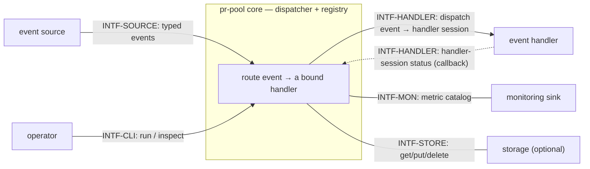
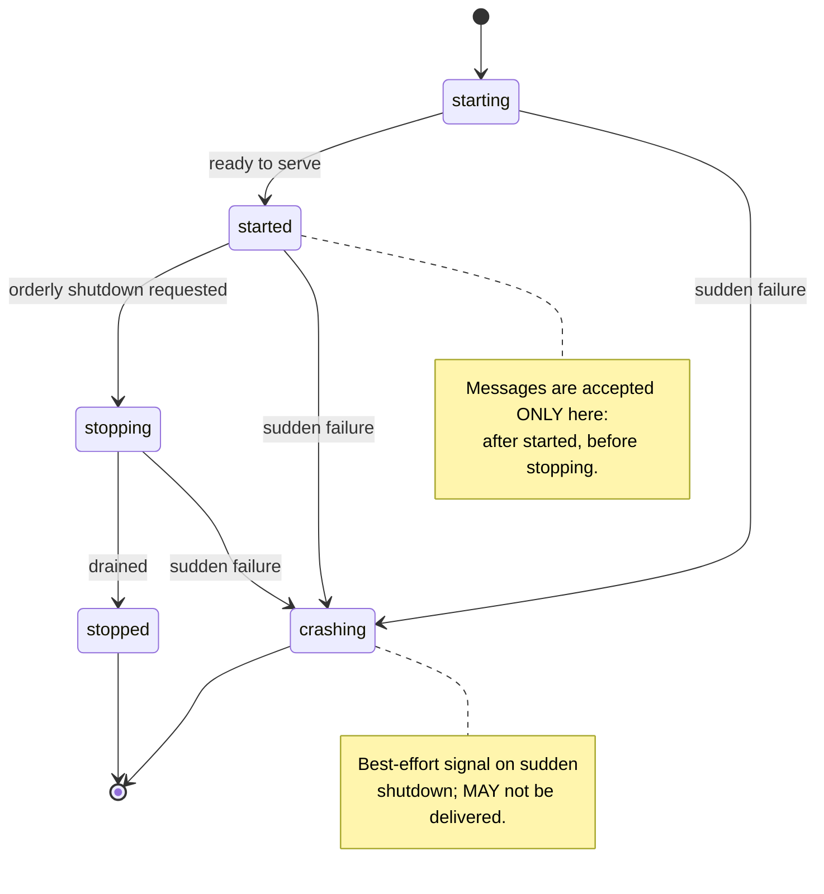
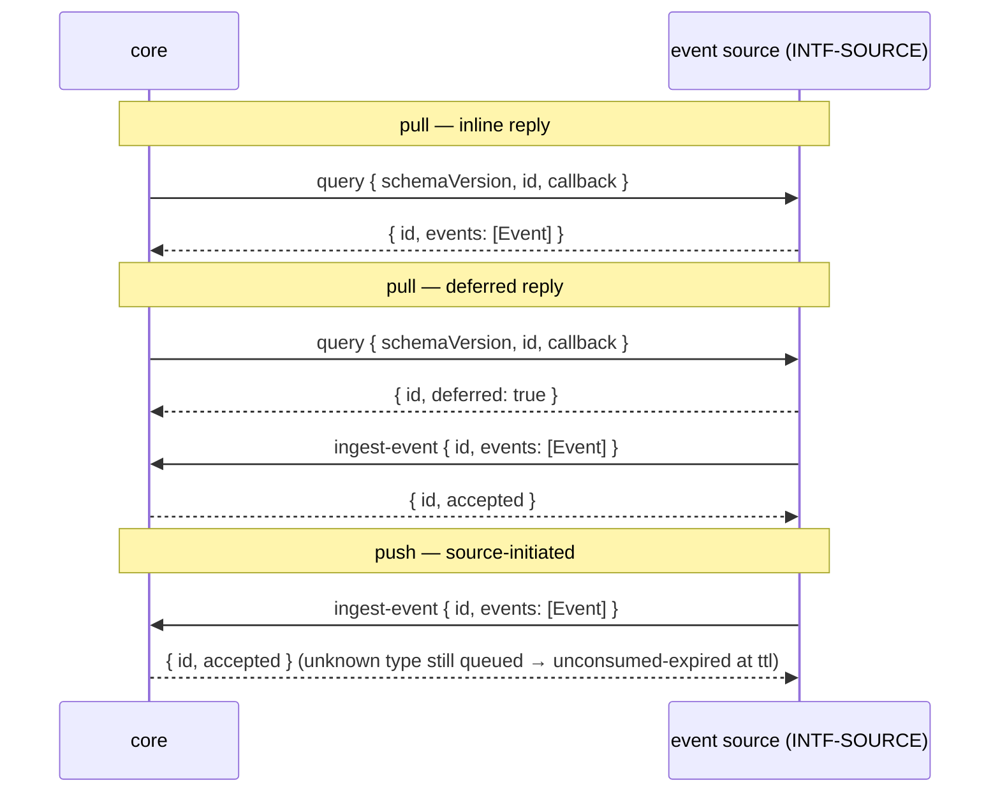
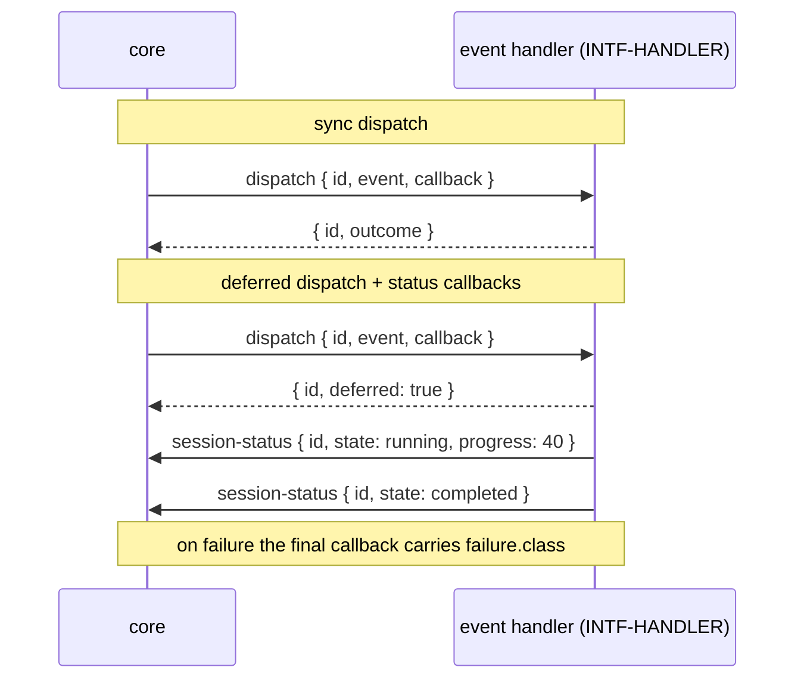
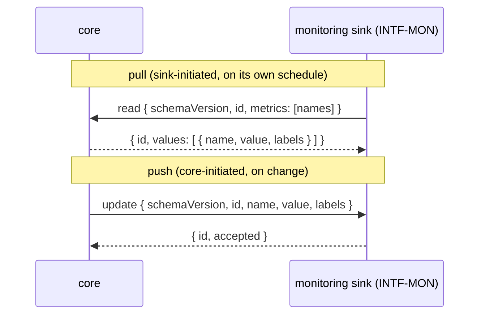
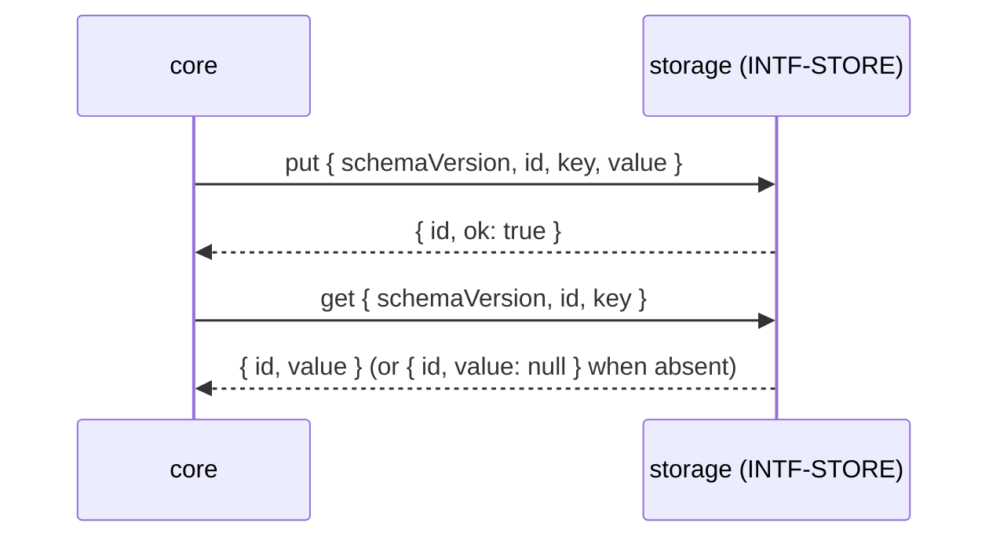
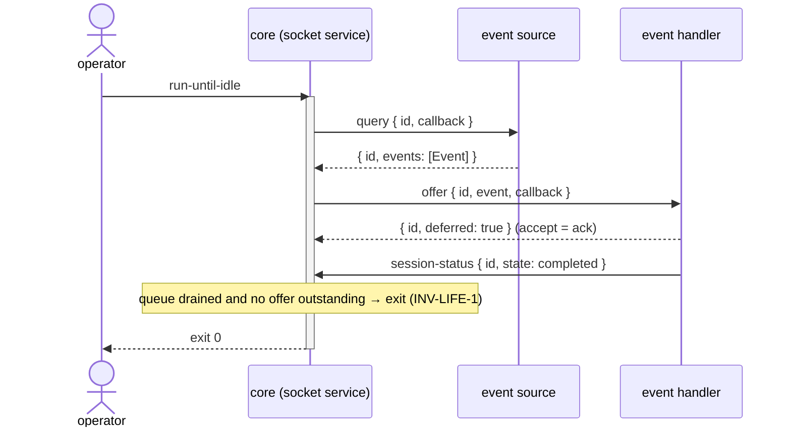
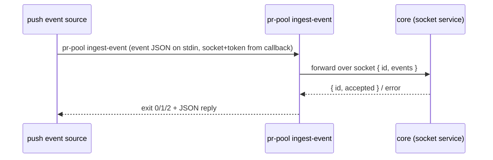

# Interfaces — pr-pool

This file follows the interface convention of the behavior-docs method
(`phillipgreenii-nix-agent-support · behavior-docs/docs/behavior`): an **interface** is a
boundary described by **what crosses it** and **what must hold**, so the parties on each side
can be confirmed to agree — never _how_ it is implemented. See the [glossary](glossary.md) for
terms, [actors](actors.md) for who sits on each side, [invariants](invariants.md) for the rules,
and [journeys](journeys.md) for the flows that exercise these interfaces.

pr-pool's core is a **dispatcher**: everything outside it is a pluggable **participant** reached
through one of the interfaces below. Which concrete implementation fills a participant — a bead
store, ccpool, prometheus — is uninteresting to the core; only these contracts are. (The concrete
implementations and any organization-specific workflow live in a downstream deployment set that
implements these interfaces.)

The five interfaces, each named for its boundary rather than a number, are:

| Interface      | Boundary                             | Counterparty (actor)             | Initiator                    |
| -------------- | ------------------------------------ | -------------------------------- | ---------------------------- |
| `INTF-SOURCE`  | typed events into the core           | `ACTOR-SRC` event source         | core (pull) or source (push) |
| `INTF-HANDLER` | events out to a handler; status back | `ACTOR-HDL` event handler        | core                         |
| `INTF-MON`     | the metric catalog out               | `ACTOR-MON` monitoring sink      | either (sink declares)       |
| `INTF-STORE`   | key/value scratch for core state     | `ACTOR-STO` storage              | core                         |
| `INTF-CLI`     | operator commands; manager callbacks | `ACTOR-OP` operator (+ managers) | operator / manager           |



## The common manager contract

Every participant interface shares one shape. `INV-INTF-1` (in [invariants](invariants.md))
requires it; the details are here.

- **CLI transport.** The default **transport contract** invokes a participant as
  `<command> <subcommand>`; the **request payload is JSON on stdin** and the **reply is JSON on
  stdout**. A subcommand MAY take its own arguments, but arguments are never the payload channel.
  The _shapes_ are the **message schema**, not the wire format — a participant MAY instead speak a
  gRPC or in-code **transport contract** over the socket and still conform, so long as it carries the
  same message schema.
- **Schema-versioned payloads.** Every request and reply carries a `schemaVersion` string, and
  every payload is defined by the interface's formal **message schema** (a JSON Schema) that backs
  the conformance suite. A party that receives a `schemaVersion` it cannot handle MUST report it
  rather than guess. The shapes shown below are **illustrative examples**, not golden ones — the
  authoritative **message schemas** are the versioned JSON Schema artifacts each conformance suite
  checks against (`INV-INTF-2`).
- **Tracking id.** Every core→participant request carries a unique **tracking id** (`id`). A
  deferred result or a later callback correlates by **echoing that `id`** — or the participant MAY
  return its own tracking id in the deferred acknowledgement, which the core stores and maps back.
  Either way the core can match a later delivery to the original call. The tracking id is per-call.
- **Deferred replies.** A reply is **either** an inline result **or** `{ "deferred": true }`. On a
  deferred reply the participant later reaches the core over its **callback** channel, keyed by the
  tracking id. The core handles either form on every call; a participant does not declare a
  sync/async mode up front. Which calls a given interface may defer is shown in that interface's
  sequence diagram below.
- **Callback.** When the core needs to be reached back, it hands the participant a single
  **callback** — one `command` string already carrying the socket and an auth token as arguments.
  The participant appends its own arguments and runs it; it never assembles the socket or token
  itself. The concrete callback targets are `INTF-CLI` subcommands (`ingest-event`,
  `session-status`).
- **Coarse exit codes.** A subcommand's exit code stays coarse: `0` ok, `1` unexpected error,
  `2` busy. The **rich outcome is in the JSON reply**; a participant in a degraded state MAY return
  an exit code only (e.g. busy → `2`, no body).
- **Self-status.** Any participant MAY push its **own** status — `healthy` / `degraded` /
  `unavailable` — over its callback channel, independent of any per-item outcome. This is the
  participant reporting on itself, distinct from a handler session's per-session state.
- **Registry & lifecycle.** A participant **registers** with the core (joins the **registry**) to
  receive lifecycle signals and to make its callback reachable, and **deregisters** on exit. The
  lifecycle and its state diagram are the next section.
- **Conformance suite.** Each interface ships a suite of **positive and negative checks** that
  invoke the subcommands and assert the replies match the JSON Schema, so an implementation can
  verify it adheres _before_ the core is trusted to route through it (`INV-INTF-2`).

## Lifecycle

The core signals a participant through a fixed lifecycle. For an executable participant these are
realized as spawn/stop; for a daemon participant that may outlive the core, as register/deregister.
The core tolerates participants whose lifetime is shorter or longer than its own; **multiple**
participants of any kind may exist, and one process MAY implement several interfaces at once (the
core neither knows nor cares).



- **`starting`** — the participant is initializing (opening its store, registering). The core does
  **not** yet route messages to it, and does not yet rely on its callback.
- **`started`** — the participant is serving. **This is the only state in which messages are
  accepted** — core→participant requests and participant→core callbacks. `INV-INTF-1` states this
  boundary as a rule.
- **`stopping`** — an orderly shutdown is underway. The core stops issuing _new_ requests; in-flight
  deferred work MAY complete on the callback channel or be abandoned. New messages are not accepted.
- **`stopped`** — the participant has drained and deregistered; no messages cross.
- **`crashing`** — a **best-effort** signal emitted on a _sudden_ shutdown (crash or forced kill)
  from any active state. It is a courtesy, not a guarantee: it MAY be lost entirely. A participant
  or the core that receives it SHOULD treat the peer as immediately gone. Because it is best-effort,
  no correctness rule may depend on it — it only lets the healthy side react faster than a timeout.

## Event delivery (shared by `INTF-SOURCE` and `INTF-HANDLER`)

Delivery of an **event** from a source to a handler goes through the core's **durable, ordered,
de-duped, TTL-bounded queue** and is **at-least-once** (`INV-EVT-1`, `ADR 0031`). An event is
enqueued durably and the core **offers it until a handler accepts** (`INV-CONC-1`); it is **dropped
only when its `ttl` expires without acceptance** (unconsumed-expired). An accepted event is
**retained in the queue until its `ttl`**, so a handler that binds within the TTL can still receive
it, and delivery **survives a restart**.

**Acceptance** is the reply that hands responsibility to the handler: an inline **completion**
(synchronous) or a deferred **ack** (asynchronous), keyed by the tracking id. The core's delivery
responsibility ends at acceptance; the durable record is written **after acceptance is confirmed**,
so a **narrow crash window** (accepted but not yet persisted) MAY redeliver. Therefore:

- an **event handler MUST tolerate duplicates** (be idempotent) — the crash window, a pre-accept
  re-offer within `ttl`, or a source re-emitting can redeliver the same event (`INV-EVT-2`);
- the core **de-duplicates by event `id` across the retained-until-`ttl` id set** — including ids
  already delivered/accepted (`INV-EVT-3`) — so a source never has to track "did I already emit
  this";
- a **pull source** re-derives current truth on its next **query trigger**; a **push-only source**'s
  events are now **durable to TTL** (no longer lost on a core restart), lost only if nothing accepts
  them before they expire.

A callback bearing a **tracking id the core does not recognize** (never issued, or already
TTL-expired and evicted) is **acknowledged and ignored** — a logged no-op, not an error, and it does
not resurrect an expired event (`INV-INTF-1`).

## `INTF-SOURCE` — event source <!-- uuid: fe42416a-5f10-4db1-b8c3-46b1609213c7 -->

- **Counterparty:** `ACTOR-SRC`, a pluggable event source. **Initiator:** core (**pull**) or source
  (**push**). **Multiplicity:** zero or more.
- **Purpose:** supply typed **events** for the core to route.

**Pull mode.** The core invokes `query` on a **query trigger** — a **periodic** tick. The reply
carries events inline, or defers and delivers them later on the callback (the `ingest-event`
target).

**Push mode.** The core never calls `query`; the source invokes the `ingest-event` callback as
external facts arrive. A push-only source still **registers** so it appears in the registry and its
lifecycle is known.

**Event shape** (illustrative):

```json
{
  "schemaVersion": "1",
  "id": "evt-abc123",
  "type": "review-requested",
  "ttl": "15m",
  "at": "2026-07-16T12:00:00Z",
  "payload": {
    "note": "source-defined; OPAQUE to the core unless a path is declared"
  }
}
```

- `id` — unique; the core de-duplicates on it across the retained-until-`ttl` id set (`INV-EVT-3`).
- `type` — the primary field a **binding** matches on.
- `ttl` — how long the core **holds, offers, and retains** the event in the queue before dropping it
  if still unaccepted (`INV-EVT-1`).
- `payload` — MUST be a JSON **object** (a keyed structure, never a bare scalar/array), so a handler
  always receives a struct. The core neither reads nor validates it.

**Matching (what a binding may match).** A **binding** matches an event over its **fields**:

- `type` is matched **by default**;
- a binding MAY additionally match on **other fields the source declares** as matchable;
- a matched field that is **absent** on a given event **simply does not match** — that is a
  non-match, not an error;
- matching into `payload` is allowed **only if the source declares that path** as matchable; a
  declared payload path thereby stops being opaque _for matching_ (the core reads only the declared
  path, nothing else in the payload).

This is the field-matching model `INV-DISP-1` states as a rule.

**Unknown type.** An event whose `type` no configured binding matches is **accepted into the queue**
and, with no handler to take it, **waits and expires at its `ttl`** (**unconsumed-expired**) — not a
rejection of the source. The core records it to logs and the unconsumed-expired metric; a `type` with
**no configured binding at all** is also surfaced as a **config-time warning** (`JOURNEY-VALIDATE`).
This is the "no event misses" visibility signal, not a runtime error (`INV-DISP-3`).



## `INTF-HANDLER` — event handler <!-- uuid: 10939663-7a48-4d44-8c4a-9a2df8ae4654 -->

- **Counterparty:** `ACTOR-HDL`, a pluggable event handler. **Initiator:** core. **Multiplicity:**
  one or more. (A handler's concrete kind — a **role** — is named in a downstream deployment set;
  the core knows only the interface.)
- **Purpose:** run a handler against one event as a **handler session**, tracked by the request's
  tracking id, and report its outcome.

**Dispatch (core → handler)** (illustrative):

```json
{
  "schemaVersion": "1",
  "id": "hs-771e",
  "event": {
    "id": "evt-abc123",
    "type": "review-requested",
    "ttl": "15m",
    "payload": {}
  },
  "callback": "pr-pool session-status --socket … --token …"
}
```

- **Reply (sync):** `{ "schemaVersion": "1", "id": "hs-771e", "outcome": { … } }`.
- **Reply (deferred):** `{ "schemaVersion": "1", "id": "hs-771e", "deferred": true }` — accepted;
  the outcome and any progress arrive later on the callback. The core never holds an open call
  across long or paused work.

**Handler-session status (handler → core, via the `session-status` callback)** (illustrative):

```json
{
  "schemaVersion": "1",
  "id": "hs-771e",
  "state": "running",
  "progress": 40,
  "detail": "checked out; running review",
  "at": "2026-07-16T12:03:00Z"
}
```

- `state` — one of `running | paused | completed | failed`.
- `progress` — optional, an **opaque `0..1`** whose meaning is **deployment-defined** (the core does
  not interpret it; a deployment MAY specialize it, e.g. budget consumption).
- `detail` — optional human-readable liveness note.
- `failure` — present **iff** `state = failed`: `{ "class": "<FailureClass>", "message": "…" }`.

A handler reporting **its own** health (not a session's) uses the common **self-status** channel
instead, so the two never collide.

**Failure class** (coarse; response follows the **acceptance boundary**, `INV-FAIL-1`):

| class            | meaning                                                       | response                                            |
| ---------------- | ------------------------------------------------------------- | --------------------------------------------------- |
| `retryable`      | transient (network blip, flake)                               | post-accept: handler retries; MAY surface / re-emit |
| `resource-limit` | a capacity/quota ceiling (e.g. a usage window) — not a defect | post-accept: handler pauses, resumes once it lifts  |
| `unavailable`    | cannot take work now (down, starting, or at capacity)         | pre-accept decline: core re-offers within `ttl`     |
| `critical`       | MUST NOT be retried; a human is needed                        | post-accept: surfaced to a human; never re-offered  |

The core itself re-offers **only on a pre-accept decline** — an `unavailable` report, or a **`busy`
exit code `2`** when the handler is at capacity (`INV-CONC-1`). Once a handler **accepts** an event,
retry/resume/persistence is the **handler's** responsibility (`INV-FAIL-1`), not the core's.

**Obligations.** A handler **MUST tolerate a duplicate event** (be idempotent) and **MUST support
the deferred form**, so a paused or long-running handler session never pins an open call from the
core.



## `INTF-MON` — monitoring sink <!-- uuid: 11c08936-42df-4fd6-a912-70fe88244012 -->

- **Counterparty:** `ACTOR-MON`, a pluggable monitoring sink. **Initiator:** either — the sink
  **declares** push or pull. **Multiplicity:** optional; may be absent or several.
- **Purpose:** expose the core's metrics. The **core owns the metric catalog** — a declared set of
  metrics, each with `name`, `kind` (`counter | gauge | histogram`), `unit`, and label shape,
  including **queue depth**, **failure rate**, and **unconsumed-expired** (`INV-OBS-1`). An
  **observer** (`ACTOR-OBS`) reads the sink's surface, never the core directly.
- **Emission transport:** the default is **OTel for metrics only** (a neutral standard, not a
  mandated backend); **logs stay JSONL**. Observability covers metrics + logs (traces later). The
  concrete backend (a scrape target, a log store) is the sink's own binding.
- A sink **declares which mode it uses and which subset of the metric catalog it handles**:
  - **pull** — the sink reads current values from the core on its own schedule;
  - **push** — the core sends the named metric updates to the sink as they change.
- The sink's own external surface (e.g. serving a scrape endpoint, writing a dashboard feed) is
  entirely the sink's concern and invisible to the core.



## `INTF-STORE` — storage <!-- uuid: aa658dfb-7631-4f16-87aa-6c17d9abc097 -->

- **Counterparty:** `ACTOR-STO`, an optional pluggable storage. **Initiator:** core.
  **Multiplicity:** optional; a **default in-memory** store applies when none is configured.
- **Purpose:** a general **key/value scratch for core state** — **explicitly not event delivery**.
- **Operations:** `get(key) → value?`, `put(key, value)`, `delete(key)`; `key` is a string, `value`
  is a JSON string; each request/reply carries `schemaVersion`. The operation set is identical
  whether the backing is in-memory, local, or remote — the core codes to the interface, never the
  backing.
- **Guarantees.** Best-effort like any participant: the core MUST function if storage is absent or
  down, and MUST NOT rely on it to back any delivery guarantee. The default store's contents do not
  survive a restart.



## `INTF-CLI` — operator commands (and the manager callbacks) <!-- uuid: 746dd5a6-34c4-4294-b727-e442c2afa723 -->

- **Counterparty:** `ACTOR-OP`, the operator. **Initiator:** operator. The same binary
  **also** carries the **manager→core callback** subcommands (`ingest-event`, `session-status`);
  those belong to `INTF-SOURCE` / `INTF-HANDLER`'s manager-initiated direction and are invoked
  through the callback the core hands out, not by the operator.
- **Operator push-inject.** The operator subcommand `push-inject` (below) is the **operator-facing
  front door to the push-ingest path**: it performs the **same core-side enqueue** as the
  `ingest-event` manager callback, but is **operator-initiated** (not invoked through a core-issued
  callback). The injected event is durable via the queue and delivered at-least-once and deduped like
  any push event (`INV-EVT-*`); no new delivery semantics. It is **distinct from** `ingest-event` (a
  manager→core callback) and from `run-role` (a one-shot smoke test that tears down).
- **Locating the core.** The CLI finds the running core via an injected socket path (env/arg) or by
  discovering the running socket service. (Whether it **auto-starts** a core when none is found is
  an open question, `OQ-AUTOSTART`.)
- **Output.** Every operator subcommand emits **human-readable text by default** and **JSON with
  `--json`** for machine consumption. Coarse exit codes follow the common contract (`0` ok, non-zero
  on error; a usage error is distinct from a runtime error).

### Global options

| Option                 | Effect                                                                   |
| ---------------------- | ------------------------------------------------------------------------ |
| `--json`               | emit JSON instead of text (any operator subcommand)                      |
| `--only <selector>`    | allow-list: restrict the **active** set of sources/handlers for this run |
| `--disable <selector>` | deny-list: exclude sources/handlers for this run                         |
| `--version`, `-v`      | print the version and exit                                               |
| `--help`, `-h`         | print help and exit                                                      |

`--only` / `--disable` (and their env equivalents) restrict the active set **without editing
config** — the mechanism behind `STORY-OP-3`. They scope which sources and handlers a `run` /
`run-until-idle` activates and which a smoke test may reach.

### Operator subcommands

| Subcommand                | Arguments                      | Behavior                                                                                                                                                                                                                                                                                                                                                                                                                                                               |
| ------------------------- | ------------------------------ | ---------------------------------------------------------------------------------------------------------------------------------------------------------------------------------------------------------------------------------------------------------------------------------------------------------------------------------------------------------------------------------------------------------------------------------------------------------------------- |
| `run`                     | —                              | Start the core as a long-running **daemon** (socket service); route events as sources emit them until stopped.                                                                                                                                                                                                                                                                                                                                                         |
| `run-until-idle`          | —                              | Start the socket service and dispatch from the durable queue; **exit once the queue is drained and no offer is outstanding** (every enqueued event accepted or TTL-expired, and no handler holding an offer, `INV-LIFE-1`). The default when no subcommand is given.                                                                                                                                                                                                   |
| `run-role <role> <event>` | role, event                    | **Smoke test**: dispatch **one named event** through **one handler** (its CLI-facing name is its _role_), then tear down. Runs **no discovery** — the event is explicit. Sets a **test-mode** signal (env) so the handler knows a test is in flight.                                                                                                                                                                                                                   |
| `run-query <query>`       | query                          | **Smoke test**: run **one pull source's query** once, **read-only**, and print the events it would emit. Also sets the test-mode signal.                                                                                                                                                                                                                                                                                                                               |
| `push-inject <json>`      | event JSON                     | Inject an **arbitrary operator-supplied event** into the **live** core — the same core-side enqueue as the `ingest-event` manager callback, but **operator-initiated**, locating/authenticating the core like the other operator subcommands. Durable via the queue, delivered at-least-once and deduped (`INV-EVT-*`). **Distinct** from `ingest-event` (a manager→core callback) and `run-role` (a smoke test that tears down). Primarily for manual/test injection. |
| `status`                  | —                              | Resolved-config summary **plus** live **handler sessions** and per-`type` **queue depths**.                                                                                                                                                                                                                                                                                                                                                                            |
| `config`                  | `--show` \| `--print-defaults` | `--show` prints the **resolved** configuration; `--print-defaults` prints the built-in defaults as a copy-paste starting point.                                                                                                                                                                                                                                                                                                                                        |

_"role"_ is the operator-facing name for a configured **event handler** (its concrete kind); the
core dispatches it as a **handler session**. _"query"_ names one pull **event source**'s query.

### Manager→core callback subcommands

These are the concrete callback targets the core hands out (socket + token already baked in); a
manager appends its arguments and runs one. They follow the common contract (JSON on stdin → JSON
on stdout; coarse exit codes).

**`ingest-event`** — a **push source**, or a **deferred pull** reply, delivers one or more events.

Request (stdin):

```json
{
  "schemaVersion": "1",
  "id": "trk-9f2c",
  "events": [
    {
      "id": "evt-abc123",
      "type": "review-requested",
      "ttl": "15m",
      "payload": {}
    }
  ]
}
```

Reply (stdout, exit `0`):

```json
{ "schemaVersion": "1", "id": "trk-9f2c", "accepted": 1, "rejected": [] }
```

Under the durable queue an event whose `type` matches no binding is **still accepted** (exit `0`,
counted in `accepted`) — it is enqueued and **expires unconsumed** at its `ttl`; visibility comes from
the **config-time warning** (`JOURNEY-VALIDATE`) and the **unconsumed-expired** metric, not from a
rejection (`INV-DISP-3`). The `rejected` list therefore carries only **malformed** events (bad schema
or missing required fields), each with a reason — e.g. exit `1` with:

```json
{
  "schemaVersion": "1",
  "id": "trk-9f2c",
  "accepted": 0,
  "rejected": [
    {
      "id": "evt-abc123",
      "reason": "malformed: missing required field \"ttl\""
    }
  ]
}
```

**`session-status`** — an event handler reports a **handler session**'s deferred progress or
terminal outcome, keyed by the tracking id.

Request (stdin), terminal failure example:

```json
{
  "schemaVersion": "1",
  "id": "hs-771e",
  "state": "failed",
  "detail": "usage window reached",
  "failure": {
    "class": "resource-limit",
    "message": "provider usage window exhausted"
  },
  "at": "2026-07-16T12:07:00Z"
}
```

Reply (stdout, exit `0`):

```json
{ "schemaVersion": "1", "id": "hs-771e", "accepted": true }
```

**`status --json`** (operator side, for reference):

```json
{
  "schemaVersion": "1",
  "sessions": [
    {
      "id": "hs-771e",
      "handler": "review",
      "event": "evt-abc123",
      "state": "running",
      "progress": 40
    }
  ],
  "queues": [{ "type": "review-requested", "depth": 3 }],
  "config": { "sources": 2, "handlers": 3 }
}
```





## Configuration (an interface the operator authors)

The **configuration structure** is itself a first-class interface — the operator authors it, and
the CLI resolves it (`config --show`). It declares: the participants (each with its command, mode,
and — for a monitoring sink — its selected metrics); the sources and their queries (with query
trigger and `ttl`); the handlers and their event-type **bindings** (including any declared
matchable fields); and the workflow wiring the core validates (`INV-WORKFLOW-1`). The `--only` /
`--disable` selectors above restrict the _active_ subset of this config per run without editing it.

The **full configuration schema** is not yet pinned; it is tracked as an open question
(`OQ-CONFIG`), with pr-pool's existing TOML as prior art.

## Notes / forward references

- **Inter-consistency (method `INV-18`) binds here in its _implementer_ form.** Every counterparty
  above is either a pluggable implementation with no behavior-docs set of its own or a downstream
  deployment set that **implements** these interfaces. In both cases
  agreement is reconciled by the **conformance suite** (`INV-INTF-2`) each implementation runs, not
  by a verbatim peer cross-check: an implementer **cites** this contract and states only its own
  side, and a counterparty with no set leans on the same suite as its sole reconciliation. Each
  interface here **is** the authoritative contract its implementations adhere to.
- **Open questions** (tracked in [journeys](journeys.md)): `OQ-AUTOSTART` (auto-start a core when
  none is found), `OQ-EVT-TTL-ORIGIN` (TTL clock origin: event `at` vs ingest), `OQ-WORKFLOW`
  (pre-runtime wiring validation of the bindings), and `OQ-CONFIG` (the full configuration
  schema).
