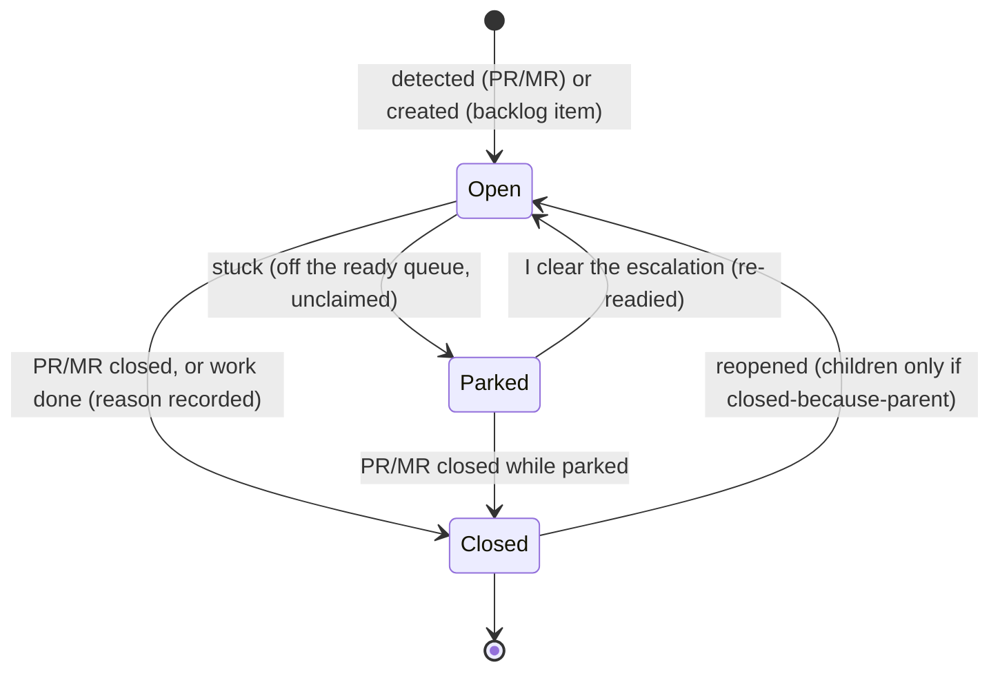

# pr-pool — cross-cutting invariants, goals & concepts

These rules hold across **every** pr-pool workflow; the workflow docs reference them
by **ID** rather than restating them. The ID convention, and the
invariant / goal / concept distinction (each tagged below), are defined once in the
behavior-docs method
(`phillipgreenii-nix-agent-support · behavior-docs/docs/behavior`) and are not
restated here.

## Precedence

- **`INV-PREC-1`** — When two rules conflict, the ordering is **safety/authority >
  continuity (never lose work) > efficiency/right-sizing**. A newly-discovered
  conflict **MUST** be logged as an open question and resolved by an ADR, not by an
  agent choosing arbitrarily.

## Continuity

- **`INV-CONT-1`** — **Work is never lost.** On error/failure the system does
  bounded retries; if it still can't proceed it escalates. Nothing in flight is
  silently dropped.
- **`INV-CONT-2`** — **A stuck item does not stop the system.** A stuck item is
  **parked**: save/clean up related state, record the situation on the tracking
  object, mark it so it does **not** surface as ready, unclaim it, and continue
  other work.
- **`INV-CONT-3`** — **Usage limits pause, they don't fail.** When a provider usage
  limit is hit, the affected work pauses until the next window, then resumes.
- **`GOAL-CONT-4`** — Continuous operation is expected; the system may run
  indefinitely, idling only when a usage limit is active or nothing is ready.

## Failure handling

- **`INV-FAIL-1`** — **The response depends on the failure _class_:**
  - _usage limit_ (rolling window) → pause + auto-resume next window (`INV-CONT-3`);
  - _transient_ (network, rate blip, flaky) → bounded automatic retry;
  - _non-retryable_ (authentication/permission failure, invalid request) →
    **escalate immediately; MUST NOT retry** (retrying burns budget and never
    recovers).

## How work is done

- **`INV-WORK-1`** — **Computation over inference.** Prefer deterministic means;
  use inference only where it's genuinely required. Each capability is explicit
  about which it uses.
- **`INV-WORK-2`** — **do → review → resolve.** Any substantive activity (code,
  plan, design, troubleshooting) passes at least one **independent** review →
  resolve pass, in the common review format ([`reviews.md`](reviews.md)), before it
  is considered done.
- **`INV-WORK-3`** — **Right-sized units.** A change is split so a PR is not too
  large and does not mix concerns; stacked PRs are used for naturally-sequential
  work.
- **`INV-WORK-4`** — **Clean up.** Completed work leaves no stray branches,
  worktrees, or tracking objects.

## Authority & escalation

- **`INV-AUTH-1`** — **Feedback authority: me > human > agent.** On conflict the
  higher authority wins — **except** that a conflict between a **live** human's
  input and an **earlier** instruction of mine **MUST escalate** (my instruction
  may be stale) rather than silently override the live human.
- **`INV-AUTH-2`** — **The human is the release authority, per integration style.**
  For **PR-driven** repos an agent **MUST NOT** merge without my explicit
  per-change permission, and automerge is off by default. For **merge-to-main**
  repos an agent **MAY** complete the integration itself (worktree → rebase onto
  main → ff-merge). The integration style is per-repo configuration. Agents
  **MUST NOT** mark external issue-tracker items done on my behalf (they MAY set
  in-progress / in-review / release when prompted).
- **`INV-AUTH-3`** — **Escalation is explicit, delivered, and resolvable.** When an
  agent isn't confident it escalates rather than guessing. An escalation **MUST** be
  delivered to me and surfaced in **NEEDS ME**; the item stays visible until I
  resolve it; clearing my signal **re-readies** the item with its context intact.

## Agent-session safety (untrusted content)

- **`INV-SEC-1`** — **Untrusted content must not act as me or the system.** When an
  agent processes untrusted input (e.g. a PR head it checks out), that content
  **MUST** run isolated, with tools scoped **least-privilege for the role** (a
  read-only reviewer is not a write-capable worker) and **no inheritance of my
  ambient credentials/secrets** — so untrusted content cannot exfiltrate secrets or
  act under my identity.
- **`INV-SEC-2`** — **Bot attribution.** Any content an agent posts under a shared
  or human account (comments, reviews) **MUST** visibly indicate it was
  bot-generated. _(Decided; see ADR 0023.)_
- **`INV-SEC-3`** — **Guardrails are not defeatable by config.** A safety guardrail
  (authorship checks, permission scoping, the rules above) **MUST NOT** be weakened
  by editing a role's prompt or config.

## Claiming & concurrency

- **`INV-CLAIM-1`** — **Role-scoped claim identity.** An agent claims work under an
  identity that is (or derives from) its role — **never** a shared/default identity
  — so concurrent agents cannot collide or double-claim the same item.
- **`INV-CLAIM-2`** — **Claim before work; one owner.** An item is claimed before
  work and **MUST NOT** be dispatched to two agents at once. Write-back to a given
  PR / tracking store has exactly **one** owner at a time.

## Tracking objects

- **`INV-TRACK-1`** — **One tracking object per PR/MR**, lifecycle bound to it:
  created on first detection; closed when the PR/MR closes (reason recorded);
  reopened if the PR/MR reopens.
- **`INV-TRACK-2`** — **Children mirror the parent _only when closed because of
  it._** A child closed with reason "parent closed" reopens when the parent
  reopens; a child closed for its **own** reason (e.g. completed) **stays closed**.
- **`INV-TRACK-3`** — **De-dup discovered work.** Before creating a work item,
  discovered work **MUST** be de-duplicated against existing open work for the same
  parent (successive comments / re-review cycles for the same underlying issue
  link or update it, never spawn duplicates).
- **`GOAL-TRACK-4`** — Backlog work items are tracking objects too; the continuity,
  claim, and readiness rules apply to them.

## Readiness & data freshness

- **`INV-FRESH-1`** — **Don't act on stale truth.** A surface I act on (the
  glance-view) **MUST** expose its own as-of time and **MUST** flag data stale
  beyond a bound; readiness derived from stale data is not "ready."
- **`GOAL-READY-1`** — An item that isn't actually ready **should not** surface as
  ready-to-work. The gating signal — and which role sets/clears it — is defined by
  the deployment's overlay via the **triage** activity (see
  [`working-the-backlog.md`](working-the-backlog.md)).

## Budget

- **`INV-BUDGET-1`** — Work runs under a **budget** (at least wall-clock time;
  optionally tokens/cost; per-run and/or per-role). Approaching it triggers an
  orderly wind-down (save progress, hand back); exceeding it stops the work safely.
  Mid-work exhaustion is treated like a usage limit — progress is saved and the item
  parked/resumed, not lost (`INV-CONT-1`).

## Observability

- **`INV-OBS-1`** — I can track and monitor the system from outside it. At minimum
  these **MUST** be observable: queue depth, parked/blocked count, per-role session
  activity, budget consumption, and usage-limit backoff state. _(Emission mechanism
  is downstream.)_
