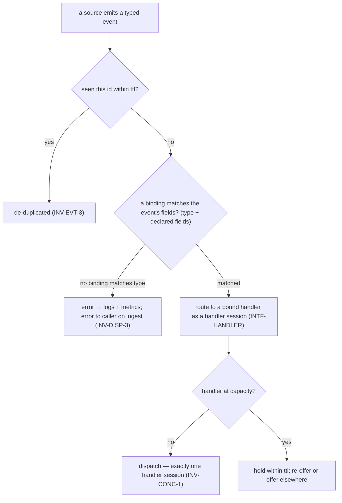

# Invariants — pr-pool

The rules pr-pool's **core** follows. These bound the core's own behavior and the **common manager
contract** it holds with its participants; they do **not** govern what a handler _does_ once
dispatched. See the [glossary](glossary.md), [interfaces](interfaces.md), [actors](actors.md), and
[journeys](journeys.md). IDs are **topical and stable**; numbering gaps are legal, and each rule
uses RFC 2119 language (`MUST` / `SHOULD` / `MAY`). The ID convention and the invariant / goal /
concept distinction come from the behavior-docs method
(`phillipgreenii-nix-agent-support · behavior-docs/docs/behavior`).

## Dispatch (the event model)

An event's path from a source to a handler is a match-then-route decision:



- **`INV-DISP-1`** — Sources **emit typed events**; handlers **bind** to events via a **binding**
  that **matches over event fields**. `type` is matched **by default**; a binding **MAY** also match
  on **other fields the source declares** as matchable (including a **declared path into `payload`**,
  which thereby stops being opaque _for matching_). A matched field that is **absent** on an event
  **does not match** — a non-match, **not** an error. The core routes a matched event to a bound
  handler, and a handler responds to **any** of its bound events.
- **`INV-DISP-2`** — The core reaches every source and handler **only through a manager interface**
  (`INTF-SOURCE` / `INTF-HANDLER`); their implementations are opaque to it. Nothing specific to a
  source, handler, or deployment lives in the core.
- **`INV-DISP-3`** — An event whose `type` **no configured binding matches** is an **error**: the
  core records it to logs and metrics **and returns an error to the caller** on the push/ingest
  path. It is **not** silently dropped. (An _absent declared field_ is a non-match, not this error;
  this error is specifically "no binding for the `type`.")

## Delivery

- **`INV-EVT-1`** — Event delivery is **best-effort**. An event is **dropped** under exactly three
  conditions: it is **delivered** to a handler, its **`ttl` expires**, or the **core stops**.
  Delivery is **not guaranteed to survive a restart**. _(The core MAY harden restart survival; that
  is a decision-doc concern and never strengthens this best-effort guarantee.)_
- **`INV-EVT-2`** — A handler **MUST tolerate duplicate events** (be idempotent); a source **MAY**
  emit the same event more than once. A **pull** source re-derives on its next **query trigger**, so
  a dropped event reappears; a **push-only** source cannot re-derive, so its dropped events are
  **lost** (its caveat).
- **`INV-EVT-3`** — The core **de-duplicates within `ttl` by event `id`**, so a source never needs
  to track whether it already emitted an event.

## Interfaces

- **`INV-INTF-1`** — Every participant interaction follows the **common manager contract**
  ([interfaces](interfaces.md)): schema-versioned JSON over stdin/stdout, a per-call **tracking id**,
  a reply that is **inline or deferred** (a deferred reply is reconciled later over the participant's
  **callback**, keyed by the tracking id), a single-`command` **callback**, and coarse exit codes
  (`0` ok / `1` error / `2` busy) with the rich outcome in the JSON. The core **accepts messages
  only after a participant is `started` and before it is `stopping`** (the lifecycle is owned by
  `INV-LIFE-1`).
- **`INV-INTF-2`** — Every interface is accompanied by a **conformance suite** (positive and
  negative checks against its JSON Schema) so an implementation can verify it adheres **before** the
  core is trusted to route through it. Because a counterparty here is an **implementer** — a
  pluggable implementation, or a downstream set (e.g. zr's `pr-pool-components`) that realizes these
  interfaces — this suite, not a peer cross-check, is how agreement is confirmed (method `INV-18`,
  implementer form).

## Concurrency, capacity & failure

```mermaid
sequenceDiagram
    participant Core as core
    participant A as handler session A
    participant B as handler session B
    Note over Core,B: competing consumers — one event to exactly one session
    Core->>A: dispatch event E1 (id hs-A)
    Core->>B: dispatch event E2 (id hs-B)
    B-->>Core: deferred; later session-status failed { class: resource-limit }
    Note over Core: not a defect — re-offer once the ceiling lifts, within E2's ttl
    Core->>A: re-offer E2 when A has capacity (still within ttl)
    A-->>Core: session-status completed
```

- **`INV-CONC-1`** — The core dispatches **concurrently**, delivering each event to **exactly one**
  handler session (**competing consumers**), bounded by each handler's **capacity**. Concurrency is
  **not assumed safe for every event type** — a `type` **MAY** be marked to **serialize** (e.g. a
  shutdown or time-of-day event) so its events never run in parallel.
- **`INV-FAIL-1`** — A handler-session failure carries a coarse **failure class** — `retryable`,
  `resource-limit`, `unavailable`, or `critical`. The core's re-offer decision **follows the class**
  and happens **only within the event's `ttl`**: `retryable` and `resource-limit` MAY be re-offered
  (the latter once the ceiling lifts), `unavailable` MAY be offered to another session, and
  `critical` is **never** retried — a human is needed.

## Workflow

- **`INV-WORKFLOW-1`** — A **workflow** is a declared flow tying **event sources → event types →
  event handlers** through their **bindings**. The core **MUST** be able to **validate the wiring**
  — no orphan event types, no unhandled source output, no disconnected handlers, and loop detection
  — and **report** on it. Declaring or altering a workflow is **configuration**: it **MUST NOT**
  require changing the core (`GOAL-MIN-1`). _(Whether validation runs pre-runtime and exactly how a
  serialize mark is expressed are open questions, `OQ-WORKFLOW` and `OQ-CONC-MARK`.)_

## Observability & lifecycle

- **`INV-OBS-1`** — The core exposes a declared **metric catalog** (each metric's `name`, `kind`,
  `unit`, labels); a **monitoring sink** pulls or pushes a declared subset (`INTF-MON`). The core is
  unaware of any concrete monitoring backend, and an **observer** reads the sink, never the core.
- **`INV-LIFE-1`** — The core runs as a **socket service** in both modes — a long-running **daemon**
  (`run`) and a one-off **run-until-idle** (dispatch everything deliverable, await outstanding
  deferred work up to `ttl`, then exit). Both keep the socket available so push sources can reach it.
  The core signals each registered participant through the lifecycle
  `starting → started → stopping → stopped`, plus a **best-effort `crashing`** signal on sudden
  shutdown; because `crashing` is best-effort (it MAY be lost), **no correctness rule may depend on
  it**.

## Precedence

- **`INV-PREC-1`** — When two invariants **conflict**, the ordering is
  **safety/isolation > continuity (never drop work) > efficiency**. A newly-discovered conflict
  **MUST** be recorded as an **open question** and resolved by a **decision** (an ADR), **not**
  chosen ad hoc by an agent. This is pr-pool's **precedence** ordering under the method's optional
  precedence mechanism (`phillipgreenii-nix-agent-support · behavior-docs/docs/behavior · INV-19`).
  _(Downstream deployments — e.g. zr's `pr-pool-components` set — cite this ordering rather than
  restate it.)_

## Goal

- **`GOAL-MIN-1`** — Keep the core **minimal**: anything specific to a source, handler, monitor,
  workflow, or deployment belongs **behind an interface** (realized in zr's `pr-pool-components`),
  **never** in the core. Over time, **less** implementation detail should live in the core, not more.
