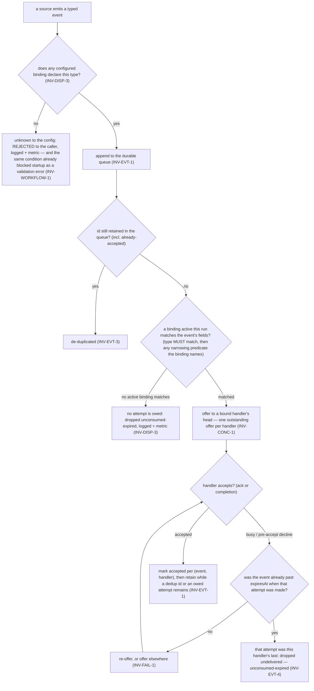
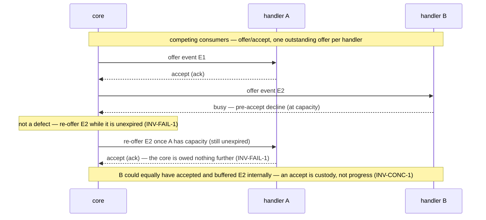

# Invariants — pr-pool

The rules pr-pool's **core** follows. These bound the core's own behavior and the **common manager
contract** it holds with its participants; they do **not** govern what a handler _does_ once
dispatched. See the [glossary](glossary.md), [interfaces](interfaces.md), [actors](actors.md), and
[journeys](journeys.md). IDs are **topical and stable**; numbering gaps are legal, and each rule
uses RFC 2119 language (`MUST` / `SHOULD` / `MAY`). The ID convention and the invariant / goal /
concept distinction come from the behavior-docs method
(`phillipgreenii-nix-agent-support · behavior-docs/docs/behavior`).

## Dispatch (the event model)

An event's path from a source to a handler is a match-then-route decision. (An operator MAY also
inject an event directly via the `push-inject` `INTF-CLI` subcommand — the same push-ingest path,
governed by these same delivery invariants, `INV-EVT-*`.)

- **`INV-DISP-1`** <!-- uuid: 5ad7c9a4-37ea-4496-8f23-51964a8aae54 --> — Sources **emit typed events**; handlers **bind** to events via a **binding**
  that **matches over event fields**. `type` is the **primary matcher** and **MUST** match: a binding
  never matches an event whose `type` it does not name, whatever else that event carries. A binding
  **MAY** then carry one **narrowing predicate** over a **payload path the binding itself names**,
  applied **only after** the type match has succeeded — a narrowing of an already-matched set, never
  a peer of `type`. **Matchability is the handler's alone**: a source declares nothing about which of
  its fields may be matched, and the core reads **only the path a binding names** and nothing else in
  the payload, so `payload` stays opaque everywhere the binding does not point. A named field or path
  that is **absent** on an event **does not match** — a non-match, **not** an error. The core routes a
  matched event to a bound handler, and a handler responds to **any** of its bound events. _(A named
  path cannot be checked when the config is authored, because no per-`type` payload shape is declared
  anywhere — `OQ-EVT-CATALOG`. So **while that open question stands**, a mistyped path narrows to
  nothing and nothing can report it; that is a consequence of the deferred catalog, **not** a property
  of path matching, and settling `OQ-EVT-CATALOG` is what makes a named path checkable at config
  time.)_
- **`INV-DISP-2`** <!-- uuid: 06662087-a4de-4732-9417-f7440c9aa471 --> — The core reaches every source and handler **only through a manager interface**
  (`INTF-SOURCE` / `INTF-HANDLER`); their implementations are opaque to it. Nothing specific to a
  source, handler, or deployment lives in the core.
- **`INV-DISP-3`** <!-- uuid: 421db242-e1fc-49ba-a1a6-38211abf5569 --> — **An unknown event type is
  rejected; a type whose binding is merely inactive this run waits.** The two cases stay distinct:
  - **Unknown to the configuration** — **no** configured binding declares this `type` at all. The core
    **MUST reject** the event to the caller: it is **not** enqueued, the reply names it as rejected
    (`INTF-CLI`), and the condition is recorded to logs and metrics. The same condition is already a
    **pre-runtime validation error** that blocks startup (`INV-WORKFLOW-1`), so at runtime it can only
    mean a source emitted a `type` its own configuration never declared — an error to report, never a
    silent drop.
  - **Declared but inactive this run** — a binding for the `type` exists and is merely **disabled for
    this run** by a **run-scoped selector**. That event **is** accepted and enqueued, waits, is offered
    to nobody, and **is dropped unconsumed-expired** (`INV-EVT-1`, `INV-EVT-4`). This is **expected and
    is neither an error nor a warning**: validity is judged against the configuration, never against the
    run's active subset (`INV-WORKFLOW-1`, `STORY-OP-3`).

  The **unconsumed-expired** drop is **counted in the metric catalog** `INTF-MON` carries
  (`INV-OBS-1`), covering the second case and the ordinary miss, and under `INV-EVT-4` that count is a
  **genuine miss** rather than a scheduling artifact: every matching handler had at least one
  opportunity and none took it. A busy handler can no longer be the reason an event expired unoffered,
  and — now that an unknown `type` is rejected rather than queued — a misconfiguration can no longer
  inflate the count either, which makes the "no event misses" signal considerably more meaningful. (A
  **field or payload path a binding names** that is _absent_ on an event is a **non-match** on an
  otherwise declared `type`, not a no-binding condition — so it leaves the event in the second case,
  never the first.)

## Delivery

- **`INV-EVT-1`** <!-- uuid: faf59ce3-6a27-42c8-8bfa-0903f895eed6 --> — **The delivery-opportunity
  guarantee.** The core holds a **durable, ordered, de-duped, retention-bounded event queue**
  (`ADR 0031`), and **every matching handler WILL get at least one opportunity to accept a matching
  event**: nothing is ever dropped **un-offered**. Delivery is **at-least-once** — an event is
  enqueued durably and the core **attempts delivery until a handler accepts it**, over the window
  `INV-EVT-4` bounds. An event carries an optional **`at`** (the source stamp; **absent, the core's
  own "now" at ingest is used**) and an optional **`expiresAt`** (an **absolute instant**; **absent,
  `at` is used**). Nothing computes a duration, and neither field is configured — they ride on the
  event. The durable record is written **after acceptance is confirmed**, so a narrow crash window MAY
  redeliver (absorbed by idempotent handlers, `INV-EVT-2`). An accepted event is **retained** while
  its `id` is still needed for de-duplication (`INV-EVT-3`) and while any matching handler is still
  owed its opportunity. Delivery therefore **survives a restart** — the storage mechanism
  (jsonl / DB / WAL) is a realization choice, not behavior. _(The `crashing` lifecycle signal in
  `INV-LIFE-1` stays best-effort — that is a separate concern from event-data durability.)_
- **`INV-EVT-2`** <!-- uuid: 06649d39-2734-409a-8098-f3c2cef44cbe --> — A handler **MUST tolerate
  duplicate events** (be idempotent) — required, because at-least-once delivery (`INV-EVT-1`) and the
  narrow crash window MAY redeliver an accepted event. A source **MAY** emit the same event more than
  once; the durable queue makes **both pull and push** events durable through their retention, so a
  push-only source no longer loses events it cannot re-derive.
- **`INV-EVT-3`** <!-- uuid: d54ad229-ed48-4862-aa27-bc2181b4d6c4 --> — The core **de-duplicates by
  event `id` across the retained id set** — including ids of events already delivered or accepted — so
  a source never needs to track whether it already emitted an event, and a re-emit **within
  retention** is dropped as a duplicate. **Retention ends when the final attempts owed under
  `INV-EVT-4` are complete**, which has a consequence worth stating rather than discovering: with the
  born-expired default the dedup window **collapses to roughly one dispatch cycle**, so a pull query
  re-emitting on its next trigger will **not** be deduped. That is consistent with "re-emission, not
  resurrection" and is a real change; an operator who wants a wider dedup window sets `expiresAt`.
- **`INV-EVT-4`** <!-- uuid: 840afb74-2159-447f-985b-33b27dfc35da --> — **Retry is bounded, and the
  bound is evaluated at attempt time.** If the event is **already expired at the moment an attempt is
  made, that attempt is the last one for that handler**: accept or decline, the core does not offer
  that event to that handler again, and once no handler is still owed an attempt the event is dropped
  **unconditionally** (**unconsumed-expired**, `INV-DISP-3`). No attempt history is kept — the expiry
  check at attempt time is the whole decision. Before `expiresAt` the re-offer behavior of
  `INV-FAIL-1` holds unchanged, so **`expiresAt` IS the retry window**: setting it in the future is
  how retries are requested, and absent it there is no retry. Because `expiresAt` defaults to `at` and
  `at` defaults to the core's ingest-now, the default event is **born expired**, and the default
  behavior is therefore **offer once to every matching handler, then drop** — a best-effort default
  needing no configuration, and one under which an event can no longer expire without ever having been
  offered to a busy handler. _(Why expiry is an absolute instant rather than a duration — and why that
  shape leaves no clock origin to choose — is recorded in
  `phillipgreenii-nix-agent-support · packages/pr-pool/docs/decisions · DEC-EVENT-1`.)_

## Interfaces

- **`INV-INTF-1`** <!-- uuid: ddffe016-17c0-4673-896a-70532c968b72 --> — Every participant
  interaction follows the **common manager contract** ([interfaces](interfaces.md)): it conforms to
  the interface's **message schema** (`INV-INTF-2`) realized over a **transport contract**, and a
  party that receives a **schema version it cannot handle MUST report it rather than guess**. Each
  call carries a per-call **tracking id** and a reply that is **inline or deferred**; where a deferral
  still owes a result, the participant reaches the core over the **callback** the core handed it,
  which arrives ready to run so the participant assembles neither the core's address nor its
  credential. A reply is the participant's **acceptance** signal: an **inline completion**
  (synchronous — `accept == complete`) or a **deferred ack** reconciled later over the participant's
  callback, keyed by the tracking id (asynchronous — `accept == ack`, outcome reported later). The
  core's delivery responsibility **ends at acceptance** (`INV-EVT-1`, `INV-FAIL-1`). A callback
  bearing a **tracking id the core does not recognize** — never issued, or already expired and
  evicted — is **acknowledged and ignored** (a logged no-op): not an error, and it does not resurrect
  an expired event. The core **accepts messages only after a participant is `started` and before it
  is `stopping`** (the lifecycle is owned by `INV-LIFE-1`).
- **`INV-INTF-2`** <!-- uuid: 26f9be4d-8481-4a44-9f1a-d79a92c0016a --> — Every interface is
  accompanied by a **conformance suite** (positive and negative checks against its JSON Schema) so an
  implementation can verify it adheres **before** the core is trusted to route through it. Because a
  counterparty here is an **implementer** — a pluggable implementation, or a downstream deployment
  set that realizes these interfaces — this suite, not a peer cross-check, is how agreement is
  confirmed (method `INV-18`, implementer form).

## Concurrency, capacity & failure

- **`INV-CONC-1`** <!-- uuid: 20c84e0f-8ffb-428c-9acc-dcaabb4fdf1b --> — Capacity is
  **handler-enforced and declared nowhere**, never a core-tracked number: no configuration states a
  per-handler ceiling and the core keeps none. A handler offered an event therefore has **two**
  legitimate responses, and the core MUST treat both as correct. It MAY **decline pre-accept with
  `busy`**, after which the core re-offers while the event is unexpired (`INV-FAIL-1`, bounded by
  `INV-EVT-4`); or it MAY **accept and buffer the event internally**, starting it whenever its own
  limits allow. The `busy` decline is what the **caller of a participant observes**, so its coarse
  signal is part of the contract and not an implementation detail: on the default CLI transport it is
  **exit `9`**, deliberately clear of the reserved low codes where `2` means a **usage** error
  (`INTF-CLI`, `ADR 0042`). Both sides MUST move together — a caller still reading a decline off the
  usage code would invert both readings, taking a decline for a typo and a typo for "re-offer later".
  **Acceptance means the handler took custody, not that work started.** The core MUST
  NOT infer progress from an accept, and MUST NOT assume an accepting handler is idle or free to
  take more; all an accept settles is that delivery is complete and the core is owed nothing further
  (`INV-EVT-1`, `INV-FAIL-1`). **"One event → one session"
  holds _within_ a handler**; **fan-out is
  _across_ handlers** — the core tracks acceptance per `(event, handler)` (`INV-EVT-1`) and keeps
  **one outstanding offer per handler** (per-handler serial FIFO, `ADR 0031`). Concurrency is **not
  assumed safe for every event type** — a `type` **MAY** be marked to **serialize** (e.g. a shutdown
  or time-of-day event) so its events never run in parallel. _(A source-side, per-source
  claim-exclusion role — e.g. a downstream deployment's durable in-session claim — is an **external
  actor's** concern, complementary to and not duplicating the core's acceptance tracking.)_
- **`INV-FAIL-1`** <!-- uuid: 2da0d587-f116-42e6-b986-8abf80ed023c --> — Failure classes split at
  the **acceptance boundary** (`INV-EVT-1`, `ADR 0031`). **Pre-accept declines** — a handler is
  `busy` (at capacity) or `unavailable` — are the **core's** to handle: it re-offers the event **while
  it is unexpired** (`INV-EVT-4`), to the same handler once the ceiling lifts or to another bound
  handler. **Post-accept
  outcomes** — `retryable`, `resource-limit`, or `critical`, reported by a handler that has
  **already accepted** the event — are the **handler's** own (once it accepts, the handler owns
  persistence/resume/retry); the core does **not** re-offer post-accept work, and does **not**
  classify or count it (`INV-OBS-1`). Such an outcome is **surfaced on the handler's own surface** (its
  own logs and metrics) or turned into a **new event**, and `critical` still means **a human is
  needed** — never a silent core retry. The core takes no per-run status stream back from a handler at
  all; the only status a participant pushes to the core is its **own** health (`healthy` / `degraded` /
  `unavailable`), and an `unavailable` report is a pre-accept decline handled above.

## Wiring

- **`INV-WORKFLOW-1`** <!-- uuid: 66dfe98d-a564-4414-a3db-77b518d27f31 --> — The **wiring** (a
  **routing graph**) is the declared flow tying **event sources → event types → event handlers**
  through their **bindings**. The core is a **flat edge-router, not a workflow engine**: it
  **MUST validate the wiring** and **report** pass or fail on it, and it validates **nothing beyond** that
  — **no workflow-completeness and no sequencing** (source semantics are opaque to the core, and the
  core sees only single directed edges, never a handler's outcome or how it correlates to a next
  event). The core defines **delivery** outcomes (accept / decline / delivery-failure class), **not
  work** outcomes (did the review pass?) — those live in the handler and a downstream tracker.
  Declaring or altering the wiring is **configuration**: it **MUST NOT** require changing the core
  (`GOAL-MIN-1`). _(How a serialize mark is expressed remains an open question, `OQ-CONC-MARK`.)_

  **Validation runs pre-runtime, and anything determinable as an invalid configuration MUST prevent
  startup.** The rule is stated as that general principle so a later check inherits it rather than
  re-arguing it. Six conditions are determinable from the resolved configuration alone, so all six
  **MUST** be checked before anything runs and each one on its own **MUST** block startup:
  1. an **orphan event type** — a binding matches a `type` no configured source emits;
  2. an **unhandled source output** — a source emits a `type` **no** configured binding declares at
     all (at runtime such a `type` is rejected, `INV-DISP-3`);
  3. a **disconnected handler** — a handler no binding can reach;
  4. a **handler with no events to listen for** — a bound handler that can never receive anything,
     because its binding declares no `type` or because every `type` it binds is emitted by no
     configured source; (1) names the unemitted **type** and (3) names the **unbound** handler,
     whereas this names a **bound** handler whose reachable event set is empty;
  5. an **absent backing command** — a configured source or handler whose backing command the core
     cannot invoke;
  6. a **determinably non-terminating re-entry cycle** — a `handler → query → same type` cycle the
     declared graph shows **cannot** terminate.

  **Exactly one** condition is a **warning** instead: a **re-entry cycle whose termination is not
  determinable**. A cycle is always detectable, but its termination usually is not, so this case is
  detectable without being determinably invalid — it **MUST** be reported and **MUST NOT** block the
  run. **The warning category is closed at one member**: nothing else in this set warns, and it is not
  a slot held open for later additions. Either a check determines the configuration invalid, and then
  it blocks, or it determines nothing — and a cycle's undecidable termination is the only such case
  worth telling the operator about.

  **Run-scoping is not a config defect.** Configuration divides in two: **ordinary configuration** —
  the participants, bindings and wiring above, which is what validity is judged against — and
  **temporarily enabling or disabling part of it for a single run** (the **run-scoped selectors**,
  `STORY-OP-3`), which selects an **active subset** and changes no declaration. Validity **MUST** be
  judged against the configuration and **MUST NOT** be judged against the run's active subset, so a
  selector-disabled source or handler leaves the configuration **valid** and is neither an error nor
  the warning. This is the boundary that keeps "anything determinable MUST prevent startup" from
  turning an ordinary isolation run into a startup failure.

## Observability & lifecycle

- **`INV-OBS-1`** <!-- uuid: 1ab39347-6835-40bf-9145-4d5e658780dd --> — The core exposes a declared
  **metric catalog** (each metric's `name`, `kind`, `unit`, labels); a **monitoring sink** pulls or
  pushes a declared subset (`INTF-MON`). Observability covers **metrics and logs** (traces are a later
  concern). The core **MUST** declare that catalog, and it MUST cover **at least** the delivery-side
  minimum — **what those members are is stated by `INTF-MON`, the interface that carries the
  catalog**, because an invariant states the obligation over an enumerated catalog and never the
  enumeration itself. **The failure classes the catalog counts are DELIVERY-SIDE and there are exactly
  two**: a **pre-accept decline** (an `unavailable` report, or a **`busy`** decline, `INV-CONC-1`) and
  a **dispatch failure** where the core could not hand the event over at all. Post-accept classes
  (`retryable`, `resource-limit`, `critical`) are **NOT** counted here: after acceptance the handler
  owns the work (`INV-FAIL-1`), so classifying its outcomes is the handler's own observability concern
  on the handler's own surface. The pure-delivery members of the catalog are unaffected by that
  narrowing. The metric catalog is the neutral **shape**; both the **emission transport** and the
  concrete backend behind it **remain** a deployment binding via `INTF-MON` (`GOAL-MIN-1` still
  holds). The core is unaware of any concrete monitoring backend, and an **observer** reads the sink,
  never the core. A daemon emits continuously, and a **drain-and-exit run DOES emit a final snapshot**
  before it exits.
- **`INV-LIFE-1`** <!-- uuid: d3d2dbc8-e260-42cc-a6d3-204aaf8dbc59 --> — The core runs in either of
  **two modes**: a long-running **daemon** that routes events until it is stopped, and a one-off
  **drain-and-exit** run, which exits when the **queue is drained and no offer is outstanding** (every
  enqueued event is accepted or expired, and no handler has an outstanding offer), then stops. In
  **both** modes the core **MUST stay reachable to push participants**, so a source that pushes rather
  than being polled is never shut out of a run still in progress. The core signals each registered
  participant through the lifecycle `starting → started → stopping → stopped`, plus a **best-effort
  `crashing`** signal on sudden shutdown; because `crashing` is best-effort (it MAY be lost), **no
  correctness rule may depend on it** — this signal stays best-effort even though event **data** is now
  durable (`INV-EVT-1`).

## Precedence

- **`INV-PREC-1`** <!-- uuid: b298120d-2344-496b-a849-63e4af071ec0 --> — When two invariants **conflict**, the ordering is
  **safety/isolation > continuity (never drop work) > efficiency**. A newly-discovered conflict
  **MUST** be recorded as an **open question** and resolved by a **decision** (an ADR), **not**
  chosen ad hoc by an agent. This is pr-pool's **precedence** ordering under the method's optional
  precedence mechanism (`phillipgreenii-nix-agent-support · behavior-docs/docs/behavior · INV-19`).
  _(A downstream deployment set cites this ordering rather than restate it.)_

## Goal

- **`GOAL-MIN-1`** <!-- uuid: e0be6f1c-8eb9-4d7e-9900-bc14e7a38d4a --> — Keep the core **minimal**:
  anything specific to a source, handler, monitor, or deployment belongs **behind an
  interface** (realized in a downstream deployment set), **never** in the core. Over time, **less**
  implementation detail should live in the core, not more. **Adding a participant is therefore
  configuration and MUST NOT require changing the core.** For an event source that requirement rests
  on one thing: the core makes a **single opaque invocation** and never distinguishes source **kinds**
  (`INV-DISP-2`, `INTF-SOURCE`), so a new source is a new configured invocation and the core gains no
  new kind, field, or case for it. This is stated as the mechanism, not as an aspiration, because the
  two are separable: a contract that made the core enumerate the kinds of source it can invoke would
  make **every** new kind a core change while the goal still read as satisfied. A downstream
  deployment set states the same requirement from its own side and cites this goal rather than
  restating it.
