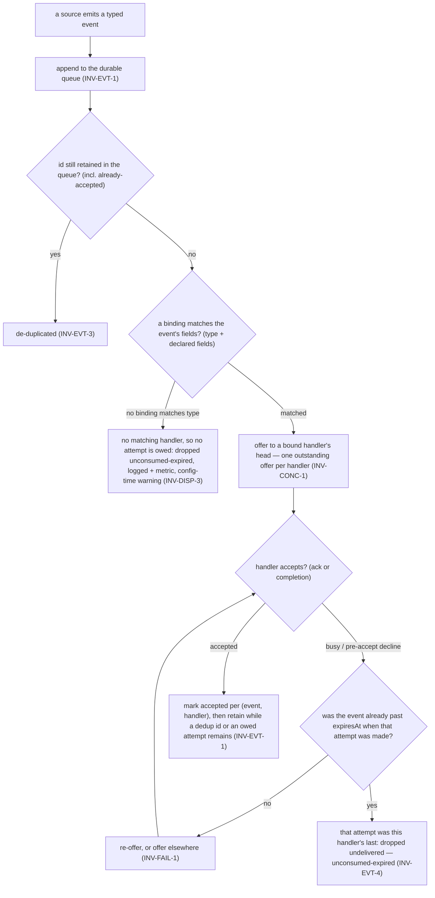
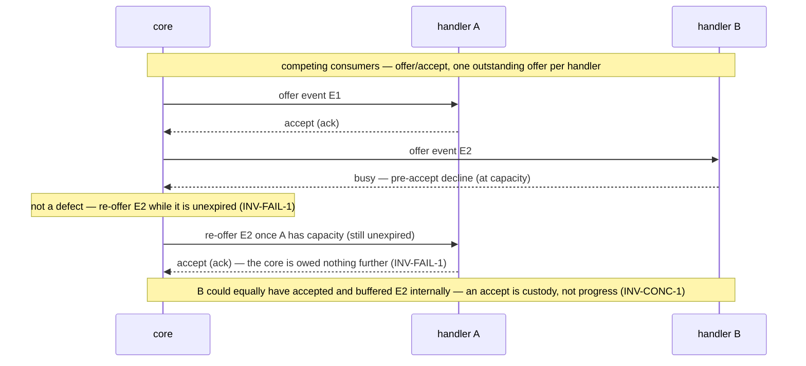

# Invariants — pr-pool

The rules pr-pool's **core** follows. These bound the core's own behavior and the **common manager
contract** it holds with its participants; they do **not** govern what a handler _does_ once
dispatched. See the [glossary](glossary.md), [interfaces](interfaces.md), [actors](actors.md), and
[journeys](journeys.md). IDs are **topical and stable**; numbering gaps are legal, and each rule
uses RFC 2119 language (`MUST` / `SHOULD` / `MAY`). The ID convention and the invariant / goal /
concept distinction come from the behavior-docs method
(`phillipgreenii-nix-agent-support · behavior-docs/docs/behavior`).

## Dispatch (the event model)

An event's path from a source to a handler is a match-then-route decision. (An operator MAY also
inject an event directly via the `push-inject` `INTF-CLI` subcommand — the same push-ingest path,
governed by these same delivery invariants, `INV-EVT-*`.)

- **`INV-DISP-1`** <!-- uuid: 5ad7c9a4-37ea-4496-8f23-51964a8aae54 --> — Sources **emit typed events**; handlers **bind** to events via a **binding**
  that **matches over event fields**. `type` is matched **by default**; a binding **MAY** also match
  on **other fields the source declares** as matchable (including a **declared path into `payload`**,
  which thereby stops being opaque _for matching_). A matched field that is **absent** on an event
  **does not match** — a non-match, **not** an error. The core routes a matched event to a bound
  handler, and a handler responds to **any** of its bound events.
- **`INV-DISP-2`** <!-- uuid: 06662087-a4de-4732-9417-f7440c9aa471 --> — The core reaches every source and handler **only through a manager interface**
  (`INTF-SOURCE` / `INTF-HANDLER`); their implementations are opaque to it. Nothing specific to a
  source, handler, or deployment lives in the core.
- **`INV-DISP-3`** <!-- uuid: 421db242-e1fc-49ba-a1a6-38211abf5569 --> — An event whose `type` **no
  configured binding matches** is **not** a runtime error under the durable queue: it is enqueued and,
  with no handler to offer it to, **is dropped unconsumed-expired** (`INV-EVT-1`, `INV-EVT-4`) — a
  visibility signal ("no event misses"), recorded to logs and metrics, not a rejection of the caller.
  Under `INV-EVT-4` that count is now a **genuine miss** rather than a scheduling artifact: either
  every matching handler had at least one opportunity and none took it, or nothing matched at all. A
  busy handler can no longer be the reason an event expired unoffered, which makes the "no event
  misses" signal considerably more meaningful. Visibility is surfaced two ways: **config-time**,
  `JOURNEY-VALIDATE` emits a **warning** when a source-emitted `type` has **no configured binding at
  all** (you would queue events nothing can take); and at runtime the **unconsumed-expired** metric
  counts such drops. A binding merely **disabled for this run** (`--only`/`--disable`) is expected and
  is neither warned nor an error — its events are offered to nobody and expire. (An _absent declared
  field_ is a non-match, not a no-binding condition.)

## Delivery

- **`INV-EVT-1`** <!-- uuid: faf59ce3-6a27-42c8-8bfa-0903f895eed6 --> — **The delivery-opportunity
  guarantee.** The core holds a **durable, ordered, de-duped, retention-bounded event queue**
  (`ADR 0031`), and **every matching handler WILL get at least one opportunity to accept a matching
  event**: nothing is ever dropped **un-offered**. Delivery is **at-least-once** — an event is
  enqueued durably and the core **attempts delivery until a handler accepts it**, over the window
  `INV-EVT-4` bounds. An event carries an optional **`at`** (the source stamp; **absent, the core's
  own "now" at ingest is used**) and an optional **`expiresAt`** (an **absolute instant**; **absent,
  `at` is used**). Nothing computes a duration, and neither field is configured — they ride on the
  event. The durable record is written **after acceptance is confirmed**, so a narrow crash window MAY
  redeliver (absorbed by idempotent handlers, `INV-EVT-2`). An accepted event is **retained** while
  its `id` is still needed for de-duplication (`INV-EVT-3`) and while any matching handler is still
  owed its opportunity. Delivery therefore **survives a restart** — the storage mechanism
  (jsonl / DB / WAL) is a realization choice, not behavior. _(The `crashing` lifecycle signal in
  `INV-LIFE-1` stays best-effort — that is a separate concern from event-data durability.)_
- **`INV-EVT-2`** <!-- uuid: 06649d39-2734-409a-8098-f3c2cef44cbe --> — A handler **MUST tolerate
  duplicate events** (be idempotent) — required, because at-least-once delivery (`INV-EVT-1`) and the
  narrow crash window MAY redeliver an accepted event. A source **MAY** emit the same event more than
  once; the durable queue makes **both pull and push** events durable through their retention, so a
  push-only source no longer loses events it cannot re-derive.
- **`INV-EVT-3`** <!-- uuid: d54ad229-ed48-4862-aa27-bc2181b4d6c4 --> — The core **de-duplicates by
  event `id` across the retained id set** — including ids of events already delivered or accepted — so
  a source never needs to track whether it already emitted an event, and a re-emit **within
  retention** is dropped as a duplicate. **Retention ends when the final attempts owed under
  `INV-EVT-4` are complete**, which has a consequence worth stating rather than discovering: with the
  born-expired default the dedup window **collapses to roughly one dispatch cycle**, so a pull query
  re-emitting on its next trigger will **not** be deduped. That is consistent with "re-emission, not
  resurrection" and is a real change; an operator who wants a wider dedup window sets `expiresAt`.
- **`INV-EVT-4`** <!-- uuid: 840afb74-2159-447f-985b-33b27dfc35da --> — **Retry is bounded, and the
  bound is evaluated at attempt time.** If the event is **already expired at the moment an attempt is
  made, that attempt is the last one for that handler**: accept or decline, the core does not offer
  that event to that handler again, and once no handler is still owed an attempt the event is dropped
  **unconditionally** (**unconsumed-expired**, `INV-DISP-3`). No attempt history is kept — the expiry
  check at attempt time is the whole decision. Before `expiresAt` the re-offer behavior of
  `INV-FAIL-1` holds unchanged, so **`expiresAt` IS the retry window**: setting it in the future is
  how retries are requested, and absent it there is no retry. Because `expiresAt` defaults to `at` and
  `at` defaults to the core's ingest-now, the default event is **born expired**, and the default
  behavior is therefore **offer once to every matching handler, then drop** — a best-effort default
  needing no configuration, and one under which an event can no longer expire without ever having been
  offered to a busy handler. _(Why expiry is an absolute instant rather than a duration — and why that
  shape leaves no clock origin to choose — is recorded in
  `phillipgreenii-nix-agent-support · packages/pr-pool/docs/decisions · DEC-EVENT-1`.)_

## Interfaces

- **`INV-INTF-1`** <!-- uuid: ddffe016-17c0-4673-896a-70532c968b72 --> — Every participant
  interaction follows the **common manager contract** ([interfaces](interfaces.md)): it conforms to
  the interface's **message schema** (the JSON Schema shapes, `INV-INTF-2`) realized over a
  **transport contract** — the default is the **CLI transport** (schema-versioned JSON on stdin → JSON
  on stdout, coarse exit codes `0` ok / `1` error / `2` busy, rich outcome in the JSON); a gRPC or
  in-code transport is equivalent. Each call carries a per-call **tracking id** and a reply that is
  **inline or deferred** over a single-`command` **callback**. A reply is the participant's
  **acceptance** signal: an **inline completion**
  (synchronous — `accept == complete`) or a **deferred ack** reconciled later over the participant's
  callback, keyed by the tracking id (asynchronous — `accept == ack`, outcome reported later). The
  core's delivery responsibility **ends at acceptance** (`INV-EVT-1`, `INV-FAIL-1`). A callback
  bearing a **tracking id the core does not recognize** — never issued, or already expired and
  evicted — is **acknowledged and ignored** (a logged no-op): not an error, and it does not resurrect
  an expired event. The core **accepts messages only after a participant is `started` and before it
  is `stopping`** (the lifecycle is owned by `INV-LIFE-1`).
- **`INV-INTF-2`** <!-- uuid: 26f9be4d-8481-4a44-9f1a-d79a92c0016a --> — Every interface is
  accompanied by a **conformance suite** (positive and negative checks against its JSON Schema) so an
  implementation can verify it adheres **before** the core is trusted to route through it. Because a
  counterparty here is an **implementer** — a pluggable implementation, or a downstream deployment
  set that realizes these interfaces — this suite, not a peer cross-check, is how agreement is
  confirmed (method `INV-18`, implementer form).

## Concurrency, capacity & failure

- **`INV-CONC-1`** <!-- uuid: 20c84e0f-8ffb-428c-9acc-dcaabb4fdf1b --> — Capacity is
  **handler-enforced and declared nowhere**, never a core-tracked number: no configuration states a
  per-handler ceiling and the core keeps none. A handler offered an event therefore has **two**
  legitimate responses, and the core MUST treat both as correct. It MAY **decline pre-accept with
  `busy`**, after which the core re-offers while the event is unexpired (`INV-FAIL-1`, bounded by
  `INV-EVT-4`); or it MAY **accept and buffer the event internally**, starting it whenever its own
  limits allow. **Acceptance means the handler took custody, not that work started.** The core MUST
  NOT infer progress from an accept, and MUST NOT assume an accepting handler is idle or free to
  take more; all an accept settles is that delivery is complete and the core is owed nothing further
  (`INV-EVT-1`, `INV-FAIL-1`). **"One event → one session"
  holds _within_ a handler**; **fan-out is
  _across_ handlers** — the core tracks acceptance per `(event, handler)` (`INV-EVT-1`) and keeps
  **one outstanding offer per handler** (per-handler serial FIFO, `ADR 0031`). Concurrency is **not
  assumed safe for every event type** — a `type` **MAY** be marked to **serialize** (e.g. a shutdown
  or time-of-day event) so its events never run in parallel. _(A source-side, per-source
  claim-exclusion role — e.g. a downstream deployment's durable in-session claim — is an **external
  actor's** concern, complementary to and not duplicating the core's acceptance tracking.)_
- **`INV-FAIL-1`** <!-- uuid: 2da0d587-f116-42e6-b986-8abf80ed023c --> — Failure classes split at
  the **acceptance boundary** (`INV-EVT-1`, `ADR 0031`). **Pre-accept declines** — a handler is
  `busy` (at capacity) or `unavailable` — are the **core's** to handle: it re-offers the event **while
  it is unexpired** (`INV-EVT-4`), to the same handler once the ceiling lifts or to another bound
  handler. **Post-accept
  outcomes** — `retryable`, `resource-limit`, or `critical`, reported by a handler that has
  **already accepted** the event — are the **handler's** own (once it accepts, the handler owns
  persistence/resume/retry); the core does **not** re-offer post-accept work, and does **not**
  classify or count it (`INV-OBS-1`). Such an outcome is **surfaced on the handler's own surface** (its
  own logs and metrics) or turned into a **new event**, and `critical` still means **a human is
  needed** — never a silent core retry. The core takes no per-run status stream back from a handler at
  all; the only status a participant pushes to the core is its **own** health (`healthy` / `degraded` /
  `unavailable`), and an `unavailable` report is a pre-accept decline handled above.

## Wiring

- **`INV-WORKFLOW-1`** <!-- uuid: 66dfe98d-a564-4414-a3db-77b518d27f31 --> — The **wiring** (a
  **routing graph**) is the declared flow tying **event sources → event types → event handlers**
  through their **bindings**. The core is a **flat edge-router, not a workflow engine**: it **MUST**
  be able to **validate the wiring** — no orphan event types, no unhandled source output, no
  disconnected handlers, and loop detection — and **report** on it, and it validates **nothing
  beyond** that — **no workflow-completeness and no sequencing** (source semantics are opaque to the
  core, and the core sees only single directed edges, never a handler's outcome or how it correlates
  to a next event). The core defines **delivery** outcomes (accept / decline / delivery-failure
  class), **not work** outcomes (did the review pass?) — those live in the handler and a downstream
  tracker. Declaring or altering the wiring is **configuration**: it **MUST NOT** require changing the
  core (`GOAL-MIN-1`). _(Whether validation runs pre-runtime and exactly how a serialize mark is
  expressed are open questions, `OQ-WORKFLOW` and `OQ-CONC-MARK`.)_

## Observability & lifecycle

- **`INV-OBS-1`** <!-- uuid: 1ab39347-6835-40bf-9145-4d5e658780dd --> — The core exposes a declared
  **metric catalog** (each metric's `name`, `kind`, `unit`, labels); a **monitoring sink** pulls or
  pushes a declared subset (`INTF-MON`). Observability covers **metrics and logs** (traces are a later
  concern). The catalog MUST declare at least: **queue depth** (gauge, per `type`), **failure rate**
  (counter, per failure class), and **unconsumed-expired** (counter, per `type` — events that expired
  with no handler accepting them, which under `INV-EVT-4` is a genuine miss and is the concrete "no
  event misses" signal, `INV-DISP-3`),
  alongside the existing throughput / backlog / liveness metrics. **The failure-rate classes are
  DELIVERY-SIDE and there are exactly two**: a **pre-accept decline** (an `unavailable` report, or a
  `busy` **exit code `2`**, `INV-CONC-1`) and a **dispatch failure** where the core could not hand the
  event over at all. Post-accept classes (`retryable`, `resource-limit`, `critical`) are **NOT**
  counted here: after acceptance the handler owns the work (`INV-FAIL-1`), so classifying its outcomes
  is the handler's own observability concern on the handler's own surface. Queue depth and
  unconsumed-expired are unaffected by that narrowing — both are already pure delivery. The metric
  catalog is the neutral **shape**; **OTel** is the default **emission transport for metrics only** (a
  neutral standard, not a mandated tool — `GOAL-MIN-1` still holds), while logs stay JSONL; the
  concrete backend **remains** a deployment binding via `INTF-MON`. The core is unaware of any
  concrete monitoring backend, and an **observer** reads the sink, never the core. A daemon emits
  continuously, and **`run-until-idle` DOES emit a final snapshot** before it exits.
- **`INV-LIFE-1`** <!-- uuid: d3d2dbc8-e260-42cc-a6d3-204aaf8dbc59 --> — The core runs as a **socket
  service** in both modes — a long-running **daemon** (`run`) and a one-off **run-until-idle**, which
  exits when the **queue is drained and no offer is outstanding** (every enqueued event is accepted
  or expired, and no handler has an outstanding offer), then stops. Both keep the socket
  available so push sources can reach it. The core signals each registered participant through the
  lifecycle `starting → started → stopping → stopped`, plus a **best-effort `crashing`** signal on
  sudden shutdown; because `crashing` is best-effort (it MAY be lost), **no correctness rule may
  depend on it** — this signal stays best-effort even though event **data** is now durable
  (`INV-EVT-1`).

## Precedence

- **`INV-PREC-1`** <!-- uuid: b298120d-2344-496b-a849-63e4af071ec0 --> — When two invariants **conflict**, the ordering is
  **safety/isolation > continuity (never drop work) > efficiency**. A newly-discovered conflict
  **MUST** be recorded as an **open question** and resolved by a **decision** (an ADR), **not**
  chosen ad hoc by an agent. This is pr-pool's **precedence** ordering under the method's optional
  precedence mechanism (`phillipgreenii-nix-agent-support · behavior-docs/docs/behavior · INV-19`).
  _(A downstream deployment set cites this ordering rather than restate it.)_

## Goal

- **`GOAL-MIN-1`** <!-- uuid: e0be6f1c-8eb9-4d7e-9900-bc14e7a38d4a --> — Keep the core **minimal**:
  anything specific to a source, handler, monitor, or deployment belongs **behind an
  interface** (realized in a downstream deployment set), **never** in the core. Over time, **less**
  implementation detail should live in the core, not more.
