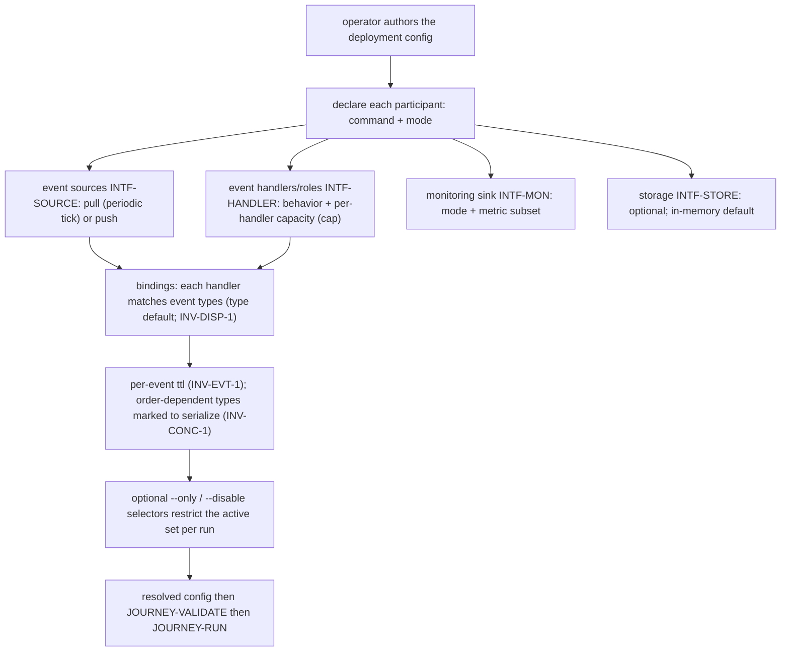
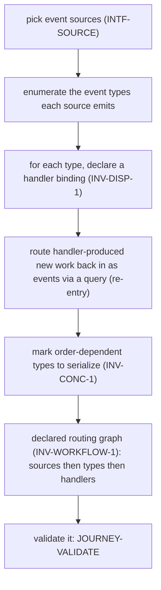
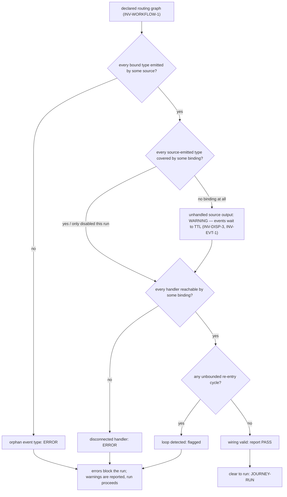
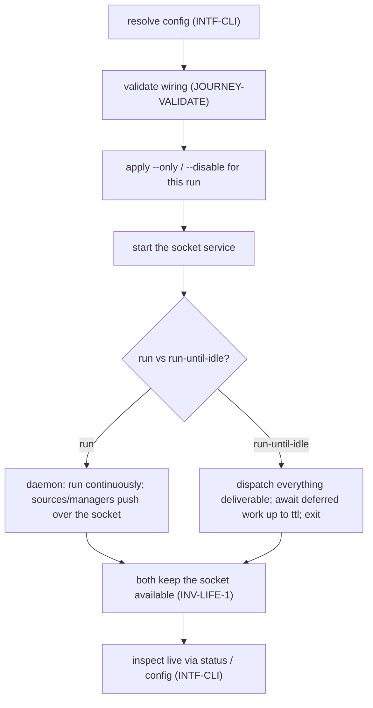
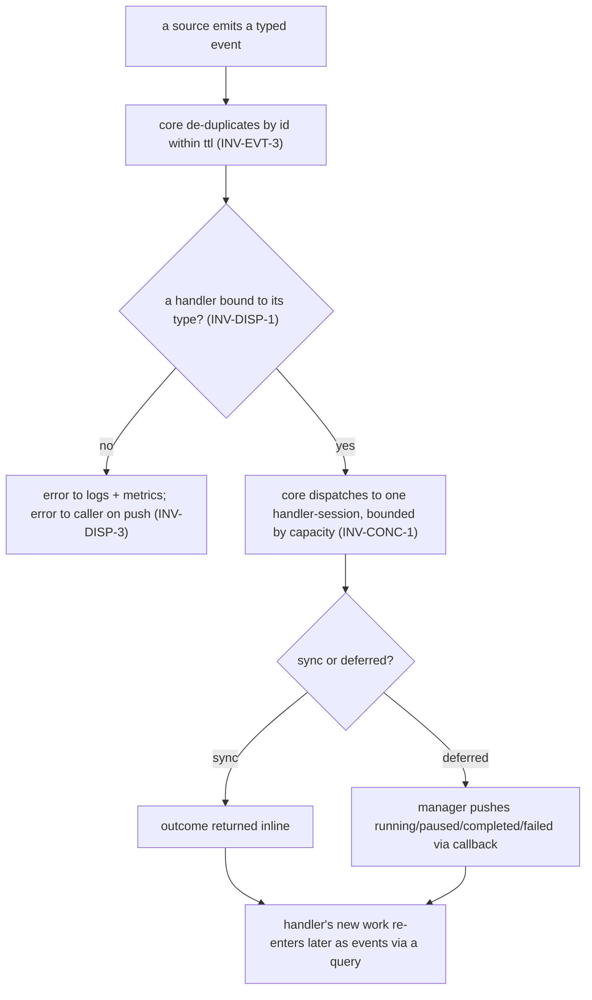
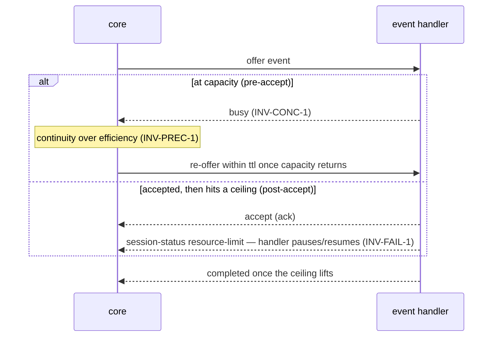
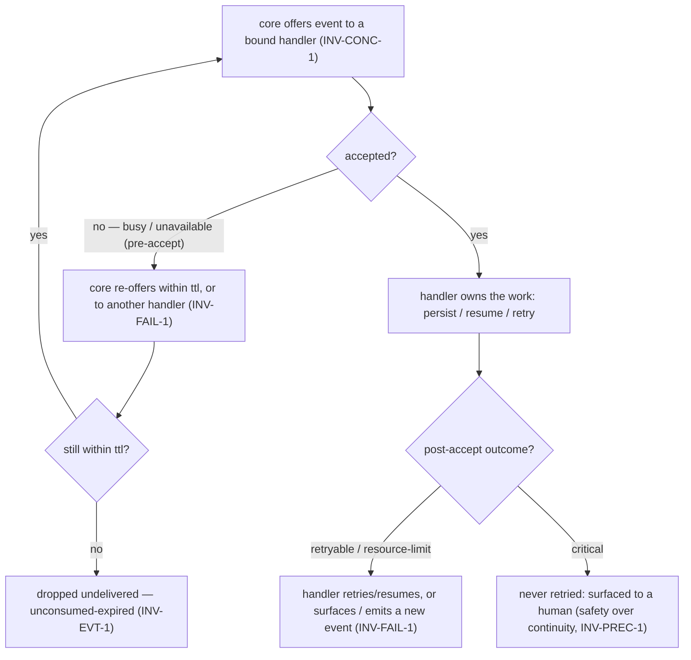
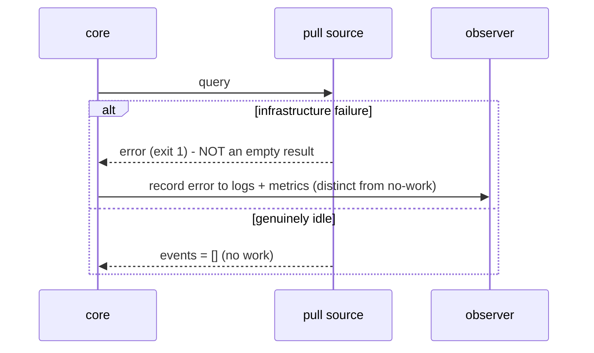
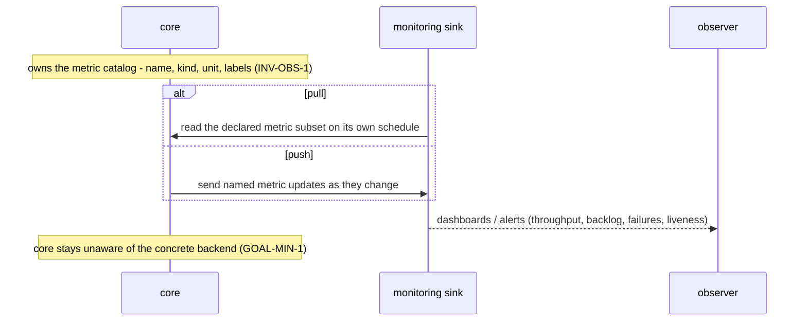

# Journeys & open questions — pr-pool

User stories, lifecycle journeys, and open questions. Stories and journeys carry IDs so downstream
can cite them; together they establish the extent. See the [glossary](glossary.md),
[actors](actors.md), [interfaces](interfaces.md), and [invariants](invariants.md) — every ID cited
below resolves in one of those files. Diagrams are illustrative (`GOAL-MIN-1` keeps the core minimal;
concrete tools, transports, and tuning constants live in a downstream deployment set and decision
docs).

Each journey states its **actor(s)**, a **one-line intent**, the **flow**, and at least one
**flow and/or sequence diagram**. Journeys are ordered as an implementer would meet them —
build a participant, configure it, wire and validate the routing graph, run, then watch it behave under
load and failure.

## User stories

**Operator (`ACTOR-OP`)**

- **`STORY-OP-1`** <!-- uuid: a2c94489-5224-42d6-a0ee-72964abbcdaf --> — configure event sources, event handlers, and their event-type **bindings**,
  then run the core as a **daemon** (`run`) or **`run-until-idle`**, so work is dispatched without
  babysitting. _(→ `JOURNEY-CONFIG`, `JOURNEY-RUN`; `INV-DISP-1`, `INV-LIFE-1`.)_
- **`STORY-OP-2`** <!-- uuid: 09c4dd4b-6bbd-4495-b338-0e173e9f7402 --> — add a new event source or handler and **smoke-test** it against the live config
  before trusting it, so a misconfiguration is caught early. _(→ `JOURNEY-SMOKE`.)_
- **`STORY-OP-3`** <!-- uuid: 2e016bb5-c241-4795-a371-36e94e55c786 --> — restrict the active set of sources/handlers for a single run **without editing
  config** (`--only` / `--disable`), so I can isolate or pause parts of the system quickly.
  _(→ `JOURNEY-RUN`.)_
- **`STORY-OP-4`** <!-- uuid: f23554c2-91f5-454a-af95-1c714a4f44f2 --> — swap a manager implementation without touching the core, so which tools back a
  source/handler/monitor/storage is my choice, not the core's concern. _(→ `INV-DISP-2`,
  `GOAL-MIN-1`.)_
- **`STORY-OP-5`** <!-- uuid: dd96bcfb-509c-4543-b32c-1f77af7330b7 --> — have orphaned bindings and misrouted event types **surfaced**, not silently
  dropped — ideally **before runtime** — so a broken wiring is visible. _(→ `JOURNEY-VALIDATE`;
  `INV-WORKFLOW-1`, `INV-DISP-3`.)_
- **`STORY-OP-6`** <!-- uuid: 6e131756-a26d-42ac-a49b-05a8bb875c32 --> — trust a stable interface **contract** plus a **conformance suite**, so I can
  add a manager and verify it adheres before relying on it. _(→ `JOURNEY-CONFORM`; `INV-INTF-1`,
  `INV-INTF-2`.)_
- **`STORY-OP-7`** <!-- uuid: 0a52eff8-35ca-46c3-a7c1-79582fd4ce44 --> — get **throughput through concurrency** yet be able to **serialize** sensitive
  event types, so parallelism never corrupts order-dependent work. _(→ `INV-CONC-1`; safety over
  efficiency, `INV-PREC-1`.)_
- **`STORY-OP-8`** <!-- uuid: 627ec338-12a6-483d-a792-2168bc3841a8 --> — rely on clear **delivery semantics** (durable, at-least-once, de-duped,
  `ttl`-bounded), so I design handlers to be idempotent and know an accepted event survives a
  restart. _(→ `INV-EVT-1`, `INV-EVT-2`, `INV-EVT-3`; `JOURNEY-FLOW`, `JOURNEY-FAIL`.)_
- **`STORY-OP-9`** <!-- uuid: 9d593740-745e-42fd-a74c-2a283b57b81c --> — declare the **wiring** tying sources → event types → handlers through their
  bindings, so the wiring is a first-class, inspectable artifact rather than an emergent accident.
  _(→ `JOURNEY-WORKFLOW`; `INV-WORKFLOW-1`.)_
- **`STORY-OP-10`** <!-- uuid: 738e4c5e-01f9-4c2b-bb11-81ed0a4c6dc9 --> — **validate** that wiring before running — no orphan event types, no unhandled
  source output, no disconnected handlers, no unbounded loops — so I get a pass/fail report, not a
  runtime surprise. _(→ `JOURNEY-VALIDATE`; `INV-WORKFLOW-1`.)_
- **`STORY-OP-11`** <!-- uuid: 49f4499d-019f-47e4-a66c-773c20137f6d --> — have a handler failure handled **by its class** (`retryable` re-offered within
  `ttl`, `resource-limit` paused and re-offered, `unavailable` deferred, `critical` never retried
  and sent to a human), so transient trouble self-heals and only genuine defects reach me.
  _(→ `JOURNEY-PAUSE`, `JOURNEY-FAIL`; `INV-FAIL-1`.)_
- **`STORY-OP-12`** <!-- uuid: 20a9f5f1-9b4a-4f67-a18b-bb1dedf23153 --> — trust that when the core must trade off, it prefers **safety over continuity
  over efficiency**, so it will halt on a `critical` fault and pause rather than push order-dependent
  work unsafely. _(→ `JOURNEY-FAIL`; `INV-PREC-1`.)_

**Observer (`ACTOR-OBS`)**

- **`STORY-OBS-1`** <!-- uuid: ce97e9c6-5719-4b18-9de9-fa1900b951bd --> — see throughput, backlog, failures, and liveness through dashboards fed by the
  **metric catalog**, so I know the system's health. _(→ `JOURNEY-OBSERVE`; `INV-OBS-1`.)_
- **`STORY-OBS-2`** <!-- uuid: 257f9e86-187b-4ee8-8123-b75b71d976b5 --> — distinguish a **source infrastructure failure** from a genuinely idle "no
  work" reading, and see `ttl`-drops and failure classes as metrics, so a silent outage does not
  read as "nothing to do." _(→ `JOURNEY-FAIL`, `JOURNEY-OBSERVE`; `INV-DISP-3`, `INV-OBS-1`.)_

**Coverage (traceability).** Per the method's rule that a set's extent is exactly what its stories
and journeys require (`phillipgreenii-nix-agent-support · behavior-docs/docs/behavior · INV-11`),
every invariant family here is exercised by a story or journey:
dispatch (`INV-DISP-*`) by `JOURNEY-FLOW` / `STORY-OP-1,5`; delivery (`INV-EVT-*`) by `JOURNEY-FLOW`
/ `JOURNEY-FAIL` / `STORY-OP-8`; interface + conformance (`INV-INTF-1/2`) by `JOURNEY-CONFORM` /
`STORY-OP-6`; concurrency (`INV-CONC-1`) by `STORY-OP-7`; failure (`INV-FAIL-1`) by `JOURNEY-PAUSE`
/ `JOURNEY-FAIL` / `STORY-OP-11`; precedence (`INV-PREC-1`) by `JOURNEY-FAIL` / `STORY-OP-12`;
observability (`INV-OBS-1`) by `JOURNEY-OBSERVE` / `STORY-OBS-*`; lifecycle (`INV-LIFE-1`) by
`JOURNEY-RUN` / `JOURNEY-FAIL`; workflow (`INV-WORKFLOW-1`) by `JOURNEY-WORKFLOW` / `JOURNEY-VALIDATE`
/ `STORY-OP-9,10`; the minimality goal (`GOAL-MIN-1`) by `JOURNEY-OBSERVE` / `STORY-OP-4`.

## Journeys

### `JOURNEY-CONFORM` — create and verify a new participant implementation <!-- uuid: 612b7808-c90f-4792-baa6-670ce22dd6d2 -->

**Actor:** `ACTOR-OP` (as the participant's implementer/integrator).
**Intent:** build an event source, event handler, monitoring sink, or storage against its `INTF-*`
contract, then run the **conformance suite** (positive + negative) before trusting it.

**Flow.**

1. Choose the interface to implement — `INTF-SOURCE`, `INTF-HANDLER`, `INTF-MON`, or `INTF-STORE`
   (one process MAY implement several; the core neither knows nor cares).
2. Read that interface's **JSON Schemas** — the authoritative contract. Note the shared **common
   manager contract** (`INV-INTF-1`): schema-versioned JSON on stdin → JSON on stdout, a tracking
   **`id`** echoed on any deferred result, a single **callback** command the core supplies, coarse
   exit codes (`0` ok / `1` error / `2` busy), and the `starting → started → stopping → stopped`
   lifecycle. Messages are accepted **only after `started` and before `stopping`**.
3. Implement the interface's subcommands:
   - **`INTF-SOURCE`** <!-- uuid: 20f6bd96-8c08-4996-b28e-120310ca1c57 --> — `query` returning `{ events }` or `{ deferred: true }` (then push via
     callback); or, for a push source, invoke the ingest callback. Each event carries `id`, `type`,
     `ttl`, `at`, and a **JSON-object** `payload`.
   - **`INTF-HANDLER`** <!-- uuid: 5b58b72c-15f1-4b8e-be9a-f83a0f164cc1 --> — accept a `dispatch`, reply with an inline outcome or `{ deferred: true }`,
     and (if deferred) push `running / paused / completed / failed` via the callback; a `failed`
     carries a **failure class** (`INV-FAIL-1`). MUST tolerate a **duplicate event** idempotently
     (`INV-EVT-2`).
   - **`INTF-MON`** <!-- uuid: 0572b0aa-b01f-4ed6-9681-c16c93e45c3b --> — declare push or pull, and the metric subset handled.
   - **`INTF-STORE`** <!-- uuid: 3f4b7167-3271-4972-b7a7-adf6488d9b9a --> — `get` / `put` / `delete` over string keys and JSON-string values.
4. Run the interface's **conformance suite** (`INV-INTF-2`): **positive** checks (well-formed
   requests get schema-valid replies; the deferred path echoes the tracking `id`; lifecycle
   transitions are accepted) and **negative** checks (an unknown `schemaVersion` is _reported_, not
   crashed on; a malformed or non-object payload is rejected; a message before `started` / after
   `stopping` is refused; a handler tolerates the same event twice).
5. Only once **both** positive and negative checks pass is the participant trusted enough to wire
   into config (`JOURNEY-CONFIG`).

```mermaid
sequenceDiagram
    participant OP as operator / implementer
    participant Suite as conformance suite
    participant P as participant (INTF-* impl)
    OP->>P: implement subcommands to the interface JSON Schema
    OP->>Suite: run positive + negative checks
    Suite->>P: starting then started (lifecycle)
    Suite->>P: positive - well-formed request (JSON stdin, tracking id)
    P-->>Suite: schema-valid reply (echoes id), or deferred then callback
    Suite->>P: negative - message before started / after stopping
    P-->>Suite: refused (not accepted)
    Suite->>P: negative - unknown schemaVersion
    P-->>Suite: reported, not crashed
    Suite->>P: negative - malformed / non-object payload
    P-->>Suite: rejected
    Note over Suite,P: handler only - same event twice is tolerated (INV-EVT-2)
    Suite-->>OP: PASS both suites then trust; else FAIL naming the offending check
```

### `JOURNEY-CONFIG` — configure participants and the app <!-- uuid: db696e7c-ec86-4980-808d-add7744e0bc1 -->

**Actor:** `ACTOR-OP`.
**Intent:** author the deployment configuration that the core resolves and runs.

**Flow.** The operator declares, in one configuration:

- **Participants** — for each, the **command** the core invokes and its **mode** where the interface
  offers one (a source's **pull** vs **push**; a monitoring sink's **pull** vs **push**).
- **Event sources** (`INTF-SOURCE`) — and, for a pull source, its **query trigger**: a **periodic**
  tick.
- **Event handlers / roles** (`INTF-HANDLER`) — each with its behavior and its **capacity (cap)**,
  the per-handler concurrency ceiling.
- **Bindings** — for each handler, the **event-type match** it responds to. `type` is the default
  field; a binding MAY match other declared fields (`INV-DISP-1`).
- **Per-event `ttl`** — how long the core **holds, offers, and retains** an event in the queue
  before dropping it if unaccepted (`INV-EVT-1`), and any event type **marked to serialize**
  (`INV-CONC-1`, see `OQ-CONC-MARK`).
- **Monitoring sink** (`INTF-MON`, optional) — its mode and the **metric subset** it handles.
- **Storage** (`ACTOR-STO` via `INTF-STORE`, optional; the default is in-memory).
- **Selectors** — `--only` / `--disable` to restrict the active set of sources/handlers for a single
  run **without editing config** (`STORY-OP-3`).

The resolved config is validated as a routing graph (`JOURNEY-VALIDATE`) and run (`JOURNEY-RUN`). The
full configuration **schema** is not yet fixed (see `OQ-CONFIG`).



### `JOURNEY-WORKFLOW` — declare the wiring <!-- uuid: 8dbe959c-e1bc-4ea4-890f-778d2651ffb4 -->

**Actor:** `ACTOR-OP`.
**Intent:** declare the **wiring** (a routing graph) — the flow tying event sources → event types →
event handlers through their bindings (`INV-WORKFLOW-1`). This is pr-pool's routing graph, **not** a
deployment's user-facing workflow.

**Flow.**

1. Pick the **event sources** the deployment needs.
2. Enumerate the **event types** each source emits.
3. For each event type, declare a **handler binding** so some handler responds to it (`INV-DISP-1`);
   a handler responds to **any** of its bound types.
4. Where a handler produces **new work**, route it back in as events **via a query** (re-entry) — the
   core does not branch outputs itself (see `OQ-BRANCH`); new work re-enters through a source.
5. Mark **order-dependent** event types to serialize (`INV-CONC-1`) so concurrency never corrupts
   them.

The result is a **declared routing graph**: an inspectable graph of sources → types → handlers that
`JOURNEY-VALIDATE` checks. The core validates the graph's **wiring** only — it never models work
sequencing or completeness (`INV-WORKFLOW-1`).



### `JOURNEY-VALIDATE` — verify the wiring will work <!-- uuid: 1aafdfa5-b3c4-4a41-bde8-4e368e6ec819 -->

**Actor:** `ACTOR-OP`.
**Intent:** validate the **wiring** **before running**, and report the result (`INV-WORKFLOW-1`).
This checks the routing graph's flat wiring **only** — never workflow-completeness or sequencing.

**Flow.** The core walks the declared routing graph and reports, distinguishing an **error** (a
malformed graph) from a **warning** (a graph that would queue events nobody can take):

- **Orphan event type** — a binding matches a `type` no configured source emits → error.
- **Unhandled source output** — a source emits a `type` **no configured binding covers at all** →
  **warning** (`INV-DISP-3`): under the durable queue such events simply wait and expire at TTL
  (unconsumed-expired, `INV-EVT-1`), so it is a visibility signal ("no event misses"), not a runtime
  error. A binding merely **disabled for this run** (`--only`/`--disable`) is expected and does not
  warn.
- **Disconnected handler** — a handler no binding can reach → error.
- **Loop** — a re-entry cycle (`handler → query → same type`) that would not terminate → flagged.

A run is blocked only on an **error**; a warning is reported and the run proceeds. The report names
each finding so the operator can fix config. (This resolves the former wiring open question —
validation is first-class via `INV-WORKFLOW-1`.)



### `JOURNEY-RUN` — configure and run <!-- uuid: 0e286925-9bca-4cba-bc37-ed4079e8637c -->

**Actor:** `ACTOR-OP`.
**Intent:** run the validated config as a **daemon** (`run`) or as **`run-until-idle`**, and inspect
it while it runs (`INV-LIFE-1`).

**Flow.** The core resolves config, validates the wiring (`JOURNEY-VALIDATE`), applies any
`--only` / `--disable` selectors for this invocation, and starts the **socket service**. Then:

- **`run`** — run continuously as a daemon; sources and managers **push** over the socket.
- **`run-until-idle`** — dispatch from the durable queue and exit once the **queue is drained and no
  offer is outstanding** (every enqueued event accepted or TTL-expired, and no handler holding an
  offer, `INV-LIFE-1`); the socket stays open throughout so managers can still push.

Both modes keep the socket available. The operator inspects a running core with `status` (resolved
config + live handler-sessions + queue depths) and `config` (the resolved configuration); every
subcommand emits text by default and `--json` for machines (`INTF-CLI`). Whether the CLI
**auto-starts** a core when it finds none is undecided (`OQ-AUTOSTART`).



### `JOURNEY-FLOW` — an event's life <!-- uuid: 507d3b05-87b5-43f3-9098-e4e9cdebc9bd -->

**Actors:** `ACTOR-SRC`, core, `ACTOR-HDL`.
**Intent:** follow one event from a source, through routing, to a bound handler, through a
sync-or-deferred reply and status, to completion — with the handler's new work re-entering later as
events via a query.

**Flow.** A source **emits** a typed event (a pull source on its query trigger; a push source on its
ingest callback). The core **de-duplicates by `id` within `ttl`** (`INV-EVT-3`) and **routes by
`type`** (`INV-DISP-1`). An event whose `type` no handler binds is an **error** — recorded to logs
and metrics, and returned to the caller on the push/ingest path (`INV-DISP-3`). Otherwise the core
**dispatches** the event to a handler as a **handler-session** (tracked by the request `id`),
delivering each event to **one** session bounded by the handler's capacity (`INV-CONC-1`). The
handler replies **sync** (outcome inline) or **deferred** (`{ deferred: true }`, then
`running / paused / completed / failed` via the callback). New work the handler produces re-enters
later as fresh events through a query.



```mermaid
sequenceDiagram
    participant SRC as event source
    participant CORE as core
    participant HDL as event handler
    participant Q as a later query
    alt pull source
        CORE->>SRC: query (tracking id, callback)
        SRC-->>CORE: events, or deferred then callback
    else push source
        SRC->>CORE: ingest-event callback
    end
    CORE->>CORE: de-dup by id within ttl (INV-EVT-3); route by type (INV-DISP-1)
    Note over CORE: unknown type is an error to logs+metrics and to the caller (INV-DISP-3)
    CORE->>HDL: dispatch event as a handler-session (tracking id)
    alt sync
        HDL-->>CORE: outcome inline
    else deferred
        HDL-->>CORE: deferred:true
        HDL->>CORE: running / paused / completed / failed via callback
    end
    Note over HDL,Q: handler's new work re-enters later as events via a query
```

### `JOURNEY-SMOKE` — add and verify <!-- uuid: 2ea962a3-b598-40a8-8ad9-60bb4e2a4ddb -->

**Actor:** `ACTOR-OP`.
**Intent:** add a source or handler to config and smoke-test it against the live config before
trusting it.

**Flow.** The operator runs `run-query <query>` (exercise a single source, read-only) or
`run-role <role> <event>` (dispatch one event through a single handler). The core sets a
**test-mode** signal so the manager/role knows a test is in flight, invokes it against the live
config, and renders the reply (text, or `--json`). The operator confirms the **shapes** — the events
a source emits, or the outcome a handler returns — before trusting it in a live run. (This exercises
the same contract the conformance suite checks in `JOURNEY-CONFORM`, but against _this_ deployment's
config rather than in isolation.)

```mermaid
sequenceDiagram
    participant OP as operator
    participant CORE as core
    participant M as source / handler manager
    OP->>CORE: run-query query  OR  run-role role event
    CORE->>M: set test-mode signal, then invoke (query / dispatch)
    M-->>CORE: reply (events, or outcome)
    CORE-->>OP: rendered shapes (text; --json for machines)
    Note over OP: confirm the shapes before trusting it in a live run
```

### `JOURNEY-PAUSE` — capacity and resource-limit at the acceptance boundary <!-- uuid: 8752e12e-7ea2-4edd-8620-839fc5ef3cff -->

**Actors:** core, `ACTOR-HDL`, `ACTOR-SRC`.
**Intent:** show how capacity and a resource limit resolve on the two sides of the **acceptance
boundary** (`INV-FAIL-1`), without pinning an open call.

**Flow — pre-accept (`busy`).** A handler at capacity **declines pre-accept** with `busy`
(`INV-CONC-1`). This is the **core's** to handle: preferring **continuity over efficiency**
(`INV-PREC-1`), it re-offers the event **within `ttl`** once the handler frees up, or offers it to
another bound handler; the event stays durable in the queue until then (`INV-EVT-1`). If `ttl`
expires still-unaccepted, the event is dropped (unconsumed-expired) — a pull source re-derives it on
its next trigger.

**Flow — post-accept (`resource-limit`).** A handler that has **already accepted** an event and then
hits a usage-window / quota ceiling reports **`resource-limit`**. Post-accept, the **handler owns**
persistence and resume (`INV-FAIL-1`): it pauses its own work and resumes once the ceiling lifts, or
surfaces the outcome / emits a new event. The core does **not** re-offer accepted work. `critical` is
never retried (`JOURNEY-FAIL`).



### `JOURNEY-FAIL` — failure scenarios <!-- uuid: fd32bd84-c5e8-456e-a1f7-f60dc3e05c05 -->

**Actors:** core, `ACTOR-SRC`, `ACTOR-HDL`, `ACTOR-OBS`.
**Intent:** show the spread of failures and how the core's precedence (`INV-PREC-1`: safety >
continuity > efficiency) shapes each response.

**Flow — handler failure at the acceptance boundary (`INV-FAIL-1`).** The response splits at
acceptance:

- **pre-accept declines** — `busy` (at capacity, `INV-CONC-1`) or `unavailable` (can't take work
  now) — are the **core's**: it re-offers the event **within `ttl`**, once the handler frees up or to
  another bound handler; the event stays durable in the queue until accepted or TTL (`INV-EVT-1`).
- **post-accept outcomes** — `retryable`, `resource-limit`, or `critical`, reported by a handler that
  **already accepted** — are the **handler's** own (it owns persistence/resume/retry once it
  accepts). The core does **not** re-offer accepted work; the outcome is surfaced back or becomes a
  new event, and `critical` is **surfaced to a human** — safety over continuity (`INV-PREC-1`).



**Flow — source infrastructure failure vs "no work."** A pull source's `query` can fail because its
backing infrastructure is down. That is an **error** (a non-zero exit / error reply), **not** an
empty result: the core records it to logs and metrics and does **not** treat it as "nothing to do"
(`INV-DISP-3` reporting discipline; `STORY-OBS-2`). An empty `events` list is the distinct,
legitimate "genuinely idle" reading.



**Flow — event `ttl`-drop.** An event stays in the **durable queue** until its `ttl` (`INV-EVT-1`),
surviving restarts; it is dropped only when the `ttl` expires **without acceptance**
(unconsumed-expired) — the `ttl` branch in the flow above. A pull source re-derives it on its next
trigger; a push-only source's event was durable to TTL, so it is lost only if nothing accepted it
before it expired (`INV-EVT-2`).

**Flow — core crash.** On a fatal condition the core makes a **best-effort** `crashing` signal to
registered participants (`INV-LIFE-1`). That signal stays best-effort and MAY be lost — but event
**data** is now durable (`INV-EVT-1`, `ADR 0031`): an accepted-and-persisted event **survives the
restart** and is redelivered at-least-once, and only the **narrow crash window** (accepted but not
yet persisted) MAY redeliver — absorbed by idempotent handlers (`INV-EVT-2`). After restart the core
resumes offering from the durable queue; pull sources also re-derive current truth on their next
trigger. (Whether the core needs an explicit branch/deadletter path beyond re-entry is `OQ-BRANCH`.)

```mermaid
sequenceDiagram
    participant CORE as core
    participant M as registered participants
    Note over CORE: fatal condition
    CORE-->>M: best-effort crashing signal (INV-LIFE-1) — MAY be lost
    Note over CORE: accepted events are durable (INV-EVT-1); only the narrow crash window may redeliver
    CORE->>CORE: restart
    Note over CORE,M: core resumes offering from the durable queue; idempotent handlers absorb any redelivery (INV-EVT-2)
```

### `JOURNEY-OBSERVE` — watch health <!-- uuid: 3c360b41-5a84-4607-88b6-425c02f80474 -->

**Actors:** core, `ACTOR-MON`, `ACTOR-OBS`.
**Intent:** watch throughput, backlog, failures, and liveness through the metric catalog.

**Flow.** The core **owns the metric catalog** — a declared set of metrics, each with `name`, `kind`
(counter / gauge / histogram), `unit`, and label shape (`INV-OBS-1`). The catalog MUST declare at
least **queue depth** (gauge, per `type`), **failure rate** (counter, per failure class), and
**unconsumed-expired** (counter, per `type` — the "no event misses" signal, `INV-DISP-3`), alongside
throughput / backlog / liveness / dispatch-latency metrics. A monitoring sink **declares its mode and
metric subset** and either **pulls** current values on its own schedule or receives **pushed** updates
(`INTF-MON`); it serves its own external surface (dashboards, alerts). Emission uses **OTel for
metrics only**; **logs stay JSONL**, and observability covers **metrics + logs** (traces are a later
concern). A **daemon** emits continuously; **`run-until-idle`** MAY emit a final snapshot. The core
stays unaware of the concrete backend (`GOAL-MIN-1`).



## Open questions

Each states the gap, its owner, a resolution path, and where it blocks.

- **`OQ-CONFIG`** <!-- uuid: e004fda6-f6e6-41e1-8ec4-0b90c17fd2b2 --> — the full **configuration schema**: participants (command + mode), event sources,
  handlers/roles + their event-type **bindings**, per-event `ttl`, caps, monitoring/storage
  selection, and the `--only` / `--disable` selectors. _Gap_: the authored config shape is not yet
  fixed. _Owner_: operator/author. _Path_: extract from pr-pool's TOML prior art and settle the
  schema. _Blocks_: authoring config (`JOURNEY-CONFIG`); `INTF-CLI`.
- **`OQ-EVT-TTL-ORIGIN`** <!-- uuid: 48ca567c-6b64-4a98-b3c0-dc5f03b2b46b --> — the **TTL clock
  origin**: whether an event's `ttl` is measured from the event's `at` (creation) time or from the
  time the core **ingests** it. _Gap_: the durable queue de-dups and expires by `ttl` (`INV-EVT-3`),
  but which instant starts the clock is unsettled. _Owner_: author. _Path_: decide `at` vs. ingest
  when settling the queue's realization. _Blocks_: exact dedup/expiry timing (`INV-EVT-1`,
  `INV-EVT-3`); the queue implementation.
- **`OQ-AUTOSTART`** <!-- uuid: f0cc2ca2-9f58-4c57-bfff-d81d003370fb --> — whether the **CLI auto-starts** a core when it finds none running, versus
  requiring an explicit `run`. _Gap_: the locate-then-act behavior is undecided. _Owner_: operator/
  author. _Path_: decide auto-start vs. fail-with-hint. _Blocks_: `INTF-CLI` locate behavior;
  `JOURNEY-RUN`.
- **`OQ-CONC-MARK`** <!-- uuid: 427e52f7-223f-428e-b8c7-e8140d557f8e --> — **how an event type is marked to serialize** (`INV-CONC-1`). _Gap_: the
  mechanism for declaring an order-dependent type is undecided. _Owner_: author. _Path_: decide a
  per-type config flag vs. a binding attribute. _Blocks_: safe handling of order-dependent events;
  `JOURNEY-CONFIG`, `JOURNEY-WORKFLOW`.
- **`OQ-BRANCH`** <!-- uuid: d846f637-19dd-4c12-aa02-3519683884dc --> — whether the core needs **branching on failure** (e.g. a deadletter path), or
  whether a handler's internal branches producing new events (re-entering via queries) suffice.
  _Gap_: no branching primitive exists; this is **deferred**. _Owner_: author. _Path_: let it fall
  out as real usage demands it rather than guess now. _Blocks_: nothing yet; revisit if a
  failure-routing need appears in `JOURNEY-FAIL`.
