# Journeys & open questions — pr-pool

User stories, one end-to-end journey, the use cases that journey composes, and open questions.
Stories, the journey, the use cases and the open questions carry IDs so downstream can cite them;
together they establish the extent, since a set's extent is exactly what its stories, use cases and
journeys require (`phillipgreenii-nix-agent-support · behavior-docs/docs/behavior · INV-11`). IDs
are **topical and stable**; numbering gaps are legal, mirroring `invariants.md`'s own convention —
one such gap sits between the operator stories above (example only, not a citation: `STORY-OP-10`
is a deliberate skip, not an omission). See the
[glossary](glossary.md), [actors](actors.md), [interfaces](interfaces.md), and
[invariants](invariants.md) — every ID cited below resolves in one of those files. Diagrams are
illustrative (`GOAL-MIN-1` keeps the core minimal; concrete tools, transports, and tuning constants
live in a downstream deployment set and decision docs).

Each element states its **actor(s)**, its **level**, its **preconditions**, a **one-line intent**, the
**flow** — with **extensions** named where the flow already implies an alternate or exceptional path
— and at least one **flow and/or sequence diagram**. Exactly **one** element is a **journey** —
`JOURNEY-FLOW`, the summary-level arc that references every use case and is the only place the
end-to-end story is told. Every other element is a **use case**: a **user-goal** the operator sets out
to achieve, or — for `USECASE-VERIFY-PARTICIPANT` — a **subfunction** other elements include by
reference instead of restating. The use cases are enumerated on a matrix rather than collected as they
occurred to someone, so a missing one shows up as an empty cell instead of as silence.

## User stories

**Operator (`ACTOR-OP`)**

- **`STORY-OP-1`** <!-- uuid: a2c94489-5224-42d6-a0ee-72964abbcdaf --> — configure event sources, event handlers, and their event-type **bindings**,
  then run the core as a **daemon** (`run`) or **`run-until-idle`**, so work is dispatched without
  babysitting. _(→ `USECASE-CONFIGURE-WIRING`, `USECASE-RUN-DAEMON`, `USECASE-RUN-DRAIN`;
  `INV-DISP-1`, `INV-LIFE-1`.)_
- **`STORY-OP-2`** <!-- uuid: 09c4dd4b-6bbd-4495-b338-0e173e9f7402 --> — add a new event source or handler and **smoke-test** it against the live config
  before trusting it, so a misconfiguration is caught early. _(→ `USECASE-ADD-ESSENTIAL`,
  `USECASE-VERIFY-PARTICIPANT`.)_
- **`STORY-OP-3`** <!-- uuid: 2e016bb5-c241-4795-a371-36e94e55c786 --> — restrict the active set of sources/handlers for a single run **without editing
  config** (`--only` / `--disable`), so I can isolate or pause parts of the system quickly.
  _(→ `USECASE-DEBUG-RUN`.)_
- **`STORY-OP-4`** <!-- uuid: f23554c2-91f5-454a-af95-1c714a4f44f2 --> — swap a manager implementation without touching the core, so which tools back a
  source/handler/monitor/storage is my choice, not the core's concern.
  _(→ `USECASE-CONFIGURE-OPTIONAL`; `INV-DISP-2`, `GOAL-MIN-1`.)_
- **`STORY-OP-5`** <!-- uuid: dd96bcfb-509c-4543-b32c-1f77af7330b7 --> — **validate the wiring before
  running** and get a **pass/fail report** instead of a runtime surprise, with every broken wiring
  **surfaced** rather than silently dropped: no **orphan event type**, no **unhandled source output**,
  no **disconnected handler**, no **handler left with no events to listen for**, no **source or
  handler whose backing command is absent**, and no **determinably non-terminating re-entry cycle**.
  All six are determinable from the configuration alone, so all six are checked **pre-runtime** and
  every one of them **blocks startup**. _(→ `USECASE-VALIDATE-CONFIG`; `INV-WORKFLOW-1`,
  `INV-DISP-3`.)_
- **`STORY-OP-6`** <!-- uuid: 6e131756-a26d-42ac-a49b-05a8bb875c32 --> — trust a stable interface **contract** plus a **conformance suite**, so I can
  add a manager and verify it adheres before relying on it. _(→ `USECASE-VERIFY-PARTICIPANT`;
  `INV-INTF-1`, `INV-INTF-2`.)_
- **`STORY-OP-7`** <!-- uuid: 0a52eff8-35ca-46c3-a7c1-79582fd4ce44 --> — get **throughput through concurrency** yet be able to **serialize** sensitive
  event types, so parallelism never corrupts order-dependent work. _(→ `USECASE-CONFIGURE-WIRING`;
  `INV-CONC-1`; safety over efficiency, `INV-PREC-1`.)_
- **`STORY-OP-8`** <!-- uuid: 627ec338-12a6-483d-a792-2168bc3841a8 --> — rely on clear **delivery semantics** (durable, at-least-once, de-duped,
  retention-bounded), so I design handlers to be idempotent and know an accepted event survives a
  restart. _(→ `INV-EVT-1`, `INV-EVT-2`, `INV-EVT-3`, `INV-EVT-4`; `JOURNEY-FLOW`,
  `USECASE-CREATE-HANDLER`.)_
- **`STORY-OP-9`** <!-- uuid: 9d593740-745e-42fd-a74c-2a283b57b81c --> — declare the **wiring** tying sources → event types → handlers through their
  bindings, so the wiring is a first-class, inspectable artifact rather than an emergent accident.
  _(→ `USECASE-CONFIGURE-WIRING`; `INV-WORKFLOW-1`.)_
- **`STORY-OP-11`** <!-- uuid: 49f4499d-019f-47e4-a66c-773c20137f6d --> — have a handler failure handled **at the acceptance boundary** — a **pre-accept
  decline** (`busy`, `unavailable`) re-offered by the core while the event is unexpired, and a
  **post-accept** outcome (`retryable`, `resource-limit`, `critical`) owned by the handler that
  accepted it, `critical` never retried and sent to a human — so transient trouble self-heals and only
  genuine defects reach me. _(→ `USECASE-CREATE-HANDLER`; `INV-FAIL-1`.)_
- **`STORY-OP-12`** <!-- uuid: 20a9f5f1-9b4a-4f67-a18b-bb1dedf23153 --> — trust that when the core must trade off, it prefers **safety over continuity
  over efficiency**, so it will halt on a `critical` fault and pause rather than push order-dependent
  work unsafely. _(→ `USECASE-CREATE-HANDLER`, `JOURNEY-FLOW`; `INV-PREC-1`.)_

**Observer (`ACTOR-OBS`)**

- **`STORY-OBS-1`** <!-- uuid: ce97e9c6-5719-4b18-9de9-fa1900b951bd --> — see throughput, backlog, failures, and liveness through dashboards fed by the
  **metric catalog**, so I know the system's health. _(→ `USECASE-DEBUG-RUN`; `INV-OBS-1`.)_
- **`STORY-OBS-2`** <!-- uuid: 257f9e86-187b-4ee8-8123-b75b71d976b5 --> — distinguish a **source infrastructure failure** from a genuinely idle "no
  work" reading, and see **expiry drops** — which count only **genuine misses**, since a `type` unknown
  to the configuration is **rejected** to the caller rather than queued to expire (`INV-DISP-3`) — and
  the **delivery-side** failure classes as metrics, so a silent outage does not read as "nothing to
  do."
  _(→ `USECASE-CREATE-SOURCE`, `USECASE-DEBUG-RUN`; `INV-DISP-3`, `INV-OBS-1`.)_

## The lifecycle-action matrix

The use cases below are **enumerated**, not collected: **seven lifecycle actions** crossed with the
**four participant kinds** the interfaces name. The grid is the point. A cell is either a **defined
element** or an **explicit not-applicable with its reason**, and there is no third state — so an
action nobody thought about for one participant kind is visible as a hole rather than absent from
everyone's attention.

The seven actions, defined once so a cell is unambiguous:

- **create** — implement a participant against its interface contract, before any deployment knows it
  exists.
- **add** — put an already-implemented participant into a live configuration for the first time.
- **configure** — change what an already-added participant declares: its mode, its bindings, its
  metric subset, its command. This is the **edit** half of the create/edit pair that
  `USECASE-VERIFY-PARTICIPANT` is included from.
- **verify** — confirm a participant adheres, by its conformance suite in isolation and by a smoke
  test in place. A **subfunction**, defined once and included by reference.
- **test-smoke** — exercise one participant once against the live configuration. **Folded** into
  `verify` and `debug` — reason (i).
- **debug** — read a run: the metric catalog, an injected test event, and the run-scoped selectors.
- **validate** — judge a **whole** configuration valid or invalid before anything runs.

| Action     | source                       | handler                      | monitor                      | store                        |
| ---------- | ---------------------------- | ---------------------------- | ---------------------------- | ---------------------------- |
| create     | `USECASE-CREATE-SOURCE`      | `USECASE-CREATE-HANDLER`     | `USECASE-CREATE-MONITOR`     | `USECASE-CREATE-STORE`       |
| add        | `USECASE-ADD-ESSENTIAL`      | `USECASE-ADD-ESSENTIAL`      | `USECASE-CONFIGURE-OPTIONAL` | `USECASE-CONFIGURE-OPTIONAL` |
| configure  | `USECASE-CONFIGURE-WIRING`   | `USECASE-CONFIGURE-WIRING`   | `USECASE-CONFIGURE-OPTIONAL` | `USECASE-CONFIGURE-OPTIONAL` |
| verify     | `USECASE-VERIFY-PARTICIPANT` | `USECASE-VERIFY-PARTICIPANT` | `USECASE-VERIFY-PARTICIPANT` | `USECASE-VERIFY-PARTICIPANT` |
| test-smoke | not applicable (i)           | not applicable (i)           | not applicable (i) + (ii)    | not applicable (i) + (ii)    |
| debug      | `USECASE-DEBUG-RUN`          | `USECASE-DEBUG-RUN`          | `USECASE-DEBUG-RUN`          | `USECASE-DEBUG-RUN`          |
| validate   | `USECASE-VALIDATE-CONFIG`    | `USECASE-VALIDATE-CONFIG`    | not applicable (iii)         | not applicable (iii)         |

The three not-applicable reasons, stated once each:

- **(i) `test-smoke` is not its own row of elements — it folds into `verify` and `debug`, mechanism
  intact.** A smoke test is not a separate goal, it is _how_ verification happens in place, so it
  belongs inside the verify subfunction: `USECASE-VERIFY-PARTICIPANT` carries the whole mechanism,
  including the rule that **the thing a participant is configured with is the thing that verifies
  it** — a pull source's query verifies that source, a handler's role verifies that handler. What is
  left of "smoke" once verification owns the in-place check is the run-scoped and injected-event
  half, and that is `USECASE-DEBUG-RUN`. Folding it away is deliberate; **losing the mechanism in the
  fold would not be**, which is why the mechanism is written out rather than referred to.
- **(ii) A monitoring sink and a storage participant have no smoke affordance at all.** `INTF-CLI`
  offers exactly two — one for a pull source's query and one for a handler role — because those are
  the two participants on the **event path**, and a smoke test's whole value is standing in for one
  hop of that path. A sink or a store is verified by its conformance suite (`INV-INTF-2`,
  `USECASE-VERIFY-PARTICIPANT`) and then by a live reading (`USECASE-DEBUG-RUN`). Inventing a third
  smoke affordance for them would widen `INTF-CLI` for no behavior anyone needs.
- **(iii) Whole-config validation reads no sink and no store, because the routing graph has no node
  for either.** All six blocking checks are statements about **sources, event types, handlers and
  bindings** (`INV-WORKFLOW-1`), so there is nothing about a sink or a store that a configuration
  could determine invalid. That is the **optional participant** split doing its job — the core MUST
  function when either is absent or down (`INTF-MON`, `INTF-STORE`) — so the absence of a check here
  is the optionality, not a gap in it.

**Three actions sit outside the grid on purpose, and are elements all the same.** **Running** the core
is not crossed with a participant kind: it is one whole-system act with two modes, so it is two
elements — `USECASE-RUN-DAEMON` and `USECASE-RUN-DRAIN` — rather than eight cells. **Gating** the core
(pause/resume) is a third: a global, out-of-band operator control orthogonal to which run mode is in
progress and to any one participant's lifecycle, so it is its own element, `USECASE-GATE-POOL`
(`INV-LIFE-2`), rather than a ninth column. And the end-to-end **arc** is not an action at all but the
composition of every element above, which is `JOURNEY-FLOW`.

## Journey

### `JOURNEY-FLOW` — the end-to-end arc, and one event's life along it <!-- uuid: 507d3b05-87b5-43f3-9098-e4e9cdebc9bd -->

**Actors:** `ACTOR-OP`, `ACTOR-SRC`, core, `ACTOR-HDL`, `ACTOR-MON`, `ACTOR-OBS`.
**Level:** summary.
**Intent:** tell the whole arc once — how the use cases compose, and what becomes of one event as it
travels the arc from a source to an accepting handler, where pr-pool's interest ends.
_Requires:_ `INV-CONC-1`, `INV-DISP-1`, `INV-DISP-3`, `INV-EVT-1`, `INV-EVT-2`, `INV-EVT-3`,
`INV-EVT-4`, `INV-FAIL-1`, `INV-LIFE-1`.
_Includes:_ `USECASE-CREATE-SOURCE`, `USECASE-CREATE-HANDLER`, `USECASE-CREATE-MONITOR`,
`USECASE-CREATE-STORE`, `USECASE-VERIFY-PARTICIPANT`, `USECASE-ADD-ESSENTIAL`,
`USECASE-CONFIGURE-WIRING`, `USECASE-CONFIGURE-OPTIONAL`, `USECASE-VALIDATE-CONFIG`,
`USECASE-RUN-DAEMON`, `USECASE-RUN-DRAIN`, `USECASE-DEBUG-RUN`.

**The arc.** An implementer builds a participant against its interface
(`USECASE-CREATE-SOURCE`, `USECASE-CREATE-HANDLER`, `USECASE-CREATE-MONITOR`,
`USECASE-CREATE-STORE`) and verifies it (`USECASE-VERIFY-PARTICIPANT`). An operator adds the
essential ones to a configuration (`USECASE-ADD-ESSENTIAL`), declares the participants and the
routing graph their bindings form (`USECASE-CONFIGURE-WIRING`), and declares the optional ones if it
wants them (`USECASE-CONFIGURE-OPTIONAL`). The configuration is judged valid or invalid before
anything runs (`USECASE-VALIDATE-CONFIG`). Then the core runs, in one of two modes
(`USECASE-RUN-DAEMON`, `USECASE-RUN-DRAIN`), and while it runs the operator and the observer read it
(`USECASE-DEBUG-RUN`). The rest of this journey is the leg no single use case owns: one event's
life.

**One event's life.** A source **emits** a typed event — a pull source on its query trigger, a push
source on its ingest callback. The core then takes three decisions in order, and they are distinct
decisions rather than one gate:

1. **Is this `type` known to the configuration at all?** If **no configured binding declares** it,
   the event is **rejected** to the caller: it is never enqueued, the reply names it as rejected, and
   the condition is recorded to logs and metrics (`INV-DISP-3`). This can only mean a source emitted
   a `type` its own configuration never declared, because the same condition already blocked startup
   as a validation error (`USECASE-VALIDATE-CONFIG`).
2. **Have I seen this `id` before?** The core **de-duplicates by `id` across the retained id set**,
   including ids already delivered or accepted (`INV-EVT-3`), so a source never has to remember what
   it already emitted.
3. **Does a binding active this run match?** `type` MUST match, and a binding MAY then narrow on a
   **payload path it names itself** (`INV-DISP-1`). A `type` that **is** declared by some binding but
   whose binding is merely **disabled for this run** is the second, entirely different case of
   `INV-DISP-3`: that event **is** accepted and enqueued, waits, is offered to nobody, and is dropped
   **unconsumed-expired**. That is expected and is neither an error nor a warning — validity is
   judged against the configuration, never against the run's active subset.

A matched event is **dispatched** to a bound handler as a **handler session** tracked by the request
`id`, one session per handler. Whether that handler **declines `busy`** or **accepts and buffers**
the event is the handler's own to decide, and both are correct (`INV-CONC-1`,
`USECASE-CREATE-HANDLER`). The handler replies **sync** — an outcome inline — or **deferred**, an
**ack** that is itself the acceptance, after which the core is owed nothing further and the run is
the handler's own (`INV-FAIL-1`). New work the handler produces re-enters later as fresh events
through a query (`USECASE-CONFIGURE-WIRING`).

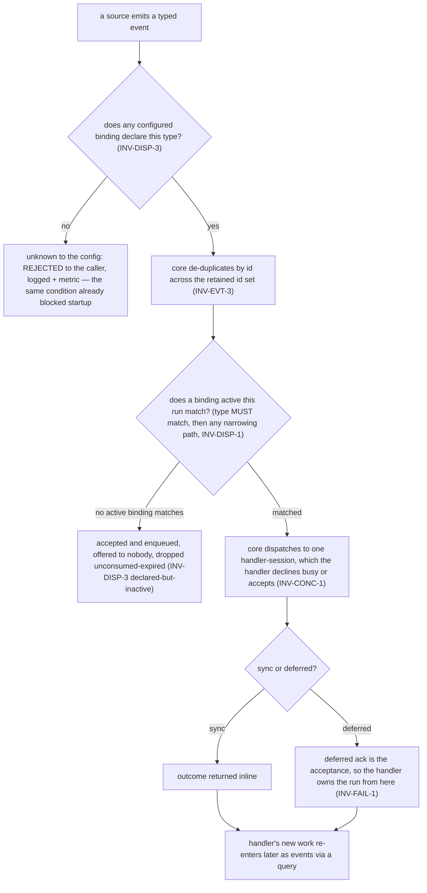
```mermaid
flowchart TD
    emit["a source emits a typed event"] --> known{"does any configured binding declare this type? (INV-DISP-3)"}
    known -->|no| rej["unknown to the config: REJECTED to the caller, logged + metric — the same condition already blocked startup"]
    known -->|yes| dedup["core de-duplicates by id across the retained id set (INV-EVT-3)"]
    dedup --> route{"does a binding active this run match? (type MUST match, then any narrowing path, INV-DISP-1)"}
    route -->|"no active binding matches"| wait["accepted and enqueued, offered to nobody, dropped unconsumed-expired (INV-DISP-3 declared-but-inactive)"]
    route -->|matched| disp["core dispatches to one handler-session, which the handler declines busy or accepts (INV-CONC-1)"]
    disp --> reply{"sync or deferred?"}
    reply -->|sync| out["outcome returned inline"]
    reply -->|deferred| cb["deferred ack is the acceptance, so the handler owns the run from here (INV-FAIL-1)"]
    out --> done["handler's new work re-enters later as events via a query"]
    cb --> done
```

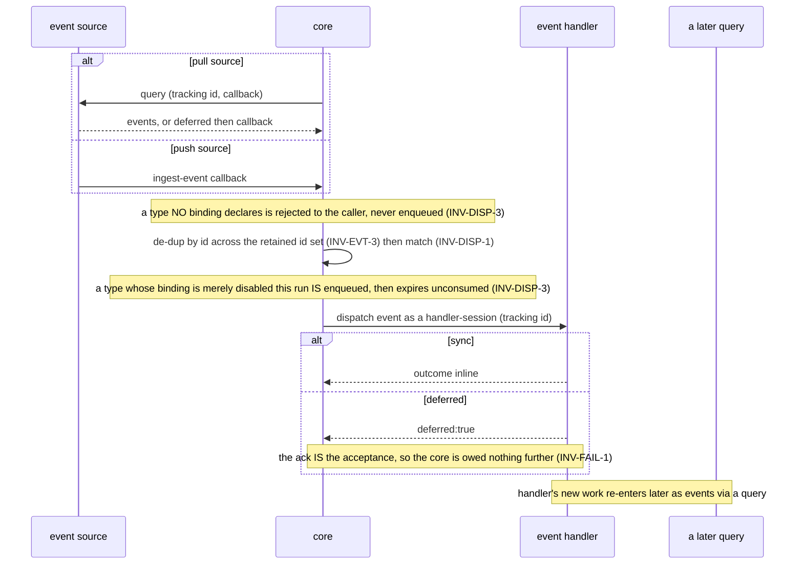
```mermaid
sequenceDiagram
    participant SRC as event source
    participant CORE as core
    participant HDL as event handler
    participant Q as a later query
    alt pull source
        CORE->>SRC: query (tracking id, callback)
        SRC-->>CORE: events, or deferred then callback
    else push source
        SRC->>CORE: ingest-event callback
    end
    Note over CORE: a type NO binding declares is rejected to the caller, never enqueued (INV-DISP-3)
    CORE->>CORE: de-dup by id across the retained id set (INV-EVT-3) then match (INV-DISP-1)
    Note over CORE: a type whose binding is merely disabled this run IS enqueued, then expires unconsumed (INV-DISP-3)
    CORE->>HDL: dispatch event as a handler-session (tracking id)
    alt sync
        HDL-->>CORE: outcome inline
    else deferred
        HDL-->>CORE: deferred:true
        Note over CORE,HDL: the ack IS the acceptance, so the core is owed nothing further (INV-FAIL-1)
    end
    Note over HDL,Q: handler's new work re-enters later as events via a query
```

**When nobody takes the event.** An event stays in the **durable queue** for its **retention**
(`INV-EVT-1`), surviving restarts. It is dropped when every matching handler has had the one attempt
it is owed and none accepted — **unconsumed-expired**, evaluated at attempt time and keeping no
attempt history (`INV-EVT-4`, `USECASE-CREATE-HANDLER`). Because the default event is expired on
arrival, that is the common case: offered once to each matching handler, then gone. A pull source
re-derives it on its next trigger; a push-only source's event was durable through its retention, so
it is lost only if nothing accepted it before it expired (`INV-EVT-2`).

**When the core dies.** On a fatal condition the core makes a **best-effort** `crashing` signal to
registered participants (`INV-LIFE-1`). That signal stays best-effort and MAY be lost — but event
**data** is durable
(`INV-EVT-1`, `phillipgreenii-nix-agent-support · packages/pr-pool/docs/decisions · DEC-EVENT-2`):
an accepted-and-persisted event **survives the
restart** and is redelivered at-least-once, and only the **narrow crash window** (accepted but not
yet persisted) MAY redeliver, absorbed by idempotent handlers (`INV-EVT-2`). After restart the core
resumes offering from the durable queue; pull sources also re-derive current truth on their next
trigger. The core carries **no branch or deadletter path** of its own: **delivery is pr-pool's
contract and everything past delivery is the handler's**, so a handler's failure branches surface on
the handler's own surface or become **new events** that re-enter through a source
(`USECASE-CONFIGURE-WIRING`).

```mermaid
sequenceDiagram
    participant CORE as core
    participant M as registered participants
    Note over CORE: fatal condition
    CORE-->>M: best-effort crashing signal (INV-LIFE-1) — MAY be lost
    Note over CORE: accepted events are durable (INV-EVT-1); only the narrow crash window may redeliver
    CORE->>CORE: restart
    Note over CORE,M: core resumes offering from the durable queue; idempotent handlers absorb any redelivery (INV-EVT-2)
```

## Use cases

Every **create** use case below opens the same way and closes the same way, so neither is restated
four times. It opens by reading the interface's **message schema** — the authoritative contract — and
the **common manager contract** every participant interaction shares (`INV-INTF-1`): a **versioned**
schema over a transport contract, a per-call **tracking id** echoed on any deferred result, a single
ready-to-run **callback** where the core must be reached back, a **coarse** transport-level outcome
with the rich outcome in the reply body, and the `starting → started → stopping → stopped` lifecycle
under which messages are accepted **only after `started` and before `stopping`**. One process MAY
implement several interfaces at once, and the core neither knows nor cares. It closes by including
`USECASE-VERIFY-PARTICIPANT`.

### `USECASE-CREATE-SOURCE` — implement an event source, in one of four shapes <!-- uuid: 05c851fa-9fb8-4501-bafb-928c147e756f -->

**Actors:** `ACTOR-OP` (as the source's implementer), core, `ACTOR-SRC`.
**Level:** user-goal.
**Preconditions:** none.
**Intent:** build an event source against `INTF-SOURCE` so a deployment can obtain typed events from
it, choosing deliberately among the shapes the two independent mode axes allow.
_Requires:_ `INV-DISP-1`, `INV-DISP-3`, `INV-EVT-1`, `INV-EVT-4`, `INV-FAIL-3`, `INV-INTF-1`,
`GOAL-MIN-1`.
_Includes:_ `USECASE-VERIFY-PARTICIPANT`.

**Flow — the four shapes.** Two axes cross here and they are **independent**: who **initiates** (the
core **pulls**, or the source **pushes**) and whether the reply is **inline** or **deferred**.
Enumerating them is what stops "implement a source" from reading as one undifferentiated shape when
it is really a choice:

| initiator     | reply    | what the implementer builds                                                                                                    |
| ------------- | -------- | ------------------------------------------------------------------------------------------------------------------------------ |
| core (pull)   | inline   | answer `query` with `{ events }` — the simplest source, and the one a periodic trigger suits                                   |
| core (pull)   | deferred | answer `query` with `{ deferred: true }`, then deliver on the `ingest-event` callback under the same tracking id               |
| source (push) | inline   | invoke the `ingest-event` callback as external facts arrive; the core's reply is inline, counting accepted and naming rejected |
| source (push) | deferred | **does not exist** — see below                                                                                                 |

**Why the fourth shape is empty, rather than merely unbuilt.** On the push path the **core** is the
replier, and its reply is a count it already knows the moment it has enqueued, so there is nothing
for it to defer. A source that wants to hand work over later does not defer a push; it simply pushes
later. Stating the empty cell is the same discipline the matrix applies to itself: an absent shape
should be absent for a reason.

**What a source declares — and what it does not.** A source is **one opaque invocation** plus the
**event types it emits**, plus — for a pull source — its **query trigger**, which is the **core's**
own when-to-poll decision and never the source's to dictate (`INTF-SOURCE`, `GOAL-MIN-1`). The
declared emitted types are a **contract boundary**: the wiring validation runs on them in both
directions (`USECASE-VALIDATE-CONFIG`). A source declares **nothing** about which of its fields may
be matched and no shape for `payload` — **matchability is the handler's alone** (`INV-DISP-1`). Each
event carries an `id`, a `type`, an optional `at`, an optional `expiresAt`, and a JSON-**object**
`payload` (`INV-EVT-1`, `INV-EVT-4`).

**A failed query is an error, not an empty result.** A pull source's `query` can fail because the
infrastructure behind it is down. The implementer **MUST** report that as an **error** — a non-zero
outcome or an error reply — and **MUST NOT** return an empty `events` list for it. The core **MAY**
retry the query itself before reporting the failure, at the **pull-source failure backoff**
`INV-FAIL-3` defines — a config surface **distinct** from this source's own query trigger, which
paces the success path, not recovery from a failure. Once any such retrying is exhausted, the core
records the error to logs and metrics and does **not** read it as "nothing to do" (`INV-DISP-3`
reporting discipline, `STORY-OBS-2`). An empty `events` list is the distinct, legitimate
**genuinely idle** reading, and conflating the two is how a silent outage comes to look like a
quiet system.

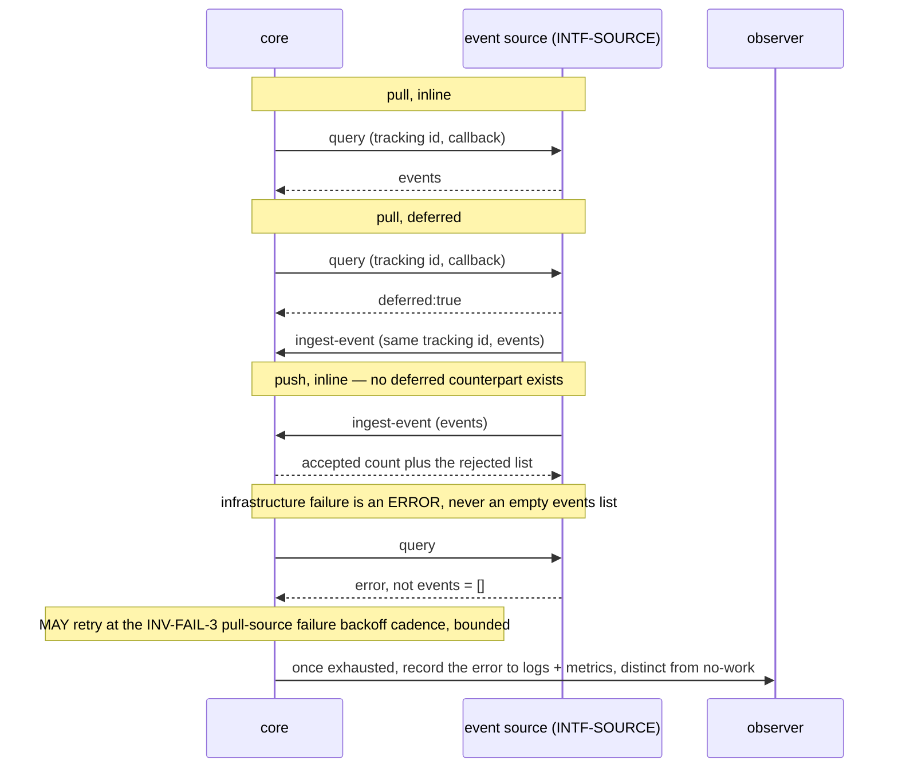
```mermaid
sequenceDiagram
    participant CORE as core
    participant SRC as event source (INTF-SOURCE)
    participant OBS as observer
    Note over CORE,SRC: pull, inline
    CORE->>SRC: query (tracking id, callback)
    SRC-->>CORE: events
    Note over CORE,SRC: pull, deferred
    CORE->>SRC: query (tracking id, callback)
    SRC-->>CORE: deferred:true
    SRC->>CORE: ingest-event (same tracking id, events)
    Note over CORE,SRC: push, inline — no deferred counterpart exists
    SRC->>CORE: ingest-event (events)
    CORE-->>SRC: accepted count plus the rejected list
    Note over CORE,SRC: infrastructure failure is an ERROR, never an empty events list
    CORE->>SRC: query
    SRC-->>CORE: error, not events = []
    Note over CORE: MAY retry at the INV-FAIL-3 pull-source failure backoff cadence, bounded
    CORE->>OBS: once exhausted, record the error to logs + metrics, distinct from no-work
```

Extensions:

- The query fails because the infrastructure behind it is down: the implementer reports an error,
  never an empty `events` list; the core MAY retry at the `INV-FAIL-3` backoff cadence before
  recording the exhausted failure to logs and metrics, distinct from a genuinely idle empty result.

### `USECASE-CREATE-HANDLER` — implement an event handler, and decline at the acceptance boundary <!-- uuid: 8752e12e-7ea2-4edd-8620-839fc5ef3cff -->

**Actors:** `ACTOR-OP` (as the handler's implementer), core, `ACTOR-HDL`.
**Level:** user-goal.
**Preconditions:** none.
**Intent:** build an event handler against `INTF-HANDLER`, and get the **acceptance boundary** right
— which side owns the work, and which side owns a failure, on each side of the accept.
_Requires:_ `INV-CONC-1`, `INV-EVT-1`, `INV-EVT-2`, `INV-EVT-4`, `INV-FAIL-1`, `INV-FAIL-2`,
`INV-INTF-1`, `INV-OBS-1`, `INV-PREC-1`.
_Includes:_ `USECASE-VERIFY-PARTICIPANT`.

**Flow — the two reply shapes.** The core hands over **one event** under **one tracking id** and the
handler answers in exactly one of two ways: a **sync** inline **completion** carrying an outcome (it
took the event and finished it inside the call), or a **deferred ack** (it took the event and will
run it on its own). A deferred ack **is** the acceptance, so nothing further is pushed back and the
run's progress and outcome stay on the handler's own surface (`INV-FAIL-1`). A handler **MUST**
support the deferred form, so a paused or long-running handler session never pins an open call, and
**MUST tolerate a duplicate event** idempotently (`INV-EVT-2`).

**Declining at the acceptance boundary.** A handler that cannot take the work **declines pre-accept**
— `busy` when it is at its own capacity (`INV-CONC-1`), or an `unavailable` **self-status** when it
is down or starting — and the **cadence is the same for both**: there is no separate knob per
decline reason (`INV-FAIL-2`). A pre-accept decline is **the core's** to handle, and the core prefers
**continuity over efficiency** (`INV-PREC-1`): it **re-offers the event within the window the
event's own `expiresAt` sets** (`INV-EVT-4`), **at the retry cadence `INV-FAIL-2` defines** — to the
same handler once it frees up, or to another bound handler — and the event stays durable in the
queue until then (`INV-EVT-1`). Declining is **not a defect**, and it is deliberately cheap: the
outcome is signalled **coarsely by the transport**, so a handler too degraded to compose a reply
body can still decline with the coarse signal alone (`INV-INTF-1`), and which coarse code carries a
`busy` decline is a realization decision
(`phillipgreenii-nix-agent-support · packages/pr-pool/docs/decisions · DEC-WIRE-1`). Once the event
is past its `expiresAt`, the next attempt on a handler is **that handler's last** (`INV-EVT-4`), and
with no handler still owed one the event is dropped unconsumed-expired — a pull source re-derives it
on its next trigger. **A cadence longer than the time left before `expiresAt` is not special-cased**:
the next eligible attempt simply lands past `expiresAt` and so **is** that final attempt — a long
enough cadence silently turns a retryable event into a one-shot for that handler, and that is an
accepted consequence of the two knobs being independent, not a bug (`INV-FAIL-2`).

**Accepting is custody, not progress.** The second legitimate response to an offer is to **accept and
buffer the event internally**, starting it whenever the handler's own limits allow. The core MUST
treat both responses as correct, MUST NOT infer progress from an accept, and MUST NOT assume an
accepting handler is idle or free to take more (`INV-CONC-1`). All an accept settles is that delivery
is complete.

**Post-accept, the outcome is the handler's own.** A handler that has **already accepted** an event
and then hits trouble reports `retryable`, `resource-limit` (a capacity or quota ceiling such as a
usage window — not a defect) or `critical`, and it reports them **on its own surface**, not to the
core. Post-accept the **handler owns** persistence, resume and retry (`INV-FAIL-1`): it pauses its
own work and resumes once the ceiling lifts, or surfaces the outcome, or emits a new event. The core
does **not** re-offer accepted work and does **not** count post-accept classes (`INV-OBS-1`).
`critical` is **never** retried and means **a human is needed** — safety over continuity
(`INV-PREC-1`).

**So the only failures pr-pool itself classifies are two, and both are pre-acceptance or the core's
own:** a **pre-accept decline** (`busy`, `unavailable`) and a **dispatch failure** where the core
could not hand the event over at all (`INV-OBS-1`, `USECASE-DEBUG-RUN`).

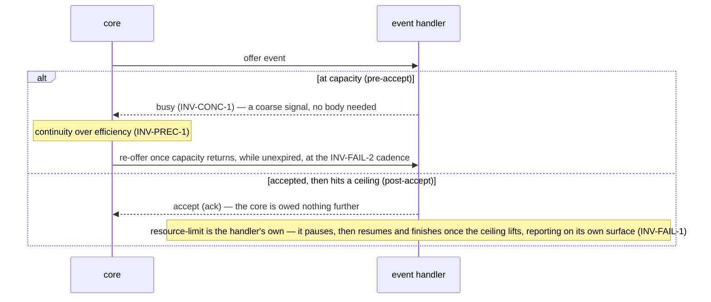
```mermaid
sequenceDiagram
    participant CORE as core
    participant HDL as event handler
    CORE->>HDL: offer event
    alt at capacity (pre-accept)
        HDL-->>CORE: busy (INV-CONC-1) — a coarse signal, no body needed
        Note over CORE: continuity over efficiency (INV-PREC-1)
        CORE->>HDL: re-offer once capacity returns, while unexpired, at the INV-FAIL-2 cadence
    else accepted, then hits a ceiling (post-accept)
        HDL-->>CORE: accept (ack) — the core is owed nothing further
        Note over HDL: resource-limit is the handler's own — it pauses, then resumes and finishes once the ceiling lifts, reporting on its own surface (INV-FAIL-1)
    end
```

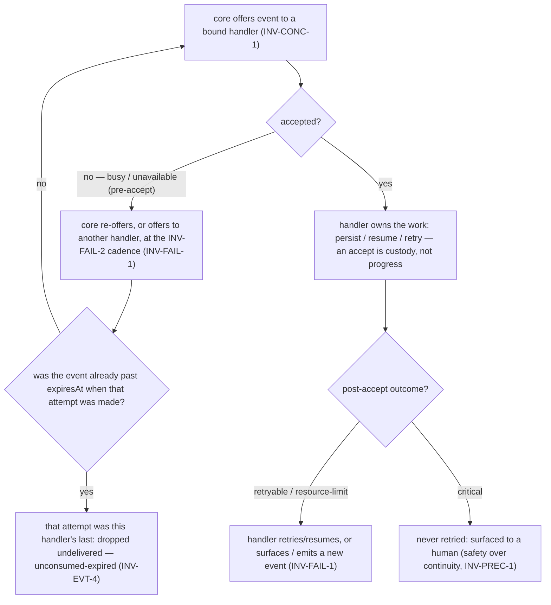
```mermaid
flowchart TD
    off["core offers event to a bound handler (INV-CONC-1)"] --> acc{"accepted?"}
    acc -->|"no — busy / unavailable (pre-accept)"| reoff["core re-offers, or offers to another handler, at the INV-FAIL-2 cadence (INV-FAIL-1)"]
    reoff --> exp{"was the event already past expiresAt when that attempt was made?"}
    exp -->|no| off
    exp -->|yes| drop["that attempt was this handler's last: dropped undelivered — unconsumed-expired (INV-EVT-4)"]
    acc -->|yes| own["handler owns the work: persist / resume / retry — an accept is custody, not progress"]
    own --> out{"post-accept outcome?"}
    out -->|retryable / resource-limit| surf["handler retries/resumes, or surfaces / emits a new event (INV-FAIL-1)"]
    out -->|critical| human["never retried: surfaced to a human (safety over continuity, INV-PREC-1)"]
```

Extensions:

- The handler declines pre-accept (`busy` at capacity, or `unavailable`): the core re-offers within
  the event's `expiresAt` window at the `INV-FAIL-2` cadence; once that window passes, the next
  eligible attempt is this handler's last and the event may be dropped unconsumed-expired
  (`INV-EVT-4`).
- The handler accepts, then hits trouble post-accept: it reports `retryable`, `resource-limit`, or
  `critical` on its own surface; `critical` is never retried and is surfaced to a human
  (`INV-PREC-1`).

### `USECASE-CREATE-MONITOR` — implement a monitoring sink <!-- uuid: aa5174b9-df2d-43a7-9439-95b1012e4aa4 -->

**Actors:** `ACTOR-OP` (as the sink's implementer), core, `ACTOR-MON`, and `ACTOR-OBS` beyond it.
**Level:** user-goal.
**Preconditions:** none.
**Intent:** build a monitoring sink against `INTF-MON` that carries some declared subset of the
core's metric catalog out to wherever an observer reads it.
_Requires:_ `INV-INTF-1`, `INV-OBS-1`, `GOAL-MIN-1`.
_Includes:_ `USECASE-VERIFY-PARTICIPANT` — by its conformance suite only, since there is no smoke
affordance for a sink (matrix reason (ii)).

**Flow.** The implementer **declares two things**: the **mode** — the sink **pulls** current values
from the core on its own schedule, or receives **pushed** updates as they change — and **which subset
of the metric catalog** it handles. The catalog's members are enumerated by `INTF-MON` itself, the
interface that carries it, and `INV-OBS-1` states only the obligation to declare them; a sink reads
that enumeration rather than inventing metric names. Everything past the boundary — serving a scrape
endpoint, writing a dashboard feed, raising an alert — is the sink's **own external surface** and is
invisible to the core. An **observer** (`ACTOR-OBS`) reads that surface, never the core.

**The core stays unaware of the backend, and that is a requirement rather than a happy accident.**
Both the **emission transport** and the concrete backend behind it remain deployment bindings via
`INTF-MON` (`GOAL-MIN-1`); which transport is the default is a realization decision
(`phillipgreenii-nix-agent-support · packages/pr-pool/docs/decisions · DEC-OBS-1`). A sink may be
absent, or there may be several.

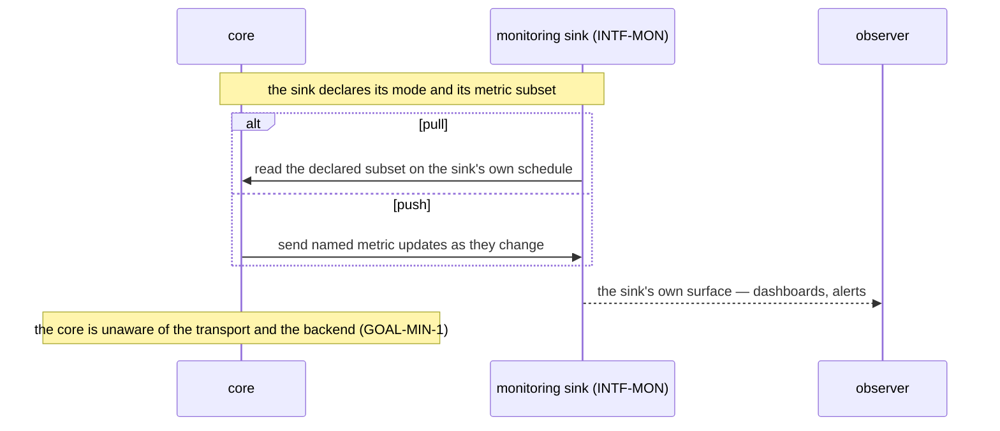
```mermaid
sequenceDiagram
    participant Core as core
    participant M as monitoring sink (INTF-MON)
    participant OBS as observer
    Note over Core,M: the sink declares its mode and its metric subset
    alt pull
        M->>Core: read the declared subset on the sink's own schedule
    else push
        Core->>M: send named metric updates as they change
    end
    M-->>OBS: the sink's own surface — dashboards, alerts
    Note over Core: the core is unaware of the transport and the backend (GOAL-MIN-1)
```

### `USECASE-CREATE-STORE` — implement a storage participant <!-- uuid: 32abf356-3ec8-43f0-86cd-1a1756704fcb -->

**Actors:** `ACTOR-OP` (as the store's implementer), core, `ACTOR-STO`.
**Level:** user-goal.
**Preconditions:** none.
**Intent:** build a key/value scratch for core state against `INTF-STORE`, knowing it never backs
event delivery.
_Requires:_ `INV-EVT-1`, `INV-INTF-1`.
_Includes:_ `USECASE-VERIFY-PARTICIPANT` — by its conformance suite only (matrix reason (ii)).

**Flow.** The implementer provides three operations — `get(key)`, `put(key, value)`, `delete(key)` —
over **string** keys and **JSON-string** values, with each request and reply carrying its schema
version (`INTF-STORE`). The operation set is **identical** whether the backing is in-memory, local or
remote, because the core codes to the interface and never to the backing.

**This is the one participant with no mode axis at all.** The core is always the initiator, and every
reply is inline: there is no pull/push choice to make and nothing to defer, because a scratch read or
write has no long-running form the way a source's query or a handler's run does. So the four shapes
`USECASE-CREATE-SOURCE` enumerates collapse to one here, which is worth saying rather than leaving a
reader to wonder which shape was meant.

**Guarantees, and the ceiling on them.** A store is **best-effort like any participant**: the core
**MUST** function if storage is absent or down and **MUST NOT** rely on it to back any delivery
guarantee (`INV-EVT-1` is the queue's promise, not the store's). When none is configured a **default
in-memory** store applies, whose contents do not survive a restart — the **Null Object** that keeps
"no storage configured" from being a special case anywhere in the core.

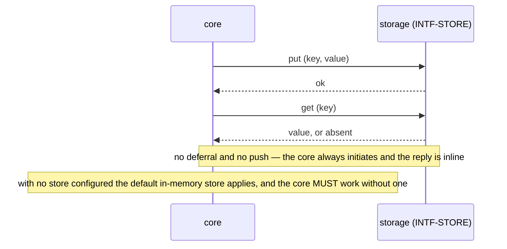
```mermaid
sequenceDiagram
    participant Core as core
    participant S as storage (INTF-STORE)
    Core->>S: put (key, value)
    S-->>Core: ok
    Core->>S: get (key)
    S-->>Core: value, or absent
    Note over Core,S: no deferral and no push — the core always initiates and the reply is inline
    Note over Core: with no store configured the default in-memory store applies, and the core MUST work without one
```

### `USECASE-VERIFY-PARTICIPANT` — verify a participant adheres, in isolation and then in place <!-- uuid: 612b7808-c90f-4792-baa6-670ce22dd6d2 -->

**Actor:** `ACTOR-OP` (as the participant's implementer/integrator).
**Level:** subfunction.
**Preconditions:** the participant has already been implemented against its interface contract (the
create use case that includes this one).
**Intent:** confirm a participant adheres to its interface before anything is trusted to route
through it — first its conformance suite in isolation, then a smoke test against the live
configuration.
_Requires:_ `INV-EVT-2`, `INV-INTF-1`, `INV-INTF-2`.

**Defined once, included by reference, never inlined.** This is a **subfunction**, and it is the
reason no element above or below restates how verification works:
`USECASE-CREATE-SOURCE`, `USECASE-CREATE-HANDLER`, `USECASE-CREATE-MONITOR` and
`USECASE-CREATE-STORE` include it on the **create** side; `USECASE-ADD-ESSENTIAL`,
`USECASE-CONFIGURE-WIRING` and `USECASE-CONFIGURE-OPTIONAL` include it on the **edit** side. Both
sides need the identical check, and an identical check written twice is a check that will disagree
with itself.

**Flow — in isolation: the conformance suite.** Every interface ships a suite of **positive** and
**negative** checks against its message schema (`INV-INTF-2`), and a participant is not trusted until
**both** pass:

- **positive** — a well-formed request gets a schema-valid reply; the deferred path echoes the
  tracking `id`; the lifecycle transitions are accepted;
- **negative** — an unknown `schemaVersion` is _reported_, not crashed on; a malformed or non-object
  payload is rejected; a message before `started` or after `stopping` is refused; a handler tolerates
  the same event twice.

**Flow — in place: the smoke test, and the rule that makes it trustworthy.** **The thing a
participant is configured with is the thing that verifies it.** A pull source's configuration _is_
its **query**, so the query is what verifies the source: `run-query <query>` runs that one source's
query **once** and **read-only** and prints the events it would emit. A handler's configuration is
its **role**, so the role is what verifies the handler: `run-role <role> <event>` dispatches **one
explicitly named event** through that one handler and then tears down, running **no discovery** of
its own. Both set a **test-mode** signal so the participant knows a test is in flight, and both run
against **this deployment's live configuration** rather than in isolation — which is exactly what the
conformance suite cannot do. The reply is rendered as text or in the machine-readable form
(`INTF-CLI`; the concrete spellings are
`phillipgreenii-nix-agent-support · packages/pr-pool/docs/decisions · DEC-CLI-2`). What the operator
confirms is the **shapes** — the events a source emits, or the outcome a handler returns.

**Only two participants have an in-place check, and the asymmetry is the design.** A sink and a store
are verified by the suite alone and then by a live reading (`USECASE-DEBUG-RUN`), because neither
sits on the event path for a smoke test to stand in for (matrix reason (ii)).

Only once the isolation checks and — where one exists — the in-place check pass is the participant
trusted enough to carry real work (`USECASE-ADD-ESSENTIAL`).

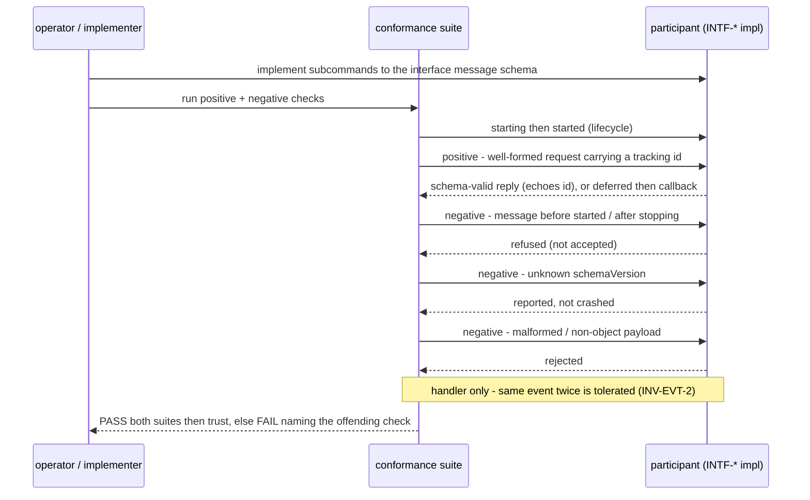
```mermaid
sequenceDiagram
    participant OP as operator / implementer
    participant Suite as conformance suite
    participant P as participant (INTF-* impl)
    OP->>P: implement subcommands to the interface message schema
    OP->>Suite: run positive + negative checks
    Suite->>P: starting then started (lifecycle)
    Suite->>P: positive - well-formed request carrying a tracking id
    P-->>Suite: schema-valid reply (echoes id), or deferred then callback
    Suite->>P: negative - message before started / after stopping
    P-->>Suite: refused (not accepted)
    Suite->>P: negative - unknown schemaVersion
    P-->>Suite: reported, not crashed
    Suite->>P: negative - malformed / non-object payload
    P-->>Suite: rejected
    Note over Suite,P: handler only - same event twice is tolerated (INV-EVT-2)
    Suite-->>OP: PASS both suites then trust, else FAIL naming the offending check
```

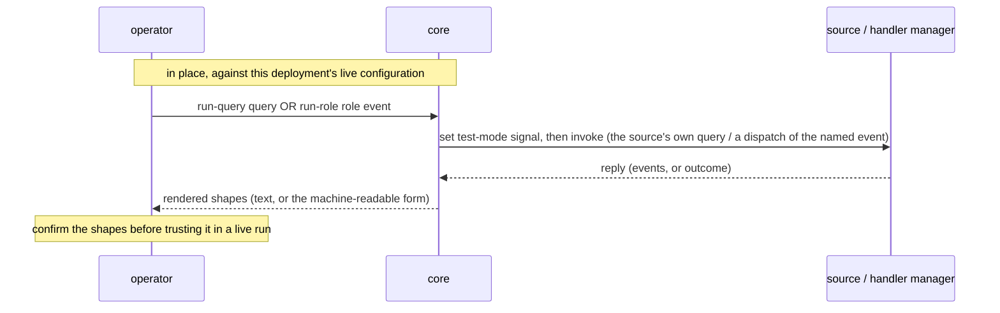
```mermaid
sequenceDiagram
    participant OP as operator
    participant CORE as core
    participant M as source / handler manager
    Note over OP,CORE: in place, against this deployment's live configuration
    OP->>CORE: run-query query  OR  run-role role event
    CORE->>M: set test-mode signal, then invoke (the source's own query / a dispatch of the named event)
    M-->>CORE: reply (events, or outcome)
    CORE-->>OP: rendered shapes (text, or the machine-readable form)
    Note over OP: confirm the shapes before trusting it in a live run
```

Extensions:

- The participant is a monitoring sink or a storage participant: there is no in-place smoke check
  for it (matrix reason (ii)); verification stops at the conformance suite, followed by a live
  reading (`USECASE-DEBUG-RUN`).

### `USECASE-ADD-ESSENTIAL` — add a source or a handler to a live configuration <!-- uuid: 2ea962a3-b598-40a8-8ad9-60bb4e2a4ddb -->

**Actor:** `ACTOR-OP`.
**Level:** user-goal.
**Preconditions:** the participant is implemented and has passed `USECASE-VERIFY-PARTICIPANT`'s
conformance-suite check in isolation (the in-place smoke half runs as this use case's own step 3).
**Intent:** put an implemented **essential** participant — an event source or an event handler — into
a live configuration and smoke it before trusting it.
_Requires:_ `INV-DISP-1`, `INV-DISP-3`, `INV-WORKFLOW-1`.
_Includes:_ `USECASE-CONFIGURE-WIRING`, `USECASE-VALIDATE-CONFIG`, `USECASE-VERIFY-PARTICIPANT`.

**An essential participant is never added alone, and the matrix is what makes that obvious.** One
element covers both the source and the handler cell of the `add` row because the two cannot be done
independently:

- adding a **source** means declaring its invocation, its mode and the **event types it emits** — and
  a **binding** for every one of those types, because a `type` **no configured binding declares** is
  an **unhandled source output**, which blocks startup (`USECASE-VALIDATE-CONFIG`) and would at
  runtime be **rejected** to the caller (`INV-DISP-3`);
- adding a **handler** means declaring its command and at least one binding whose `type` some
  configured source actually emits, because a handler bound to nothing — or bound only to types
  nobody emits — is a **handler with no events to listen for**, which also blocks startup.

So the unit of work is a source, a handler, and the binding between them. Adding "just one side" is
not a smaller version of this use case; it is a configuration that will not start.

**Flow.**

1. Declare the participant and its bindings (`USECASE-CONFIGURE-WIRING`).
2. Validate the whole configuration and read the report (`USECASE-VALIDATE-CONFIG`). Nothing is
   smoked until the configuration would start.
3. Smoke the new participant in place — its own query, or its own role
   (`USECASE-VERIFY-PARTICIPANT`).
4. Run (`USECASE-RUN-DAEMON` or `USECASE-RUN-DRAIN`), and read the first run
   (`USECASE-DEBUG-RUN`).

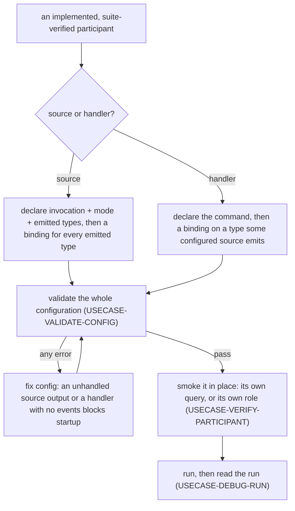
```mermaid
flowchart TD
    impl["an implemented, suite-verified participant"] --> pair{"source or handler?"}
    pair -->|source| s["declare invocation + mode + emitted types, then a binding for every emitted type"]
    pair -->|handler| h["declare the command, then a binding on a type some configured source emits"]
    s --> val["validate the whole configuration (USECASE-VALIDATE-CONFIG)"]
    h --> val
    val -->|"any error"| fix["fix config: an unhandled source output or a handler with no events blocks startup"]
    fix --> val
    val -->|"pass"| smoke["smoke it in place: its own query, or its own role (USECASE-VERIFY-PARTICIPANT)"]
    smoke --> run["run, then read the run (USECASE-DEBUG-RUN)"]
```

Extensions:

- Validation reports any error (an unhandled source output, a handler with no events to listen for,
  or any other `USECASE-VALIDATE-CONFIG` finding): config is fixed and re-validated before anything
  is smoked.

### `USECASE-CONFIGURE-WIRING` — configure the essential participants and the routing graph they form <!-- uuid: db696e7c-ec86-4980-808d-add7744e0bc1 -->

**Actor:** `ACTOR-OP`.
**Level:** user-goal.
**Preconditions:** none — this authors or edits the configuration itself, whether empty or already
populated.
**Intent:** author, or later edit, the configuration the core resolves — the essential participants,
their **bindings**, and the **wiring** (a routing graph) those bindings form (`INV-WORKFLOW-1`).
_Requires:_ `INV-CONC-1`, `INV-DISP-1`, `INV-EVT-1`, `INV-EVT-4`, `INV-WORKFLOW-1`.
_Includes:_ `USECASE-VERIFY-PARTICIPANT` (an edited binding is re-verified in place by the same role
or query that verified it when it was added), `USECASE-VALIDATE-CONFIG`.

**Flow.** The operator declares, in one configuration:

- **Participants** — for each, the **command** the core invokes and its **mode** where the interface
  offers one (a source's **pull** vs **push**).
- **Event sources** (`INTF-SOURCE`) — each **one invocation** plus the event types it emits, never a
  per-tool source kind; and, for a pull source, its **query trigger**: periodic, threshold, or
  manual, which is the core's own when-to-poll decision rather than anything a source dictates.
- **Event handlers / roles** (`INTF-HANDLER`) — each with its behavior.
- **Bindings** — for each handler, the **event-type match** it responds to. `type` MUST match; a
  binding MAY then narrow on a **payload path it names itself**, applied after the type match
  (`INV-DISP-1`). No matchable field comes from the source — matchability is the handler's alone. A
  named path that is **absent** on an event is a **non-match**, not an error.
- **Serialize marks** — any event type **marked to serialize** (`INV-CONC-1`) is declared **in this
  same configuration**, alongside the routing graph — a per-type mark, never a per-binding attribute,
  because a type MAY be bound by several handlers and the mark is a property of the type itself. The
  concrete declaration is a realization detail
  (`phillipgreenii-nix-agent-support · packages/pr-pool/docs/decisions · DEC-CONC-1`). So marked,
  concurrency never corrupts order-dependent work.
- **Re-entry** — where a handler produces **new work**, it is routed back in as events **via a
  query**. The core does **not** branch outputs itself: **delivery is pr-pool's contract and
  everything past delivery is the handler's**, so new work re-enters through a source rather than
  through a core-side branch.

**The result is a declared routing graph.** Enumerating each source's **emitted event types** is the
part that looks like bookkeeping and is not: it is the **contract boundary** the validation compares
the bindings against in **both** directions (`USECASE-VALIDATE-CONFIG`), and neither direction has
anything to compare without it. What comes out is an inspectable graph of sources → types →
handlers. The core validates that graph's **wiring** only — it is a **flat edge-router, not a
workflow engine**, and it never models work sequencing or completeness (`INV-WORKFLOW-1`).

**What is deliberately not authored here.** **Expiry** is not: each event carries its own optional
`at` and `expiresAt` (`INV-EVT-1`), an event with neither is expired on arrival, so the default needs
no config entry and an operator who wants a retry window sets `expiresAt` on the event
(`INV-EVT-4`). **A handler's concurrency ceiling** is not: how many events a handler runs at once is
the handler's own limit to keep, and this configuration declares no such number (`INV-CONC-1`,
`USECASE-CREATE-HANDLER`). The **optional participants** are not — a monitoring sink and a store are
`USECASE-CONFIGURE-OPTIONAL`. The full configuration **schema** is not yet fixed (see `OQ-CONFIG`).

**Configuration divides in two, and only one half is this element.** What is declared here is
**ordinary configuration**, and it is what validity is judged against. **Temporarily enabling or
disabling part of it for a single run** is the other half — the **run-scoped selectors**
(`STORY-OP-3`), which live with the run they scope (`USECASE-DEBUG-RUN`), change no declaration, and
are **not** a config defect (`INV-WORKFLOW-1`, `USECASE-VALIDATE-CONFIG`).

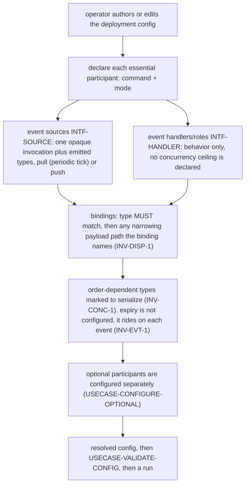
```mermaid
flowchart TD
    start["operator authors or edits the deployment config"] --> parts["declare each essential participant: command + mode"]
    parts --> src["event sources INTF-SOURCE: one opaque invocation plus emitted types, pull (periodic tick) or push"]
    parts --> hdl["event handlers/roles INTF-HANDLER: behavior only, no concurrency ceiling is declared"]
    src --> bind["bindings: type MUST match, then any narrowing payload path the binding names (INV-DISP-1)"]
    hdl --> bind
    bind --> ser["order-dependent types marked to serialize (INV-CONC-1). expiry is not configured, it rides on each event (INV-EVT-1)"]
    ser --> opt["optional participants are configured separately (USECASE-CONFIGURE-OPTIONAL)"]
    opt --> out["resolved config, then USECASE-VALIDATE-CONFIG, then a run"]
```

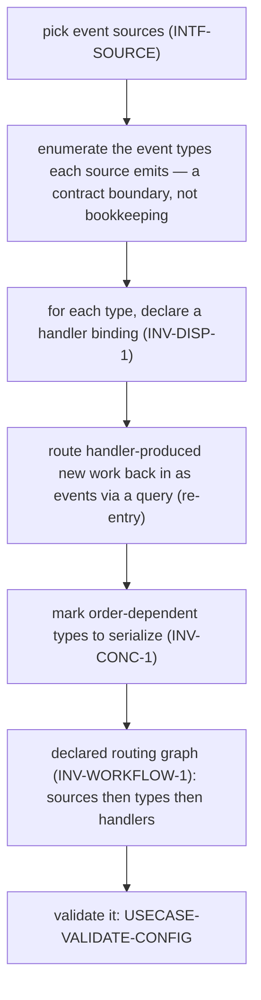
```mermaid
flowchart TD
    s["pick event sources (INTF-SOURCE)"] --> types["enumerate the event types each source emits — a contract boundary, not bookkeeping"]
    types --> b["for each type, declare a handler binding (INV-DISP-1)"]
    b --> reentry["route handler-produced new work back in as events via a query (re-entry)"]
    reentry --> serialize["mark order-dependent types to serialize (INV-CONC-1)"]
    serialize --> decl["declared routing graph (INV-WORKFLOW-1): sources then types then handlers"]
    decl --> val["validate it: USECASE-VALIDATE-CONFIG"]
```

Extensions:

- A binding's narrowing payload path is absent on a given event: that is a non-match at runtime, not
  an error (`INV-DISP-1`).

### `USECASE-CONFIGURE-OPTIONAL` — add or change an optional participant <!-- uuid: d8c0162d-cdb1-4e7e-83db-ef72b12542ad -->

**Actor:** `ACTOR-OP`.
**Level:** user-goal.
**Preconditions:** none.
**Intent:** declare, change, or remove the **optional** participants — a monitoring sink and storage
— knowing the system runs untouched without either.
_Requires:_ `INV-DISP-2`, `INV-OBS-1`, `GOAL-MIN-1`.
_Includes:_ `USECASE-VERIFY-PARTICIPANT`.

**Adding one and changing one are the same edit, which is why this element covers both rows.** An
optional participant is not a node in the routing graph, so nothing else has to move with it: there
is no binding to add, no emitted type to reconcile, and no validation finding it can cause
(`USECASE-VALIDATE-CONFIG`, matrix reason (iii)). Declaring a sink for the first time and changing
which metrics it handles are therefore the same act on the same declaration — unlike the essential
participants, where adding one is a distinct and larger job (`USECASE-ADD-ESSENTIAL`).

**Flow.**

- **Monitoring sink** (`INTF-MON`, optional) — declare its **mode** and the **metric subset** it
  handles. There may be none, one, or several.
- **Storage** (`ACTOR-STO` via `INTF-STORE`, optional) — declare the command backing it. With none
  declared the **default in-memory** store applies, so removing a store is a legitimate edit rather
  than a broken configuration.

**Swapping one is the point of the interface.** Which concrete tool backs a sink or a store is the
operator's choice and not the core's concern, so an implementation is swapped by editing this
declaration and **without touching the core** (`STORY-OP-4`, `INV-DISP-2`, `GOAL-MIN-1`).

**Verification here has no in-place half.** There is no smoke affordance for a sink or a store
(matrix reason (ii)), so a swapped implementation is verified by its conformance suite and then by a
live reading — metric values arriving at the sink, or core state surviving a `put` and `get`
(`USECASE-DEBUG-RUN`).

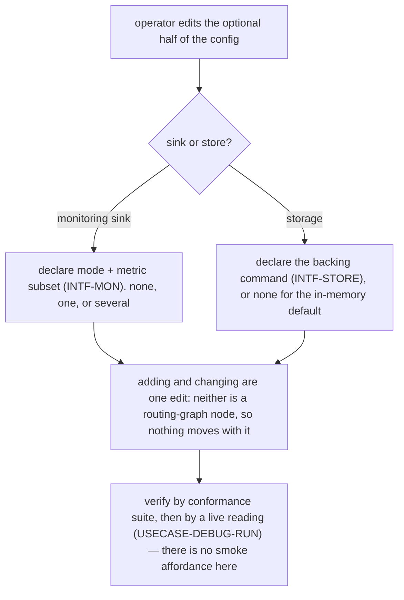
```mermaid
flowchart TD
    edit["operator edits the optional half of the config"] --> which{"sink or store?"}
    which -->|"monitoring sink"| mon["declare mode + metric subset (INTF-MON). none, one, or several"]
    which -->|storage| sto["declare the backing command (INTF-STORE), or none for the in-memory default"]
    mon --> same["adding and changing are one edit: neither is a routing-graph node, so nothing moves with it"]
    sto --> same
    same --> ver["verify by conformance suite, then by a live reading (USECASE-DEBUG-RUN) — there is no smoke affordance here"]
```

Extensions:

- Storage is left undeclared (or a store declaration is removed): the default in-memory store
  applies rather than the configuration being treated as broken.

### `USECASE-VALIDATE-CONFIG` — validate a whole configuration before anything runs <!-- uuid: 1aafdfa5-b3c4-4a41-bde8-4e368e6ec819 -->

**Actor:** `ACTOR-OP`.
**Level:** user-goal.
**Preconditions:** a configuration has been authored (`USECASE-CONFIGURE-WIRING`, and
`USECASE-CONFIGURE-OPTIONAL` where an optional participant is declared).
**Intent:** judge the **whole** configuration valid or invalid **before running**, and report the
result (`INV-WORKFLOW-1`). This checks the routing graph's flat wiring **only** — never
workflow-completeness or sequencing.
_Requires:_ `INV-DISP-3`, `INV-EVT-4`, `INV-WORKFLOW-1`.

**This is one whole-configuration judgement, and deliberately not four per-interface checks.** Every
finding below is a statement about a **pair** of declarations — a binding against the types some
source emits, a handler against the bindings that can reach it — so no single participant's
declaration can be judged on its own. That is why validation is its own element rather than a
`validate` step folded into each participant's use case, and why the `validate` row has no sink or
store cell at all (matrix reason (iii)).

**Flow.** The core walks the declared routing graph **before anything runs** and reports **pass or
fail**, naming every finding so the operator can fix config. **Six** findings are **errors**, and each
one on its own **blocks startup** — anything determinable as an invalid configuration prevents the run
(`INV-WORKFLOW-1`):

- **Orphan event type** — a binding matches a `type` no configured source emits → error.
- **Unhandled source output** — a source emits a `type` **no configured binding declares at all** →
  error. That `type` is unknown to the configuration, so at runtime the core **rejects** it to the
  caller rather than queueing it (`INV-DISP-3`) — a config that would emit it is invalid, not merely
  wasteful.
- **Disconnected handler** — a handler no binding can reach → error.
- **Handler with no events to listen for** — a handler that _is_ bound yet can never receive anything,
  because its binding declares no `type` or because every `type` it binds is emitted by no configured
  source → error. The orphan-event-type finding above names the **type**; this one names the
  **handler**, so a handler bound only to orphan types is reported both ways.
- **Absent backing command** — a configured source or handler whose **backing command** the core
  cannot invoke → error.
- **Determinably non-terminating re-entry cycle** — a `handler → query → same type` cycle the declared
  graph shows **cannot** terminate → error.

Exactly **one** finding is a **warning**: a **re-entry cycle whose termination is not determinable** —
the same shape, where the graph cannot settle whether it stops. A cycle is always **detectable**, but
its termination usually is not, so this one is "detectable but not determinably invalid": it is
**reported and the run proceeds**. The warning category is **closed at one member** — nothing else in
this set warns, and it is not a slot held open for future additions; a check either determines the
configuration invalid, in which case it blocks, or it determines nothing, in which case only a cycle's
undecidable termination is worth telling the operator about.

**Run-scoping is not a config defect.** A binding merely **disabled for this run** by a
**run-scoped selector** (`STORY-OP-3`, `USECASE-DEBUG-RUN`) is neither an error nor a warning:
validity is judged against the **configuration** and never against the run's **active subset**
(`INV-WORKFLOW-1`). Its events are still accepted and enqueued, offered to nobody, and dropped
**unconsumed-expired** (`INV-DISP-3`, `INV-EVT-4`).

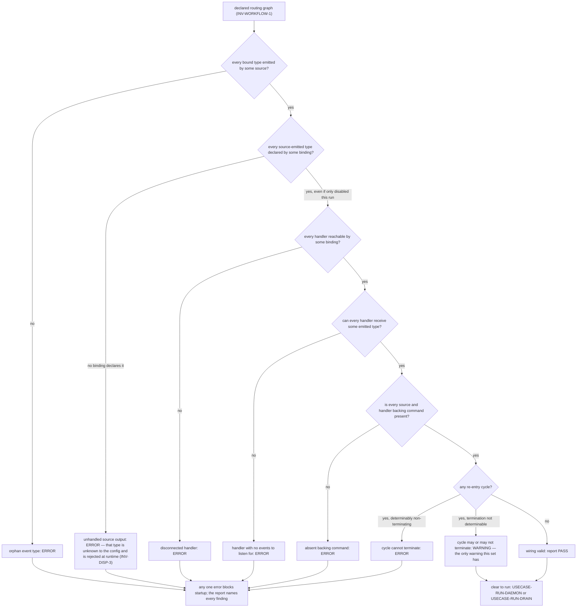
```mermaid
flowchart TD
    wf["declared routing graph (INV-WORKFLOW-1)"] --> c1{"every bound type emitted by some source?"}
    c1 -->|no| e1["orphan event type: ERROR"]
    c1 -->|yes| c2{"every source-emitted type declared by some binding?"}
    c2 -->|"no binding declares it"| e2["unhandled source output: ERROR — that type is unknown to the config and is rejected at runtime (INV-DISP-3)"]
    c2 -->|"yes, even if only disabled this run"| c3{"every handler reachable by some binding?"}
    c3 -->|no| e3["disconnected handler: ERROR"]
    c3 -->|yes| c4{"can every handler receive some emitted type?"}
    c4 -->|no| e4["handler with no events to listen for: ERROR"]
    c4 -->|yes| c5{"is every source and handler backing command present?"}
    c5 -->|no| e5["absent backing command: ERROR"]
    c5 -->|yes| c6{"any re-entry cycle?"}
    c6 -->|"yes, determinably non-terminating"| e6["cycle cannot terminate: ERROR"]
    c6 -->|"yes, termination not determinable"| w6["cycle may or may not terminate: WARNING — the only warning this set has"]
    c6 -->|no| ok["wiring valid: report PASS"]
    e1 --> rep["any one error blocks startup; the report names every finding"]
    e2 --> rep
    e3 --> rep
    e4 --> rep
    e5 --> rep
    e6 --> rep
    w6 --> run
    ok --> run["clear to run: USECASE-RUN-DAEMON or USECASE-RUN-DRAIN"]
```

Extensions:

- Orphan event type — a binding matches a `type` no configured source emits: ERROR, blocks startup.
- Unhandled source output — a source emits a `type` no configured binding declares at all: ERROR,
  blocks startup (that `type` is unknown to the config and is rejected at runtime, `INV-DISP-3`).
- Disconnected handler — a handler no binding can reach: ERROR, blocks startup.
- Handler with no events to listen for — a bound handler that can never receive anything: ERROR,
  blocks startup.
- Absent backing command — a configured source or handler the core cannot invoke: ERROR, blocks
  startup.
- Determinably non-terminating re-entry cycle — a `handler → query → same type` cycle the graph
  shows cannot terminate: ERROR, blocks startup.
- Re-entry cycle whose termination is not determinable: WARNING — reported, and the run proceeds
  (the only warning category this set has).

### `USECASE-RUN-DAEMON` — run the core as a long-running daemon <!-- uuid: 0e286925-9bca-4cba-bc37-ed4079e8637c -->

**Actor:** `ACTOR-OP`.
**Level:** user-goal.
**Preconditions:** an authored configuration exists to resolve — validating its wiring is this use
case's own first step.
**Intent:** run the validated configuration as a **daemon** (`run`) that routes events until it is
stopped, and inspect it while it runs (`INV-LIFE-1`).
_Requires:_ `INV-LIFE-1`.
_Includes:_ `USECASE-VALIDATE-CONFIG` (the startup path validates the wiring before anything runs),
`USECASE-DEBUG-RUN` (the run-scoped selectors this invocation applies, and the live inspection).

**Flow — the startup path both modes share.** The core resolves config, validates the wiring
(`USECASE-VALIDATE-CONFIG`), applies any **run-scoped selectors** for this invocation
(`USECASE-DEBUG-RUN`), becomes **reachable to its participants**, and signals each registered
participant through `starting → started` (`INV-LIFE-1`). `USECASE-RUN-DRAIN` shares this path
exactly; only what happens next differs.

**Then it does not stop.** A daemon routes events for as long as it is up: sources and managers
**push** to the core as facts arrive, pull sources are queried on their triggers, and the core stays
**reachable** throughout (`INV-LIFE-1`). On an orderly shutdown it signals `stopping → stopped`; on a
sudden one it makes the best-effort `crashing` signal whose loss no correctness rule may depend on
(`JOURNEY-FLOW`).

**Inspecting a live core.** The operator inspects a running core for its resolved config, its live
**deliveries** and its per-`type` queue depths; every command emits text by default and a
machine-readable form on request (`INTF-CLI`). A command that finds **no running core** MUST **fail
with a "no running core" error** — the CLI never **auto-starts** one, so "is a core running?" stays
answerable from a caller's exit code (`INTF-CLI` "Locating the core",
`phillipgreenii-nix-agent-support · packages/pr-pool/docs/decisions · DEC-WIRE-2`).

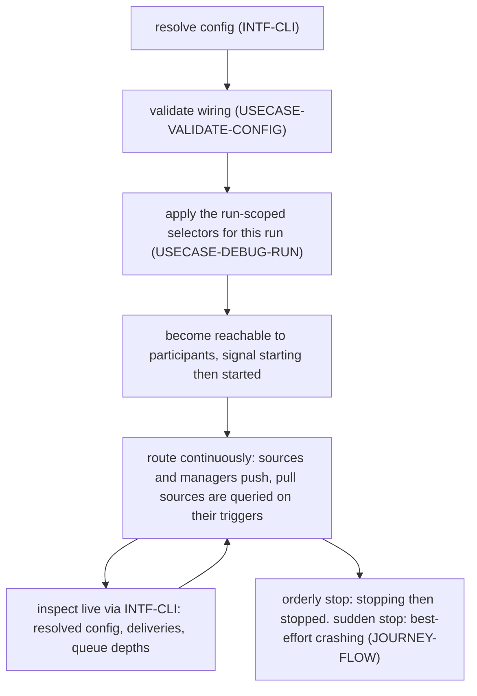
```mermaid
flowchart TD
    cfg["resolve config (INTF-CLI)"] --> val["validate wiring (USECASE-VALIDATE-CONFIG)"]
    val --> sel["apply the run-scoped selectors for this run (USECASE-DEBUG-RUN)"]
    sel --> reach["become reachable to participants, signal starting then started"]
    reach --> daemon["route continuously: sources and managers push, pull sources are queried on their triggers"]
    daemon --> inspect["inspect live via INTF-CLI: resolved config, deliveries, queue depths"]
    inspect --> daemon
    daemon --> stop["orderly stop: stopping then stopped. sudden stop: best-effort crashing (JOURNEY-FLOW)"]
```

Extensions:

- An inspection command finds no running core: it MUST fail with a "no running core" error rather
  than auto-starting one (`INTF-CLI` "Locating the core",
  `phillipgreenii-nix-agent-support · packages/pr-pool/docs/decisions · DEC-WIRE-2`).
- Shutdown is sudden rather than orderly: the core makes a best-effort `crashing` signal, which MAY
  be lost without violating any correctness rule (`JOURNEY-FLOW`).

### `USECASE-RUN-DRAIN` — run the core until the queue is drained, then exit <!-- uuid: 8095a98b-3100-4242-b8b5-b1ad4e3cf1e7 -->

**Actor:** `ACTOR-OP`.
**Level:** user-goal.
**Preconditions:** an authored configuration exists to resolve; none beyond
`USECASE-RUN-DAEMON`'s shared startup path.
**Intent:** dispatch from the durable queue and **exit** once there is provably nothing left to
deliver (`run-until-idle`), emitting a **final observability snapshot** on the way out.
_Requires:_ `INV-LIFE-1`, `INV-OBS-1`.
_Includes:_ `USECASE-RUN-DAEMON` (the shared startup path), `USECASE-VALIDATE-CONFIG`.

**Flow.** The startup path is `USECASE-RUN-DAEMON`'s, unchanged and included by reference. What
differs is the **exit predicate**: this mode exits once the **queue is drained and no offer is
outstanding** — every enqueued event accepted or expired, and no handler holding an offer
(`INV-LIFE-1`). The core stays **reachable throughout**, so a push source is never shut out of a run
still in progress.

**It emits a final snapshot before it exits, and that is why this is a separate element.** A daemon
emits observability continuously, so "what did this run do?" is always answerable from a live core.
A run that exits has no live core left to ask, so a drain-and-exit run **does** emit a **final
snapshot** before exiting (`INV-OBS-1`, `USECASE-DEBUG-RUN`). The two modes therefore differ in two
ways, not one — their exit predicate **and** what they emit at the end — and only an element of its
own can state the second. Why the two modes are separate operator commands rather than a flag on one
is a realization decision
(`phillipgreenii-nix-agent-support · packages/pr-pool/docs/decisions · DEC-CLI-2`).

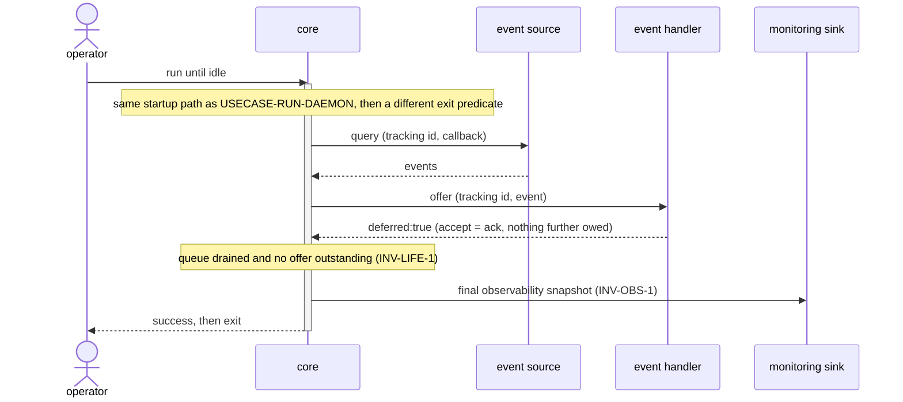
```mermaid
sequenceDiagram
    actor Op as operator
    participant Core as core
    participant Src as event source
    participant H as event handler
    participant MON as monitoring sink
    Op->>Core: run until idle
    activate Core
    Note over Core: same startup path as USECASE-RUN-DAEMON, then a different exit predicate
    Core->>Src: query (tracking id, callback)
    Src-->>Core: events
    Core->>H: offer (tracking id, event)
    H-->>Core: deferred:true  (accept = ack, nothing further owed)
    Note over Core: queue drained and no offer outstanding (INV-LIFE-1)
    Core->>MON: final observability snapshot (INV-OBS-1)
    Core-->>Op: success, then exit
    deactivate Core
```

### `USECASE-GATE-POOL` — pause and resume the pool via a global gate <!-- uuid: a2668c8c-fd26-4849-a7f5-a5068355cb1a -->

**Actor:** `ACTOR-OP` (a human operator for `quota-paused`; an automation actor for `cicd-down`).
**Level:** user-goal.
**Preconditions:** none — a gate is file-backed and MAY be set or cleared whether or not a core is
currently running.
**Intent:** suspend, then resume, event production and new dispatch across the whole pool without
touching configuration, so an operator (or an automation signal) can halt the system reversibly
(`INV-LIFE-2`).
_Requires:_ `INV-LIFE-2`, `INV-LIFE-1` (reachability in both run modes).
_Includes:_ `USECASE-DEBUG-RUN` (reading whether a running core is halted or quiescent).

**Flow.** `pause [<gate>]` sets a named gate (default `quota-paused`); `resume [<gate>]` clears one
gate, and `resume --all` clears every gate outstanding. Setting or clearing succeeds **whether or not
a core is currently running** — the command acts on the gate's own persisted state, never on a live
core — so a gate set before the next start is still honoured at that start. While **any** gate is set
the core suspends event production and new dispatch; work already accepted keeps running to
completion, and expiry keeps advancing (`INV-LIFE-2`). This differs from a **run-scoped selector**
(`STORY-OP-3`) in **kind**, not degree: a selector is scoped to one run and never outlives it, while a
gate is global and persists across runs until explicitly cleared.

**Two gates, OR-effective.** `quota-paused` is the operator's own; `cicd-down` belongs to an
automation actor, and every surface reporting gate state labels an automation-owned gate as such,
because it MAY re-assert the gate on its own initiative.

**A gated drain-and-exit run does not drain.** Because new dispatch is suspended, a drain-and-exit run
(`USECASE-RUN-DRAIN`) started while gated would never see its own queue empty on its own idle
predicate; `INV-LIFE-2` instead requires it to boot, stay reachable, emit its final snapshot, and exit
promptly, without reporting the queue as drained.

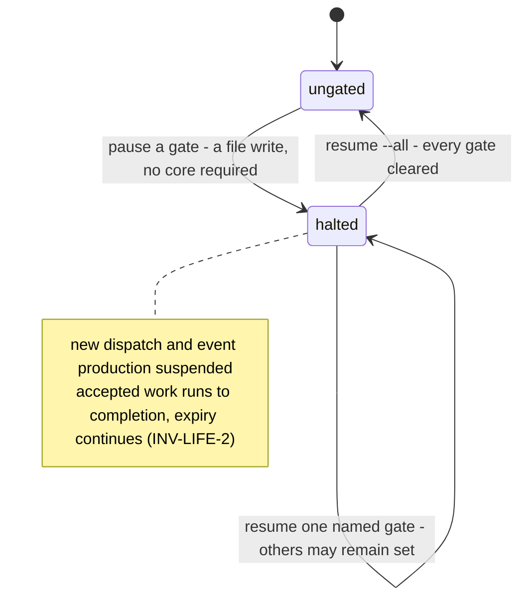
```mermaid
stateDiagram-v2
    [*] --> ungated
    ungated --> halted: pause a gate - a file write, no core required
    halted --> halted: pause a second gate - OR-effective
    halted --> ungated: resume --all - every gate cleared
    halted --> halted: resume one named gate - others may remain set
    note right of halted
      new dispatch and event production suspended
      accepted work runs to completion, expiry continues (INV-LIFE-2)
    end note
```

**Reading halted apart from quiescent.** `INV-LIFE-2` requires inspection to **distinguish** these —
a gated core MAY still have unsettled work in flight, and a core MAY be quiescent (nothing unsettled
remains) without any gate active at all, so neither reading substitutes for the other. That
distinction is read the same way any other run state is read, through `USECASE-DEBUG-RUN`'s
inspection: the core's own lifecycle state and run mode name whether it is winding toward exit on its
own account (a drain-and-exit run with nothing left to offer, independent of any gate — see the
glossary's **quiescing** entry), and each gate's active flag and gate owner name whether dispatch is
halted and by whom. A client that watches continuously renders these as two visibly different states rather
than one generic "not dispatching": a **halted** pool still shows every participant's own health,
because the participants themselves are not the ones stopped; a **quiescent**, ungated run is
winding down toward `USECASE-RUN-DRAIN`'s own exit and is not an error condition at all.

Extensions:

- A gate is set or cleared while no core is running: `pause`/`resume` still exit `0` and report that
  the change takes effect at the next start, because the command is a file write, not a call over a
  socket (contrast `INTF-CLI` "Locating the core").
- The core is asked to run drain-and-exit while gated: it boots, stays reachable, emits a final
  snapshot, and exits promptly without draining (`INV-LIFE-2`, `USECASE-RUN-DRAIN`).
- Inspecting a running core while it is gated and/or winding toward a drain-and-exit: lifecycle
  state/mode and each gate's active/owner together let the reading distinguish halted from
  quiescent, per `INV-LIFE-2` (`USECASE-DEBUG-RUN`).

### `USECASE-DEBUG-RUN` — read a run: metrics, injected test events, and run-scoped selectors <!-- uuid: 3c360b41-5a84-4607-88b6-425c02f80474 -->

**Actors:** core, `ACTOR-MON`, `ACTOR-OBS`, `ACTOR-OP`.
**Level:** user-goal.
**Preconditions:** a core has run or is running, so there is a metric catalog and/or a final
observability snapshot to read.
**Intent:** see what a run is doing, and narrow it until a cause is visible — the metric catalog
through a sink, an injected test event, and the run-scoped selectors.
_Requires:_ `INV-DISP-1`, `INV-DISP-3`, `INV-EVT-1`, `INV-EVT-3`, `INV-FAIL-1`, `INV-LIFE-1`,
`INV-LIFE-2`, `INV-OBS-1`, `GOAL-MIN-1`.

**Flow — the metric catalog (steady-state reading).** The core **owns the metric catalog** — a
declared set of metrics, each with `name`, `kind` (counter / gauge / histogram), `unit`, and label
shape (`INV-OBS-1`), whose members are enumerated by `INTF-MON`, the interface that carries it. The
failure classes the catalog counts are **delivery-side** and there are exactly two — a **pre-accept
decline** (`unavailable`, or a `busy` decline) and a **dispatch failure** the core could not hand
over; post-accept classes belong to the accepting handler and are counted on **its** surface, not
here (`INV-FAIL-1`, `USECASE-CREATE-HANDLER`). A monitoring sink **declares its mode and metric
subset** and either **pulls** current values on its own schedule or receives **pushed** updates
(`INTF-MON`, `USECASE-CREATE-MONITOR`); it serves its own external surface, and an **observer**
(`ACTOR-OBS`) reads that surface rather than the core. Observability covers **metrics + logs**
(traces are a later concern). A **daemon** emits continuously; a drain-and-exit run's **final
snapshot** is stated with that mode (`USECASE-RUN-DRAIN`). A **source infrastructure failure** is
recorded here as an error rather than as a quiet zero, which is what keeps it distinguishable from a
genuinely idle reading (`USECASE-CREATE-SOURCE`, `STORY-OBS-2`).

**Flow — an injected test event.** The operator MAY **inject** an arbitrary operator-supplied event
into the **live** core (`push-inject`), which performs the **same core-side enqueue** as the
`ingest-event` manager callback but is **operator-initiated**. The injected event is durable via the
queue, delivered at-least-once and de-duped like any push event (`INV-EVT-1`, `INV-EVT-3`); no new
delivery semantics come with it. It is **distinct** from `ingest-event`, and distinct from the
one-shot smoke test (`USECASE-VERIFY-PARTICIPANT`), which tears down instead of feeding the live
queue. Injecting is how an operator reproduces a routing question on a running system rather than
waiting for a source to emit the event again.

**Flow — halted vs quiescent.** A running core's own lifecycle state and run mode, together with
each gate's active and owner fields, let a reader tell **halted** (`USECASE-GATE-POOL`'s gate, set
by an operator or an automation actor) apart from **quiescent** (nothing unsettled remains in
flight, per `INV-LIFE-2`) — two readings that never substitute for one another, because a gated core
MAY still have unsettled work and an ungated core MAY be quiescent on its own account (a
drain-and-exit run with nothing left to offer; see the glossary's **quiescing** entry for the
lifecycle-state reading that names this). Reading them together is what keeps a coherent, non-error
resting state visually distinct from an actual poll failure.

**Flow — run-scoped selectors.** The operator MAY restrict the **active** set of sources and handlers
for a single run — as an allow-list, a deny-list, or both — **without editing the configuration**
(`STORY-OP-3`; the concrete spellings are
`phillipgreenii-nix-agent-support · packages/pr-pool/docs/decisions · DEC-CLI-1`). The restriction
scopes which participants a run activates and which a smoke test may reach, and it **MUST NOT**
outlive the run it was given for, which is what makes "isolate or pause part of the system" a
reversible act. It is **not** a config defect (`USECASE-VALIDATE-CONFIG`): a disabled binding's
events are still accepted and enqueued, offered to nobody, and dropped **unconsumed-expired** — the
**declared but inactive this run** case of `INV-DISP-3`, which is expected rather than a finding.

**Flow — "this binding matched nothing this run."** A binding's narrowing **payload path** cannot be
checked when the configuration is authored, because no per-`type` payload shape is declared anywhere
(`OQ-EVT-CATALOG`); while that open question stands, a mistyped path narrows to nothing and no
pre-runtime check reports it (`INV-DISP-1`). A running core therefore **MAY** report, for the run so
far, **which configured bindings have matched no event** (`INTF-CLI`). That is the one signal
available against a silent typo today, and it is a **MAY** because it is a debugging convenience
rather than a delivery guarantee: settling `OQ-EVT-CATALOG` replaces it with a config-time check,
which is the better answer and the reason this affordance is not promoted to a rule.

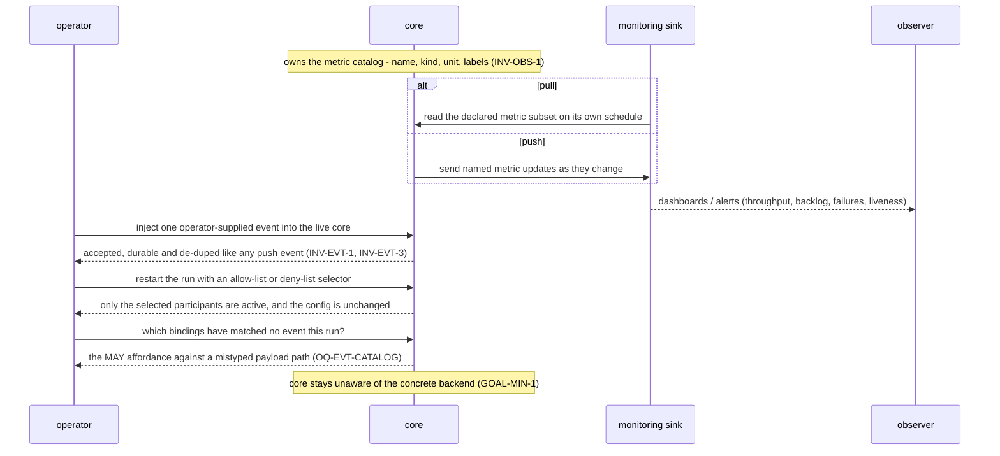
```mermaid
sequenceDiagram
    participant OP as operator
    participant CORE as core
    participant MON as monitoring sink
    participant OBS as observer
    Note over CORE: owns the metric catalog - name, kind, unit, labels (INV-OBS-1)
    alt pull
        MON->>CORE: read the declared metric subset on its own schedule
    else push
        CORE->>MON: send named metric updates as they change
    end
    MON-->>OBS: dashboards / alerts (throughput, backlog, failures, liveness)
    OP->>CORE: inject one operator-supplied event into the live core
    CORE-->>OP: accepted, durable and de-duped like any push event (INV-EVT-1, INV-EVT-3)
    OP->>CORE: restart the run with an allow-list or deny-list selector
    CORE-->>OP: only the selected participants are active, and the config is unchanged
    OP->>CORE: which bindings have matched no event this run?
    CORE-->>OP: the MAY affordance against a mistyped payload path (OQ-EVT-CATALOG)
    Note over CORE: core stays unaware of the concrete backend (GOAL-MIN-1)
```

Extensions:

- A binding's narrowing payload path matches nothing this run and no pre-runtime check caught it
  (`OQ-EVT-CATALOG` is unsettled): the operator MAY read which configured bindings have matched no
  event this run, the sole available signal against a mistyped path today.
- A source infrastructure failure occurs: it is recorded as an error rather than a quiet zero,
  keeping it distinguishable from a genuinely idle reading (`USECASE-CREATE-SOURCE`, `STORY-OBS-2`).

## Open questions

Each states the gap, its owner, a resolution path, and where it blocks.

- **`OQ-CONFIG`** <!-- uuid: e004fda6-f6e6-41e1-8ec4-0b90c17fd2b2 --> — the full **configuration schema**: participants (command + mode), event sources,
  handlers/roles + their event-type **bindings**, monitoring/storage selection, and the
  `--only` / `--disable` selectors. _Gap_: the authored config shape is not yet fixed. _Owner_:
  operator/author. _Path_: extract from pr-pool's TOML prior art and pin the schema. _Blocks_:
  authoring config (`USECASE-CONFIGURE-WIRING`, `USECASE-CONFIGURE-OPTIONAL`); `INTF-CLI`.
- **`OQ-EVT-CATALOG`** <!-- uuid: 7f4ba6ef-bb0e-4bcb-95fb-932a2eba7db5 --> — a **shared event catalog**: a declared shape for an event's `payload`,
  owned by the event **`type`** rather than by any one source. _Gap_: a `type` is declared, routed and
  matched on, but nothing anywhere declares what an event of that `type` **carries** — the event
  contract constrains `payload` to be an object and stops there, so a `type` is a name with no
  declared content. This is **deferred**, and it is more load-bearing than "deferred" suggests.
  _Owner_: author, with the implementers of every source that emits a shared `type` (a `type` two
  sources both emit is shared shape, so it cannot be settled one source at a time). _Path_: decide
  where a per-`type` payload shape is declared, pin it, and have config-time validation read it.
  _Blocks_ **two things, neither of which can be enforced until it is settled**: (a) the settled
  intent that **two sources emitting the same `type` MUST emit compatible events** — with no declared
  shape there is nothing to compare them against, so the rule can be stated and cannot be checked; and
  (b) **config-time validation of a binding's narrowing payload path** (`INV-DISP-1`, `INTF-SOURCE`),
  since a path can only be checked against a declared shape. (b) is the **sole** reason a mistyped
  path is undetectable, which is why the undetectable typo belongs to this open question and not to
  path matching — and why the only signal available meanwhile is a run-scoped reading
  (`USECASE-DEBUG-RUN`). Settling it makes payload-path matching checkable rather than best-effort,
  and recovers for `payload` the same declared-versus-referenced cross-check the wiring already runs
  on emitted types (`USECASE-VALIDATE-CONFIG`).
