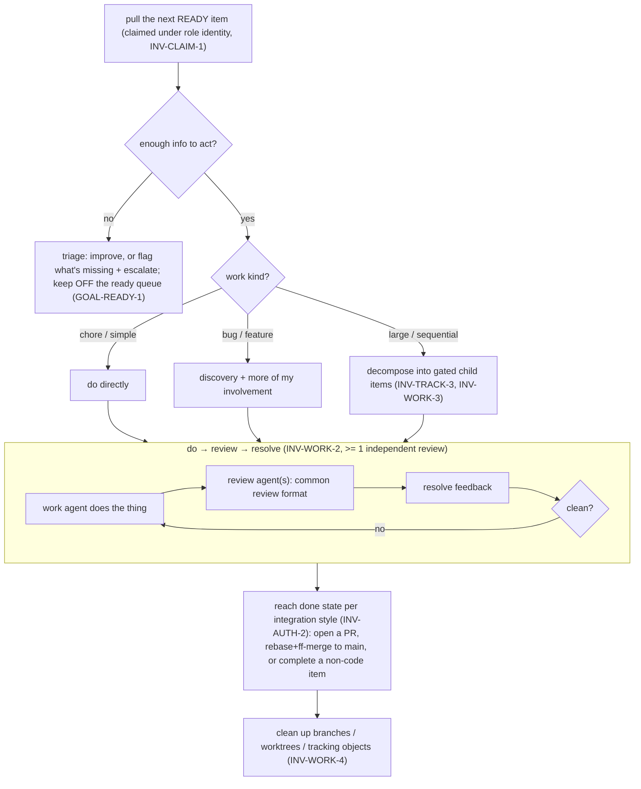

# Working the backlog

See the [glossary](glossary.md) and [invariants](invariants.md) for shared terms
and IDs.

## Purpose

How the system pulls work from a backlog, makes sure each item is well-formed
enough to act on, routes it through the right path for its kind, and produces the
change through a do→review→resolve loop — with me involved only when the work needs
me. Some work ends in code and a landed change; some doesn't. The shape is the same
either way; the difference is only how the item reaches its done state.

## Actors

- **Me** — set direction, resolve escalations, approve where required.
- **Triage** — the activity of deciding readiness: improve an item, set/clear the
  readiness signal, or escalate what can't be made ready (`GOAL-READY-1`). A
  deployment MAY run this as a dedicated **triage role** or fold it into another
  role; that choice lives in the deployment's overlay, not here.
- **Work agent** — does the item (code, plan, design, troubleshooting, …).
- **Review agent(s)** — independently review the work in the common review format.
- **The system** — pulls ready work, routes by kind, tracks, integrates, cleans up.

## User stories

- Agents **work through the backlog**, pulling the next ready item themselves.
- I can drop a **quick one-line item**; if it's simple and unambiguous an agent just
  does it; if vague, the system figures out what's missing and gets it ready — it
  doesn't work it blindly.
- **Under-specified items** are improved or escalated, not guessed at.
- **Different kinds of work flow differently** — a chore may go straight to a
  change; a bug or feature needs discovery and more of my involvement.
- Work is **broken into appropriately-sized changes** (and into **child tracking
  items** with gates when it's naturally sequential).
- A **do→review→resolve** loop applies across coding, planning, design, and
  troubleshooting — with at least one independent review (`INV-WORK-2`).
- Agents work across **repos with different integration styles** (`INV-AUTH-2`).
- Work that doesn't end in code is handled the same way, differing only in done
  state.
- Agents **clean up** after themselves and **never mark external tracker items
  done** on my behalf (`INV-AUTH-2`, `INV-WORK-4`).

## Journey



## Per-kind routing

- **Chore / simple task** — straight through the loop to a change; minimal human
  involvement.
- **Bug** — reproduce/confirm first; often needs my input on intended behavior;
  then the loop.
- **Feature** — discovery/design (itself a do→review→resolve activity) before
  implementation; more human touchpoints.
  _(The exact taxonomy and each kind's touchpoints are an open question below.)_

## Invariants (this workflow)

- An item **MUST** have sufficient information before it's worked; otherwise it's
  triaged (improved or escalated), never worked blindly.
- Agents **MUST** do only what they're confident in and **MUST** escalate ambiguity
  (`INV-AUTH-3`).
- Every substantive activity **MUST** pass ≥1 independent review→resolve pass
  (`INV-WORK-2`) in the common review format.
- Work **MUST** be right-sized (`INV-WORK-3`); large/sequential work **MAY** be
  decomposed into child tracking items gated on each other (`INV-TRACK-3`).
- Agents **MUST NOT** mark external issue-tracker items done (`INV-AUTH-2`).
- Shared by reference: claim identity `INV-CLAIM-1`; never lose work `INV-CONT-1`;
  stuck→park `INV-CONT-2`; usage limits pause `INV-CONT-3`; clean up `INV-WORK-4`.
- **`GOAL-READY-1`** — an item that isn't actually ready **should not** surface as
  ready-to-work (a goal, not an absolute — the gating signal is unresolved below).

## Example — quick capture, then triage

```
$ <capture> "the retry backoff feels wrong on 429s"
  created item ph-8t2  (open, label: needs-triage)

triage → "insufficient: no acceptance criteria, no repro. added label
          needs-acceptance-criteria; held off the ready queue. escalated to
          NEEDS ME: is this a bug (wrong behavior) or a tuning request?"
```

## Usage scenarios

- **Capture a one-liner:** verify a simple/unambiguous one gets worked while a vague
  one is held off the ready queue with a reason and surfaced in NEEDS ME.
- **Watch routing:** a chore reaches a change without me; a feature pauses for
  discovery and loops me in.
- **Cross-repo:** the same item opens a PR in a PR-driven repo and ff-merges to main
  in a merge-to-main repo — the agent picks the style from repo config (`INV-AUTH-2`).

## Failure conditions

- **Ambiguous / under-specified:** triaged; if it can't be made ready confidently,
  escalated (not guessed).
- **Review keeps finding problems:** the loop repeats; it does not integrate until
  clean.
- **Stuck / usage limit / non-retryable:** park-and-continue / pause / escalate
  (`INV-FAIL-1`).

## Open questions

- **The readiness signal (central).** A quick capture shows as "ready" but isn't.
  The **triage** activity is the candidate owner (sets/clears signals like
  `needs-acceptance-criteria` / `has-open-questions`), but the deciding rules — how
  the signal is set/cleared and which role owns it — are a per-deployment overlay
  concern (see the ZR overlay) left open here. This is the crux of the
  ready-vs-quick-capture tension.
- **Work-kind taxonomy** (chore / task / bug / feature / …) and each kind's exact
  path + human touchpoints.
- **How many review passes** for which situations, and how "what is done when" is
  defined (one reviewer? a panel? which lenses?).
- **Non-code work:** which kinds don't end in code + a landed change, and how their
  done state differs.
