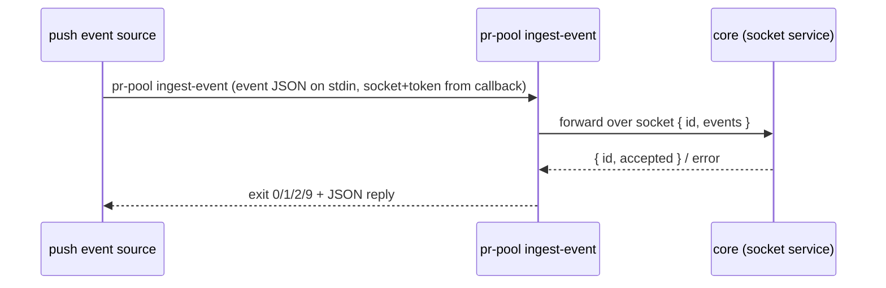

# Wire — pr-pool decision docs

Realization decisions about **how** a message crosses one of pr-pool's participant boundaries: the
default transport, the concrete message shapes that ride on it, and how a participant reaches the
core to call back. The behavior side — what crosses each boundary and what must hold — is
`INV-INTF-1`, `INV-INTF-2` and the interface definitions in pr-pool's
[behavior docs](../behavior/interfaces.md), which state that a **transport contract** carries a
**message schema** and deliberately do not say which transport or which encoding.

### `DEC-WIRE-1` — the default transport is a CLI invocation carrying JSON, with coarse exit codes <!-- uuid: 6450eed7-228f-4a99-bfd9-6705a6c552ee -->

**Decided.** The default **transport contract** invokes a participant as `<command> <subcommand>`.
The request payload is **JSON on stdin** and the reply is **JSON on stdout**. A subcommand MAY take
its own arguments, but arguments are never the payload channel. Concretely:

- **`schemaVersion`.** Every request and reply carries a `schemaVersion` string. A party that
  receives one it cannot handle reports it rather than guessing — that obligation is behavior and
  stays in the contract (`INV-INTF-1`); the fact that the version travels as a top-level JSON string
  field is this entry's.
- **Tracking id.** Every core→participant request carries a unique tracking id in an `id` field. A
  deferred result or a later callback correlates by **echoing that `id`**, or by returning its own id
  in the deferred acknowledgement, which the core stores and maps back. The id is per-call.
- **Deferred replies.** A deferral is the literal reply `{ "deferred": true }`. Whether a deferral
  still owes the core a result, or is itself the acceptance, is per-interface behavior
  (`INTF-SOURCE`'s `query` owes events later; `INTF-HANDLER`'s `dispatch` owes nothing).
- **Coarse exit codes.** A subcommand's exit code stays coarse: `0` ok, `1` unexpected error, `2`
  **usage** error, `9` busy, and `≥3` otherwise app-specific. The **rich outcome is in the JSON
  reply**, so a participant in a degraded state MAY return an exit code only (busy → `9`, no body).
  The **low** codes are held for meanings general to every app — any app can be invoked wrongly, so
  `2` is reserved for that — while busy means something only to a participant on a capacity-bounded
  transport and therefore lives out in the app-specific range (`ADR 0042`).
- **The callback is one `command` string.** When the core needs to be reached back it hands the
  participant a single ready-to-run command; how that command is addressed and authenticated is
  `DEC-WIRE-2`.

A gRPC or in-code transport that carries the same message schema conforms equally, which is why the
behavior side names only "a transport contract" and this entry names the default one.

**Why the exit codes stay coarse rather than enumerating outcomes.** An exit code is a single small
integer with no room for a reason, so any richer scheme would encode a taxonomy in it — and that
taxonomy would then have two homes, the exit code and the JSON reply, which drift. Four codes cover
the only distinctions a caller can act on without reading the body: it worked, it broke, it was
invoked wrongly, it is busy right now. Everything else is a field.

**The illustrative message shapes.** These are **illustrative examples**, not golden ones: the
authoritative artifacts are the versioned JSON Schemas each interface's conformance suite checks
against (`INV-INTF-2`). They are recorded here because they show the intended interaction concretely,
which the behavior set states as field shape and obligations instead.

An event, as an event source emits it (`INTF-SOURCE`):

```json
{
  "schemaVersion": "1",
  "id": "evt-abc123",
  "type": "review-requested",
  "at": "2026-07-16T12:00:00Z",
  "expiresAt": "2026-07-16T12:15:00Z",
  "payload": {
    "note": "source-defined; OPAQUE to the core except a path a binding names"
  }
}
```

A dispatch, core → handler (`INTF-HANDLER`):

```json
{
  "schemaVersion": "1",
  "id": "hs-771e",
  "event": {
    "id": "evt-abc123",
    "type": "review-requested",
    "expiresAt": "2026-07-16T12:15:00Z",
    "payload": {}
  }
}
```

Its two replies: the **inline completion**
`{ "schemaVersion": "1", "id": "hs-771e", "outcome": { … } }`, and the **deferred ack**
`{ "schemaVersion": "1", "id": "hs-771e", "deferred": true }` — which is itself the acceptance, so
nothing further is owed for that dispatch.

The `ingest-event` callback request, carrying one or more events (`INTF-CLI`, the manager→core
direction):

```json
{
  "schemaVersion": "1",
  "id": "trk-9f2c",
  "events": [
    {
      "id": "evt-abc123",
      "type": "review-requested",
      "expiresAt": "2026-07-16T12:15:00Z",
      "payload": {}
    }
  ]
}
```

Its reply on stdout, exit `0`:

```json
{ "schemaVersion": "1", "id": "trk-9f2c", "accepted": 1, "rejected": [] }
```

And with a rejected event, exit `1` — `rejected` carries the **malformed** events and the events
whose `type` is **unknown to the configuration** (no configured binding declares it, so the core
rejects rather than enqueues, `INV-DISP-3`), each with a reason:

```json
{
  "schemaVersion": "1",
  "id": "trk-9f2c",
  "accepted": 0,
  "rejected": [
    {
      "id": "evt-abc123",
      "reason": "malformed: missing required field \"type\""
    },
    {
      "id": "evt-def456",
      "reason": "unknown type: no configured binding declares \"review-abandoned\""
    }
  ]
}
```

The operator-side `status` reply in its machine-readable form:

```json
{
  "schemaVersion": "1",
  "deliveries": [
    { "id": "hs-771e", "handler": "review", "event": "evt-abc123" }
  ],
  "queues": [{ "type": "review-requested", "depth": 3 }],
  "config": { "sources": 2, "handlers": 3 }
}
```

**Not decided here.** Which fields each schema requires, and the schema artifacts themselves, belong
to the implementation and its conformance suite (`INV-INTF-2`). What each field **means** — that `id`
is the de-duplication key, `type` the primary matcher, `payload` a JSON object, `at`/`expiresAt`
absolute instants, and that `accepted` counts events the core took rather than freshly appended — is
behavior and stays in the behavior set.

### `DEC-WIRE-2` — the core is reached over a socket, and the callback command arrives with its address and token already baked in <!-- uuid: 70fea0a8-45f7-45cb-9f4a-915e27765663 -->

**Decided.** The core runs as a **socket service** in both of its run modes, and that socket is how
every inbound message reaches it — an operator subcommand and a manager callback alike. Two
mechanisms follow:

- **Locating a running core.** The CLI finds it via an **injected socket path** (an environment
  variable or an argument) or by **discovering the running socket service**. Locating means being
  able to **reach** a core, not finding a trace that one once existed: a stale trace left by a core
  that has died is the same outcome as no trace at all.
- **Addressing and authenticating a callback.** The core hands a participant one `command` string
  that already carries the socket and an **auth token** as arguments. The participant appends its own
  arguments and runs it; it never assembles the socket or the token itself, so no participant holds
  addressing or credential logic and neither can be got wrong on the participant's side.



**What the behavior side keeps, and why the split falls here.** The socket is a transport choice: a
core reached over a named pipe, a loopback port or an in-process call would leave every stated
behavior intact. What does **not** survive generalization, and therefore stays in the behavior set,
is the obligation either mechanism exists to serve: a caller that cannot reach a running core
**MUST** fail with a "no running core" error and a non-zero exit code and **MUST NOT** start one
(`INTF-CLI`, `ADR 0036`), so "is a core running?" stays answerable from a caller's exit code; and the
core **MUST** stay reachable to push participants in **both** run modes (`INV-LIFE-1`), which is what
makes a push source's events deliverable while a drain-and-exit run is still going.

**Not decided here.** The socket's path convention, the token's format and lifetime, and the
discovery mechanism are the implementation's own.
