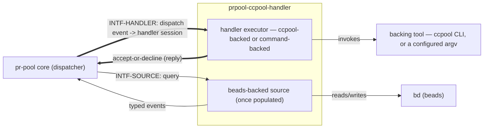

# prpool-ccpool-handler — behavior docs

`prpool-ccpool-handler` is `packages/pr-pool`'s **downstream deployment set** for the
ccpool-backed and command-backed participant kinds: it is an **implementer** of
`INTF-HANDLER`/`INTF-SOURCE` as those interfaces are defined by pr-pool's own behavior docs
(`phillipgreenii-nix-agent-support · packages/pr-pool/docs/behavior`), the same way that set's own
[README](../../../pr-pool/docs/behavior/README.md) `## Scope` names "concrete participant
implementations ... and any deployment-specific behavior" as content that "live[s] in a downstream
deployment set that implements these interfaces" and excludes from its own extent. This set follows
the behavior-docs method (`phillipgreenii-nix-agent-support · behavior-docs/docs/behavior`).

Start here, then the [glossary](glossary.md); the rules are in [invariants](invariants.md), the
boundaries in [interfaces](interfaces.md), the actors in [actors](actors.md), and the stories,
journeys, and open questions in [journeys](journeys.md).

## The model

This module sits **on the participant side** of both interfaces the diagram crosses: pr-pool's
core knows only the interface, and this module is one concrete implementer standing behind it —
`INTF-HANDLER`'s `ACTOR-HDL` and `INTF-SOURCE`'s `ACTOR-SRC`
(`packages/pr-pool/docs/behavior/interfaces.md`). Nothing on the core side of that line is
restated here; this set cites it rather than duplicating it (`INV-18`-style inter-set
consistency).

## Scope (extent + floor)

- **Extent (in)** — once populated (Task 5.2 onward): the ccpool-backed handler session lifecycle
  and the command-backed handler session lifecycle, both realizing `INTF-HANDLER`'s
  dispatch/accept-or-decline/deferred-ack contract; watchdog and budget policy that gate a handler
  session; prompt templating that shapes what a handler session is asked to do; the beads-backed
  event source realizing `INTF-SOURCE`'s query-reply contract; the pg-pr ACL a handler session
  consults. This is exactly the "concrete participant behavior" `phillipgreenii-nix-agent-support`
  ADR 0065's "New module" decision names as belonging here rather than in
  `packages/pr-pool/docs/behavior`.
- **Extent (out)** — pr-pool's own generic dispatch, queue, and wiring-validation behavior, which
  stays owned by `packages/pr-pool/docs/behavior` and is cited here, never restated;
  deployment-specific configuration, credentials, and any organization-specific wiring, which live
  further downstream in whatever deployment set assembles pr-pool and this module together for a
  real installation — mirroring `packages/pr-pool/docs/behavior/README.md`'s own "Extent (out)"
  pattern, applied one layer down.
- **Floor** — this set speaks in handler sessions, dispatch, accept/decline, deferred acks,
  self-status, and source queries/events — never in package names, executor source paths, ccpool
  CLI flags, or deployment secrets.

## Realization gaps

This set's realization-gap register (`INV-23`): intended behavior this set's implementation has
not built yet, one row per gap, keyed by the element id the gap is against. Not an open
question — the intent below is settled and the build has not caught up (`INV-15`).

| Element        | Intended                                                                                   | Where the implementation stands                                                                                                               | Tracked by                   |
| -------------- | ------------------------------------------------------------------------------------------ | --------------------------------------------------------------------------------------------------------------------------------------------- | ---------------------------- |
| `INTF-HANDLER` | this module realizes `INTF-HANDLER` for the ccpool-backed and command-backed handler kinds | this module is an empty, buildable shell — the ccpool executor and the command executor still live in `packages/pr-pool`                      | `pg2-oju6w.2`, `pg2-oju6w.3` |
| `INTF-SOURCE`  | this module realizes `INTF-SOURCE` for the beads-backed built-in query set                 | not yet moved — the beads client and built-in query set still live in `packages/pr-pool`'s `internal/beads`/`internal/roles`/`internal/query` | `pg2-oju6w.2`                |

## External references

This set follows the behavior-docs method and cites elements the method and pr-pool's own set
define, so a cross-set reference resolves by the owner's stable UUID, not the mutable name.

| Name           | What it is                                                                               | Owner set-path                                                      | Owner UUID                                                                                                                                         |
| -------------- | ---------------------------------------------------------------------------------------- | ------------------------------------------------------------------- | -------------------------------------------------------------------------------------------------------------------------------------------------- |
| `INTF-SOURCE`  | typed events into the core, over the one opaque source contract                          | `phillipgreenii-nix-agent-support · packages/pr-pool/docs/behavior` | [fe42416a-5f10-4db1-b8c3-46b1609213c7](https://github.com/phillipgreenii/nix-agent-support/blob/main/packages/pr-pool/docs/behavior/interfaces.md) |
| `INTF-HANDLER` | dispatch to a handler and its accept-or-decline/deferred-ack reply                       | `phillipgreenii-nix-agent-support · packages/pr-pool/docs/behavior` | [10939663-7a48-4d44-8c4a-9a2df8ae4654](https://github.com/phillipgreenii/nix-agent-support/blob/main/packages/pr-pool/docs/behavior/interfaces.md) |
| `INV-23`       | the realization-gap register is set-level, named `## Realization gaps`, never an element | `phillipgreenii-nix-agent-support · behavior-docs/docs/behavior`    | [f3bba3e7-440f-4109-a4de-9d37daa34bcf](https://github.com/phillipgreenii/nix-agent-support/blob/main/behavior-docs/docs/behavior/invariants.md)    |
| `INV-15`       | the behavior docs set is the source of truth; a realization gap is normal, not a defect  | `phillipgreenii-nix-agent-support · behavior-docs/docs/behavior`    | [375b542f-2a9f-4cfd-a77e-7aed45a416d5](https://github.com/phillipgreenii/nix-agent-support/blob/main/behavior-docs/docs/behavior/invariants.md)    |
| `INV-18`       | inter-consistency at every interface, reconciled by the counterparty's kind              | `phillipgreenii-nix-agent-support · behavior-docs/docs/behavior`    | [4c6a764b-02f5-4c85-afae-a082fe6c21cd](https://github.com/phillipgreenii/nix-agent-support/blob/main/behavior-docs/docs/behavior/invariants.md)    |
