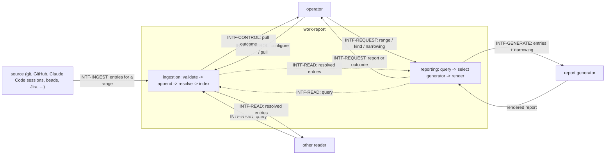

# work-report — behavior docs

work-report **ingests** the operator's own activity from a pluggable set of sources, **stores**
each observation as an append-only entry, **resolves** which entry is authoritative when more
than one names the same thing, and **renders**, on request, one or more reports over a range.
This set follows the behavior-docs method
(`phillipgreenii-nix-agent-support · behavior-docs/docs/behavior`).

Start here, then the [glossary](glossary.md); the rules are in [invariants](invariants.md), the
boundaries in [interfaces](interfaces.md), the actors in [actors](actors.md), and the stories,
use cases and journeys in [journeys](journeys.md).

> **Provenance.** This set is a copy of the work-report behavior docs as they stood at commit
> `3a61f08` of `phillipgreenii-nix-support-apps`, amended here (optional `summary` and `url` on an
> entry; `rejected`, `unchanged`, and `truncated` on a pull outcome; the four previously open
> questions settled). The originals in `phillipgreenii-nix-support-apps` are removed in the
> retirement phase; until then this copy is the living one.

work-report is **one product with two conceptual halves**, and every file in this set groups its
elements under matching headers: **ingestion** (pulling activity from pluggable sources into the
store) and **reporting** (rendering what the store holds into a report). Whether that split
surfaces as two commands, one command with two subcommands, or something else entirely is a
realization decision this set does not make (`INV-10`).

## The model

The diagram below **is** this set's interface inventory (`GOAL-7`) — not a data-flow diagram and
not a component diagram.

**`INTF-CONTROL`, `INTF-INGEST`, `INTF-READ`, and `INTF-REQUEST` are essential** — configuring and
pulling, having a source to pull from, resolving what was pulled into a queryable form, and being
asked for a report are what work-report is for; the reporting half cannot render anything without
reading through `INTF-READ`, which is exactly why these two halves are one product rather than
two. **`INTF-GENERATE` is optional** — the baseline report kind renders directly from queried
entries, with no generator involved (`INV-BASELINE-1`).

**Entries are append-only, but reading resolves to one winner per identity.** Nothing already
written is ever mutated or deleted; a read instead resolves, per unique identifier, to the single
latest entry — the store's **latest-wins resolution** (`INV-LATEST-1`). This is what lets both a
one-off happening (an "activity") and a standing fact about something external (an "entity") live
in the store as the same kind of record.

**A source decides its own pull strategy.** The ingestion contract accepts any range — a single
date, a bounded span, or open-ended — and imposes no further shape on how a source gets efficient
about repeated or overlapping pulls; that optimization, if any, is entirely the source
implementation's own decision (`INV-RANGE-1`).

**Pulling and reporting never share a request.** The reporting half never triggers a pull; it
reads whatever the ingestion half already holds at request time, and states the range it read
(`INV-REPORT-RANGE-1`).

## Scope (extent + floor)

- **Extent (in), ingestion** — a pluggable set of sources that ingest independently, so one
  source's failure degrades gracefully rather than blocking the rest; an entry's shape (unique
  identifier, optional external identifier, source, type, occurred-at, optional labels, optional summary and URL);
  append-only writes with latest-wins resolution per unique identifier, tie-broken by ingestion
  time; per-type schema validation; indexing for cross-reference and lookup by identifier, type,
  source, and label; a uniform source contract that lets a new source be added without changing an
  existing one's behavior.
- **Extent (in), reporting** — requesting a report for a range, in a named or default kind; a
  baseline kind (a plain chronological rendering) that is always available and depends on nothing
  optional; further, pluggable report kinds; narrowing a report's scope by label, source, or
  type — the same dimensions the store indexes; adding a new report kind without changing an
  existing kind's request or response shape.
- **Extent (out)** — the concrete storage engine, index implementation, or configuration
  mechanism; a source's own internal optimization strategy for repeated pulls (`INV-RANGE-1`); the
  concrete mechanism any report kind uses to render its content — a template, generated prose, or
  anything else — and any credential or configuration such a mechanism needs; a report's file
  format or delivery mechanism; how the two halves surface as commands (`INV-10`).
- **Floor** — work-report speaks in entries, identifiers, sources, types, ranges, latest-wins
  resolution, reports, kinds, and narrowing — never in SQL schemas, index structures, a named
  storage or rendering engine, or a command-line shape.

## Realization gaps

This set's **realization-gap register** (`INV-23`): intended behavior this set's implementation
has not built yet, one row per gap, each keyed by the element id the gap is against. Not an open
question — the intent below is settled and the build has not caught up (`INV-15`). This set has no
implementation yet, so every use case is presently a gap.

| Element                     | Intended                                                                                                       | Where the implementation stands                                                                                                                                                                                                                                                   |
| --------------------------- | -------------------------------------------------------------------------------------------------------------- | --------------------------------------------------------------------------------------------------------------------------------------------------------------------------------------------------------------------------------------------------------------------------------- |
| `USECASE-ING-PULL`          | pulling from a pluggable source set with per-source graceful degradation and source-decided range optimization | not yet implemented                                                                                                                                                                                                                                                               |
| `USECASE-ING-QUERY`         | querying by range/id/type/label with latest-wins resolution                                                    | not yet implemented                                                                                                                                                                                                                                                               |
| `USECASE-ING-ADD-SOURCE`    | adding a source with no change to any existing source's or reader's behavior                                   | not yet implemented                                                                                                                                                                                                                                                               |
| `USECASE-REP-REPORT`        | a report for a range, in a named or default kind, optionally narrowed by label/source/type                     | not yet implemented                                                                                                                                                                                                                                                               |
| `USECASE-REP-ADD-GENERATOR` | adding a report kind with no change to any existing kind's request or response shape                           | not yet implemented                                                                                                                                                                                                                                                               |
| `INV-TYPE-1`                | an entry that does not satisfy its declared type's schema is rejected and reported                             | v1 validates the envelope only; the kind-specific shape of `fields` is documented and tested inside each backend and is not checked by work-report. Upgrade path: each backend's `activity_kinds` vocabulary MAY carry a JSON Schema per kind that work-report validates against. |
| `INV-ENTITY-1`              | entity-typed entries resolve like any other entry                                                              | no phase produces entity entries; the design's "Ranged `list` queries" section specifies how `entity_queries` would, as an optional later phase. Activity entries do not depend on it.                                                                                            |

## External references

This set follows the behavior-docs method and cites elements the method defines.

| Name     | What it is                                                                                                                            | Owner set-path                                                   | Owner UUID                                                                                                                                      |
| -------- | ------------------------------------------------------------------------------------------------------------------------------------- | ---------------------------------------------------------------- | ----------------------------------------------------------------------------------------------------------------------------------------------- |
| `INV-2`  | a behavior doc describes intended behavior only — no _how_, no past/present/future-code framing                                       | `phillipgreenii-nix-agent-support · behavior-docs/docs/behavior` | [015a5534-9f3c-4eeb-9c22-34397008b9c5](https://github.com/phillipgreenii/nix-agent-support/blob/main/behavior-docs/docs/behavior/invariants.md) |
| `INV-3`  | every element carries a typed name and a stable UUID minted once at its definition                                                    | `phillipgreenii-nix-agent-support · behavior-docs/docs/behavior` | [c44b760f-9baf-471a-8424-49984eb94ac7](https://github.com/phillipgreenii/nix-agent-support/blob/main/behavior-docs/docs/behavior/invariants.md) |
| `INV-8`  | a cross-product interaction MUST be an explicit interface, classified by counterparty kind and by essential-vs-optional participation | `phillipgreenii-nix-agent-support · behavior-docs/docs/behavior` | [67a79e92-2f98-40a2-9392-034a697e457e](https://github.com/phillipgreenii/nix-agent-support/blob/main/behavior-docs/docs/behavior/invariants.md) |
| `INV-10` | a set speaks at its scope's floor, located by the substitution test                                                                   | `phillipgreenii-nix-agent-support · behavior-docs/docs/behavior` | [75d9daaa-46f5-4645-949d-f9223bb4fafc](https://github.com/phillipgreenii/nix-agent-support/blob/main/behavior-docs/docs/behavior/invariants.md) |
| `INV-13` | a set MUST make its scope explicit (extent + floor) and define all its actors and interfaces                                          | `phillipgreenii-nix-agent-support · behavior-docs/docs/behavior` | [94285c70-da89-4402-8ae2-af27925008bd](https://github.com/phillipgreenii/nix-agent-support/blob/main/behavior-docs/docs/behavior/invariants.md) |
| `INV-14` | a named concept MUST be used in at least two places beyond its glossary definition                                                    | `phillipgreenii-nix-agent-support · behavior-docs/docs/behavior` | [5ffe697b-8758-4404-8a59-5f27d1016109](https://github.com/phillipgreenii/nix-agent-support/blob/main/behavior-docs/docs/behavior/invariants.md) |
| `INV-15` | the behavior docs set is the source of truth; a realization gap is normal, not a defect                                               | `phillipgreenii-nix-agent-support · behavior-docs/docs/behavior` | [375b542f-2a9f-4cfd-a77e-7aed45a416d5](https://github.com/phillipgreenii/nix-agent-support/blob/main/behavior-docs/docs/behavior/invariants.md) |
| `INV-22` | traceability is a listing obligation on every story, use case and journey, not a coverage section                                     | `phillipgreenii-nix-agent-support · behavior-docs/docs/behavior` | [b2502527-1340-4a1f-858c-aaa80c601317](https://github.com/phillipgreenii/nix-agent-support/blob/main/behavior-docs/docs/behavior/invariants.md) |
| `INV-23` | the realization-gap register is set-level, named `## Realization gaps`, and never an element                                          | `phillipgreenii-nix-agent-support · behavior-docs/docs/behavior` | [f3bba3e7-440f-4109-a4de-9d37daa34bcf](https://github.com/phillipgreenii/nix-agent-support/blob/main/behavior-docs/docs/behavior/invariants.md) |
| `GOAL-7` | a set SHOULD show intent through examples                                                                                             | `phillipgreenii-nix-agent-support · behavior-docs/docs/behavior` | [42ad1aa1-af11-4387-bf02-e0f028f80434](https://github.com/phillipgreenii/nix-agent-support/blob/main/behavior-docs/docs/behavior/invariants.md) |
