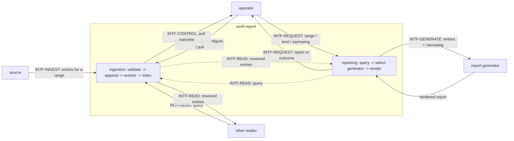

# Interfaces — work-report

This file follows the interface convention of the behavior-docs method
(`phillipgreenii-nix-agent-support · behavior-docs/docs/behavior`): an **interface** is a boundary
described by **what crosses it** and **what must hold**, never _how_ it is implemented — including
a **minimal schema** where a concrete field-shape crosses (`INV-8`). See the
[glossary](glossary.md) for terms, [actors](actors.md) for who sits on each side,
[invariants](invariants.md) for the rules, and [journeys](journeys.md) for the flows that exercise
these interfaces.

| Interface       | Boundary                                            | Counterparty (kind)             | Participation | Initiator                        |
| --------------- | --------------------------------------------------- | ------------------------------- | ------------- | -------------------------------- |
| `INTF-CONTROL`  | operator's requests in; pull outcome out            | `ACTOR-OP` (actor)              | essential     | operator                         |
| `INTF-INGEST`   | entries for a range, from each configured source    | `ACTOR-SOURCE` (implementer)    | essential     | work-report asks; source answers |
| `INTF-READ`     | resolved entries out, for a query                   | `ACTOR-READER` (actor)          | essential     | reader                           |
| `INTF-REQUEST`  | operator's report request in; report or outcome out | `ACTOR-OP` (actor)              | essential     | operator                         |
| `INTF-GENERATE` | entries + narrowing out; rendered report in         | `ACTOR-GENERATOR` (implementer) | optional      | work-report                      |

`INTF-CONTROL`, `INTF-INGEST`, `INTF-READ`, and `INTF-REQUEST` are **essential**: configuring and
pulling, having a source, resolving what was pulled into a queryable form, and being asked for a
report are what work-report is for. The reporting half's own use case reads through `INTF-READ`
unconditionally — even the baseline kind — which is exactly why `INTF-READ` is essential rather
than optional now that ingestion and reporting are one product. `INTF-GENERATE` is **optional**:
the baseline kind renders directly from queried entries, with no generator involved
(`INV-BASELINE-1`).

## Ingestion

### `INTF-CONTROL` — the operator's ingestion control surface <!-- uuid: 8263db9b-8b99-4e02-a6f4-3a9206d0181d -->

- **In (operator → work-report)** — configure which sources are enabled and how to reach each one
  (floor: connection detail is a decision doc); trigger a pull naming a range and, optionally, a
  subset of enabled sources (default: all enabled sources).
- **Out (work-report → operator)** — the pull outcome, one row per source attempted:

  | Field       | Meaning                                                                                                                                                           |
  | ----------- | ----------------------------------------------------------------------------------------------------------------------------------------------------------------- |
  | `source_id` | which source this row reports                                                                                                                                     |
  | `status`    | one of `succeeded`, `degraded`, `disabled` (`glossary.md` "Pull outcome")                                                                                         |
  | `count`     | present when `status = succeeded`: how many entries were accepted; MAY also be present when `status = degraded`, when entries were stored despite the degradation |
  | `unchanged` | how many entries were re-observed identically and therefore not appended                                                                                          |
  | `rejected`  | present when any entry was rejected for schema reasons (`INV-TYPE-1`): how many                                                                                   |
  | `truncated` | whether the source could not cover the whole range                                                                                                                |
  | `reason`    | present when `status = degraded`: why                                                                                                                             |

- **Guarantee** — a pull request MUST NOT fail as a whole because one source degraded
  (`INV-DEGRADE-1`); the outcome MUST report every attempted source individually, never a single
  merged pass/fail signal.

### `INTF-INGEST` — source ingestion contract <!-- uuid: b414dfd9-e2fa-40af-b9b2-03d8fe068b15 -->

- **Out (work-report → source)** — a pull request naming a range (a single date, a bounded span,
  or open-ended). How the source uses this to optimize a repeated or overlapping pull is entirely
  its own decision (`INV-RANGE-1`) — this interface states no watermark, cursor, or other
  bookkeeping mechanism.
- **In (source → work-report)** — zero or more entries, each:

  | Field         | Required | Meaning                                                                                   |
  | ------------- | -------- | ----------------------------------------------------------------------------------------- |
  | `id`          | yes      | the unique identifier (`INV-ID-1`)                                                        |
  | `external_id` | no       | an external system's identifier for the same thing, if one exists                         |
  | `source_id`   | yes      | which source this entry came from (`INV-SOURCE-1`)                                        |
  | `type`        | yes      | the entry's type, naming the schema `fields` must satisfy (`INV-TYPE-1`)                  |
  | `occurred_at` | yes      | a date or date-time; a bare date is acceptable (`INV-ORDER-1`)                            |
  | `labels`      | no       | zero or more labels (`INV-LABEL-1`)                                                       |
  | `summary`     | no       | one human-readable line naming the entry, independent of its type                         |
  | `url`         | no       | a link to the thing the entry describes                                                   |
  | `fields`      | yes      | the type-specific payload; shape is fixed by `type`'s own schema, out of this set's floor |

  — or an unavailable/errored outcome for the whole request, carried on `INTF-CONTROL`'s pull
  outcome rather than as entries.

- **Guarantee (validation)** — an entry that does not satisfy its declared `type`'s schema MUST be
  rejected and reported, never silently stored (`INV-TYPE-1`). A rejected entry does not degrade
  its source: the other entries from the same pull are still stored, and the source's outcome is
  `succeeded` with a `rejected` count on `INTF-CONTROL`.
- **Guarantee (attribution)** — a source MUST return only entries that are the operator's own
  activity, scoped by the operator's own part in each event: for a source with no natural
  single-owner filter (for example a workspace shared with other contributors), an event
  qualifies only where the operator is the actor or assignee, never merely because it occurred in
  a workspace the operator lists.
- **Guarantee (independence)** — a source's unavailability, error, or rejected entry MUST NOT
  prevent ingestion from any other configured source (`INV-DEGRADE-1`).

### `INTF-READ` — query boundary <!-- uuid: 20c87333-7767-48db-9d52-f316598f28b9 -->

- **Out (reader → work-report)** — a query naming a range and, optionally, any combination of: a
  unique identifier, a type, a label, or a source.
- **In (work-report → reader)** — zero or more entries matching the query, each carrying the same
  fields named in `INTF-INGEST` (`id`, `external_id`, `source_id`, `type`, `occurred_at`,
  `labels`, `summary`, `url`, `fields`) — nothing is reshaped for a reader.
- **Guarantee (resolution)** — the result MUST already be resolved by latest-wins per unique
  identifier (`INV-LATEST-1`): a reader never receives two entries sharing the same `id` from one
  query. Work-report's own reporting half is one caller of this interface, exercising no
  privilege another reader lacks.

## Reporting

### `INTF-REQUEST` — the operator's report request surface <!-- uuid: be1f6b28-8858-4f58-84db-9fe1fdf9a59b -->

- **In (operator → work-report)** — a request:

  | Field       | Required | Meaning                                                                                                                                                                         |
  | ----------- | -------- | ------------------------------------------------------------------------------------------------------------------------------------------------------------------------------- |
  | `range`     | yes      | the range the report should cover                                                                                                                                               |
  | `kind`      | no       | which kind to render; when omitted, the baseline kind (`INV-BASELINE-1`)                                                                                                        |
  | `narrowing` | no       | any combination of label, source, and/or type to restrict scope to, each dimension taking one or more values; intersection across dimensions, union within one (`INV-CUSTOM-1`) |

- **Out (work-report → operator)** — either a report:

  | Field       | Meaning                                                                       |
  | ----------- | ----------------------------------------------------------------------------- |
  | `range`     | the range actually covered (`INV-REPORT-RANGE-1`)                             |
  | `kind`      | the kind actually rendered                                                    |
  | `narrowing` | the narrowing actually applied, echoed back                                   |
  | `content`   | the rendered report; shape is the kind's own concern, out of this set's floor |

  — or an outcome reporting why no report was produced (e.g. an unrecognized `kind`, or a
  `narrowing` value the generator could not honor).

- **Guarantee** — a request whose range matches no entries still yields a report stating the
  range and that nothing was found, never an error (`INV-REPORT-RANGE-1`).

### `INTF-GENERATE` — report generator contract <!-- uuid: 75c6b51d-3b29-499d-a9c7-160b722fa019 -->

- **Out (work-report → generator)** — the entries a request resolved to (queried via
  `INTF-READ`), the range, and any narrowing to honor.
- **In (generator → work-report)** — the rendered report content.
- **Guarantee** — a generator MUST honor any narrowing it is given, and MUST report distinctly
  when it cannot (`INV-CUSTOM-1`) — never silently ignore it. This interface carries no
  requirement on the generator's own rendering mechanism (`INV-2`).
